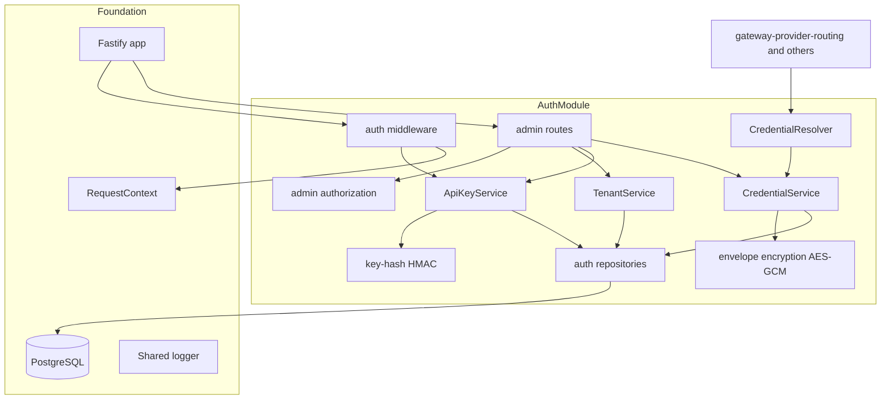
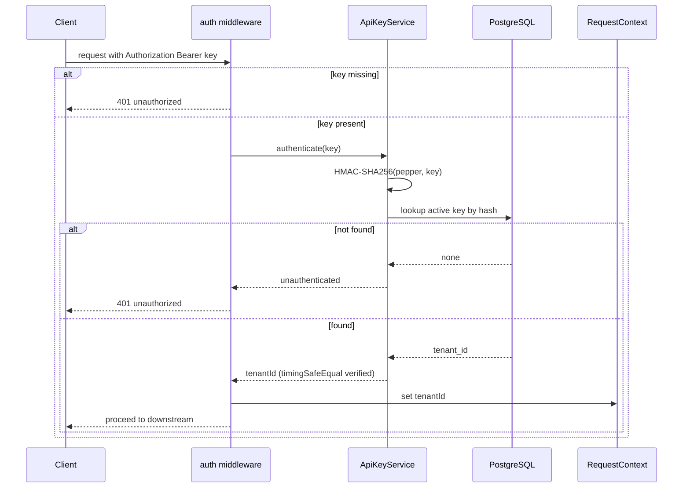
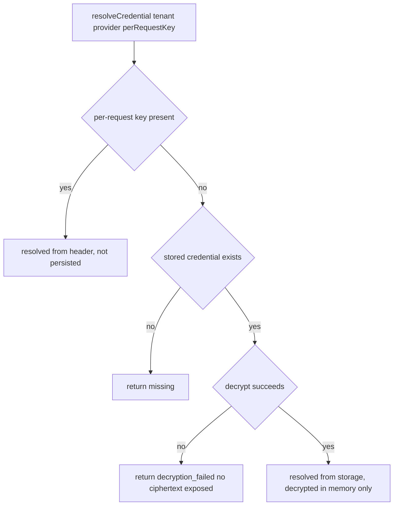

# Technical Design: auth-tenancy-credentials

## Overview

**Purpose**: This feature makes the gateway multi-tenant and secret-safe. It authenticates every protected request with a gateway API key mapped to an isolated tenant, stores each tenant's provider credentials encrypted at rest, resolves the provider key for a request from either a per-request header (BYOK) or decrypted storage, and exposes a minimal admin API to provision tenants and manage keys — all while guaranteeing that no secret reaches logs, errors, or telemetry.

**Users**: Gateway operators (provision tenants, issue keys, attach/rotate credentials via the admin API) and integrating developers (authenticate with a gateway key and supply provider keys per-request or via storage).

**Impact**: Extends `platform-foundation` with an `auth` domain module. It writes tenant identity into the shared request context and defines the `ProviderName` identifier and the `CredentialResolver` contract that `gateway-provider-routing`, `resilience-failover`, `rate-limiting`, and `dual-layer-caching` consume. It adds this spec's own database migration; it does not call providers.

### Goals
- Authenticate protected requests via a hashed gateway API key and bind each request to exactly one tenant in the shared context.
- Store gateway API keys as non-reversible keyed hashes and provider credentials as AES-256-GCM ciphertext, scoped per `(tenant, provider)`.
- Resolve a provider credential from a per-request header or from decrypted storage behind one interface, without persisting per-request secrets or leaking any secret.
- Provide a minimal admin API (create tenant, issue gateway key, attach/rotate/remove provider credential) that returns plaintext key material only once at issuance and never returns stored secrets.
- Guarantee secret redaction across logs, errors, telemetry, and the shared context.

### Non-Goals
- Rate limiting (`rate-limiting`), provider selection/calls/normalization (`gateway-provider-routing`), retries/failover/circuit breaking (`resilience-failover`), cache behavior (`dual-layer-caching`).
- An Admin UI (stretch) and OAuth/SSO/end-user account management.
- Deciding whether a given provider requires a key (that is routing's policy; this spec reports credential presence/absence).

## Boundary Commitments

### This Spec Owns
- The tenant model and per-tenant isolation rules.
- Gateway API-key issuance, non-reversible (HMAC) storage, and the request authentication middleware that resolves a key to a tenant.
- Encrypted-at-rest storage of per-tenant provider credentials (AES-256-GCM keyring) and the encryption/decryption utilities.
- The `CredentialResolver` contract covering both BYOK modes and the `ProviderSecret` redacting wrapper.
- The minimal admin/provisioning API and its administrator authorization.
- The canonical `ProviderName` identifier (`openai` | `anthropic` | `ollama`) used for credential scoping.
- This spec's database migration (tenants, gateway API keys, provider credentials) and its own auth config segment (encryption keyring, key pepper, admin token).
- Secret redaction/non-exposure guarantees for the data it owns.

### Out of Boundary
- Enforcing quotas/token buckets (`rate-limiting`).
- Selecting, calling, or normalizing providers and the `ProviderAdapter` interface (`gateway-provider-routing`).
- Retries, failover, circuit breaking (`resilience-failover`); cache logic (`dual-layer-caching`).
- Metrics/dashboards (`telemetry-analytics`); an Admin UI; OAuth/SSO/user accounts.
- Modifying the foundation's bootstrap, health endpoints, or `Config` schema.

### Allowed Dependencies
- `platform-foundation`: the Fastify app instance and plugin registration, `app.pg`, `app.config`, the shared Pino logger and its redact policy, `RequestContext` (writes `tenantId`), and the migration-runner convention.
- Node.js built-in `crypto` (HMAC-SHA256, AES-256-GCM, `randomBytes`, `timingSafeEqual`).
- PostgreSQL only (no Redis, no third datastore). `gen_random_uuid()` (built into PostgreSQL 17).

### Revalidation Triggers
Downstream specs must re-check integration when any of these change:
- The tenant-identity contract in the shared request context (`tenantId`).
- The `CredentialResolver` interface or `ProviderSecret` shape.
- The `ProviderName` set (adding/removing a provider).
- The admin API surface (routes, request/response shapes).
- The auth config keys (encryption keyring, pepper, admin token) or the gateway-key header format.
- The credential storage schema or encryption envelope format.

## Architecture

### Existing Architecture Analysis
This module extends `platform-foundation` and preserves its conventions: domain modules live under `src/modules/<domain>/`, depend on the foundation (never the reverse), read shared clients via app decorations (`app.pg`), and use the shared logger. The foundation's health endpoints remain unauthenticated — auth middleware is scoped to protected gateway/admin routes only. State stays within the two-datastore rule (PostgreSQL here; no Redis).

### Architecture Pattern & Boundary Map

**Selected pattern**: Domain module as a Fastify plugin with a layered internal structure — crypto utilities → repositories → services → routes/middleware. The plugin registers the auth middleware (for later protected gateway routes), the admin routes, and exposes the `CredentialResolver` and `ProviderName` as the seam that downstream specs consume.



**Architecture Integration**:
- Selected pattern: layered Fastify plugin; secrets confined to crypto utils/services and never written to context/logs.
- Domain boundaries: tenant/key auth, credential storage/resolution, admin provisioning, and the redaction policy are cohesive sub-areas within one module.
- Existing patterns preserved: domain-module layout, app decorations, shared logger, migration-per-spec, two-datastore rule.
- New components rationale: services encapsulate business rules; repositories isolate SQL; crypto utils centralize the two sensitive primitives.
- Steering compliance: secrets never leave the module in plaintext; dependency direction points at the foundation; gateway keys stay distinct from provider keys.

### Technology Stack

| Layer | Choice / Version | Role in Feature | Notes |
|-------|------------------|-----------------|-------|
| Backend / Services | Fastify 5 plugin (TypeScript strict) | Auth middleware, admin routes, services | Registered onto the foundation app |
| Crypto | Node.js built-in `crypto` | HMAC-SHA256 (key hashing), AES-256-GCM (credential encryption), `timingSafeEqual`, `randomBytes` | No third-party crypto dependency |
| Data / Storage | PostgreSQL (via `app.pg`) | tenants, gateway_api_keys, provider_credentials | `gen_random_uuid()`; this spec's migration |
| Config | `zod` (auth env segment) | Validate encryption keyring, key pepper, admin token | Fail-fast, secret-safe; separate from foundation Config |
| Validation | Fastify JSON Schema | Admin request body/param validation at the HTTP boundary | Steering: validate external I/O at the boundary |

## File Structure Plan

### Directory Structure
```
src/modules/auth/
├── index.ts                     # Fastify plugin: validate auth config, register middleware + admin routes, expose resolver
├── config.ts                    # zod schema for auth env segment (keyring, pepper, admin token) → frozen AuthConfig
├── types.ts                     # ProviderName, Tenant, GatewayApiKey, ProviderCredential, CredentialResolution, ProviderSecret, error types
├── crypto/
│   ├── key-hash.ts              # HMAC-SHA256(pepper, key), timingSafeEqual compare, gateway-key generation + prefix
│   └── envelope-encryption.ts   # AES-256-GCM encrypt/decrypt over a versioned keyring; iv‖tag‖ciphertext codec
├── repositories/
│   ├── tenant-repository.ts     # tenants CRUD (scoped)
│   ├── api-key-repository.ts     # gateway_api_keys: insert, lookup-by-hash, revoke
│   └── credential-repository.ts  # provider_credentials: upsert, get by (tenant,provider), delete
├── services/
│   ├── tenant-service.ts         # create tenant
│   ├── api-key-service.ts        # issue key (returns plaintext once), authenticate key → tenantId
│   ├── credential-service.ts     # attach/rotate/remove + encrypt/decrypt provider credentials
│   └── credential-resolver.ts    # BYOK resolution (header-or-stored) → CredentialResolution
├── middleware/
│   ├── authenticate.ts           # gateway API-key auth hook; sets RequestContext.tenantId
│   └── admin-guard.ts            # admin token authorization for /admin routes
└── routes/
    └── admin-routes.ts           # POST /admin/tenants, POST /admin/tenants/:id/keys, PUT/DELETE credentials, revoke key

migrations/
└── {timestamp}_auth_tenancy.sql  # tenants, gateway_api_keys, provider_credentials + indexes/constraints
```

### Modified Files
- `src/app.ts` (foundation) — register the auth plugin (`app.register(authModule)`). The plugin is self-contained; no other foundation code changes. Health routes remain outside the auth middleware's scope.
- `.env.example` — document new auth env vars (`GATEWAY_KEY_PEPPER`, `CREDENTIAL_ENCRYPTION_KEYS`, `CREDENTIAL_ENCRYPTION_ACTIVE_VERSION`, `ADMIN_API_TOKEN`).

> The `authenticate` middleware is exported for `gateway-provider-routing` to apply to its protected chat endpoint; this spec applies it to the admin surface differently (admin-guard) and provides the hook for later gateway routes.

## System Flows

### Gateway request authentication


Key decisions: unknown/missing/invalid keys are rejected before downstream processing (Req 2.1, 2.2); only `tenantId` is written to the context, never the key (Req 6.3). Lookup is a single indexed query on the keyed hash.

### Credential resolution (BYOK)


Key decisions: per-request keys are never persisted (Req 4.1); absence yields a typed `missing` result that the caller maps to a missing-credential error (Req 4.3); decryption failure yields a typed error exposing no ciphertext/key material (Req 3.5). Every resolved secret is wrapped in `ProviderSecret` (Req 4.4).

## Requirements Traceability

| Requirement | Summary | Components | Interfaces | Flows |
|-------------|---------|------------|------------|-------|
| 1.1 | Distinct tenant with stable unique id | TenantService, tenant repo, migration | `createTenant` | — |
| 1.2 | Bind request to one tenant in context | auth middleware | `RequestContext.tenantId` | Auth |
| 1.3 | Scope keys/credentials to owning tenant | repositories, migration (FKs) | tenant-scoped queries | — |
| 1.4 | Deny cross-tenant resource access | repositories, admin routes | tenant-scoped queries | — |
| 2.1 | Require + authenticate key on protected endpoint | auth middleware, ApiKeyService | `authenticate` | Auth |
| 2.2 | Reject missing/unknown/invalid, no downstream | auth middleware | 401 response | Auth |
| 2.3 | Resolve valid key to owning tenant | ApiKeyService | `authenticate` | Auth |
| 2.4 | Store keys hashed, never plaintext | key-hash, api-key repo | HMAC storage | — |
| 2.5 | Gateway keys distinct from provider keys | types, services | separate tables/types | — |
| 3.1 | Encrypt credential at rest, never plaintext | envelope encryption, CredentialService | `encrypt` | — |
| 3.2 | Scope credential to (tenant, provider) | credential repo, migration (unique) | upsert | — |
| 3.3 | Allow multiple providers per tenant | migration (unique tenant,provider) | — | — |
| 3.4 | Decrypt in memory only, don't persist decrypted | CredentialService, resolver | `decrypt` | Resolution |
| 3.5 | Fail safely when key material unavailable/invalid | envelope encryption | typed error | Resolution |
| 4.1 | Per-request BYOK used, not persisted | CredentialResolver | `resolveCredential` | Resolution |
| 4.2 | Fall back to stored credential | CredentialResolver | `resolveCredential` | Resolution |
| 4.3 | Reject when neither available | CredentialResolver, caller | `missing` result | Resolution |
| 4.4 | Expose resolved credential without leaking | ProviderSecret, resolver | `ProviderSecret` | Resolution |
| 5.1 | Admin create tenant | admin routes, TenantService | `POST /admin/tenants` | — |
| 5.2 | Issue key, return plaintext once, store hash | admin routes, ApiKeyService | `POST /admin/tenants/:id/keys` | — |
| 5.3 | Attach/rotate/remove credential | admin routes, CredentialService | `PUT/DELETE credentials` | — |
| 5.4 | Reject unauthorized admin, no change | admin-guard | admin authorization | — |
| 5.5 | Never return stored secrets | admin routes | response shapes | — |
| 6.1 | Redact secrets from logs | logger redact policy, ProviderSecret | redact paths | — |
| 6.2 | Errors contain no secret values | typed error types | error envelopes | Resolution |
| 6.3 | Exclude secrets from telemetry + context | auth middleware, ProviderSecret | context writes tenantId only | Auth |
| 6.4 | Expose key plaintext only at issuance | ApiKeyService, admin routes | issue response | — |

## Components and Interfaces

| Component | Domain/Layer | Intent | Req Coverage | Key Dependencies (P0/P1) | Contracts |
|-----------|--------------|--------|--------------|--------------------------|-----------|
| Auth Config | config | Validate auth env segment (keyring, pepper, admin token) | 3.5, 5.4, 6.1 | zod (P0), foundation config pattern (P1) | Service, State |
| Key Hash Util | crypto | Generate + HMAC-hash gateway keys; constant-time compare | 2.4, 6.4 | Node crypto (P0), Auth Config (P0) | Service |
| Envelope Encryption Util | crypto | AES-256-GCM encrypt/decrypt over versioned keyring | 3.1, 3.4, 3.5 | Node crypto (P0), Auth Config (P0) | Service |
| Auth Repositories | data | Tenant/key/credential persistence, tenant-scoped | 1.1, 1.3, 1.4, 2.4, 3.2 | app.pg (P0) | State |
| TenantService | service | Create tenants with unique ids | 1.1 | tenant repo (P0) | Service |
| ApiKeyService | service | Issue + authenticate gateway keys | 2.1, 2.3, 2.4, 5.2, 6.4 | key-hash (P0), api-key repo (P0) | Service |
| CredentialService | service | Attach/rotate/remove + encrypt/decrypt credentials | 3.1–3.5, 5.3 | envelope (P0), credential repo (P0) | Service |
| CredentialResolver | service | BYOK resolution (header-or-stored) | 4.1–4.4 | CredentialService (P0), ProviderSecret (P0) | Service |
| Auth Middleware | middleware | Authenticate request, set tenant context | 1.2, 2.1, 2.2, 2.3, 6.3 | ApiKeyService (P0), RequestContext (P0) | Service |
| Admin Guard | middleware | Authorize admin requests | 5.4 | Auth Config (P0) | Service |
| Admin Routes | routes | Provisioning API surface | 5.1–5.5 | services (P0), Admin Guard (P0) | API |
| Auth Migration | data | Create tenant/key/credential schema | 1.1, 1.3, 2.4, 3.2, 3.3 | migration runner (P0) | State |

### crypto

#### Key Hash Util

| Field | Detail |
|-------|--------|
| Intent | Generate gateway keys and store/compare them as keyed hashes |
| Requirements | 2.4, 6.4 |

**Responsibilities & Constraints**
- Generate `scg_<base64url(32 random bytes)>`; derive a non-secret `key_prefix` for identification.
- Compute `HMAC_SHA256(pepper, key)`; compare candidates with `timingSafeEqual`. Never stores or logs plaintext keys.

**Dependencies**: External: Node `crypto` (P0). Outbound: Auth Config (pepper) (P0).

**Contracts**: Service [x]

##### Service Interface
```typescript
interface KeyHashUtil {
  generateGatewayKey(): { plaintext: string; prefix: string; hash: Buffer };
  hash(key: string): Buffer;                        // HMAC-SHA256(pepper, key)
  matches(key: string, storedHash: Buffer): boolean; // timingSafeEqual
}
```
- Preconditions: pepper present in Auth Config.
- Postconditions: plaintext returned only from `generateGatewayKey` (surfaced once by the caller).
- Invariants: identical input+pepper → identical hash (enables indexed lookup); plaintext never persisted.

#### Envelope Encryption Util

| Field | Detail |
|-------|--------|
| Intent | Encrypt/decrypt provider secrets with a versioned AES-256-GCM keyring |
| Requirements | 3.1, 3.4, 3.5 |

**Responsibilities & Constraints**
- Encrypt with the active key and a fresh 12-byte nonce; output `iv‖authTag‖ciphertext` (bytea) + `key_version`.
- Decrypt by selecting the key for the stored version; on missing/invalid key or failed auth tag, throw a typed error exposing no ciphertext/key material.

**Dependencies**: External: Node `crypto` (P0). Outbound: Auth Config (keyring, active version) (P0).

**Contracts**: Service [x]

##### Service Interface
```typescript
interface EnvelopeEncryption {
  encrypt(plaintext: string): { ciphertext: Buffer; keyVersion: number };
  decrypt(ciphertext: Buffer, keyVersion: number): string; // throws DecryptionError
}
```
- Preconditions: active key present; for decrypt, `keyVersion` maps to a configured key.
- Postconditions: plaintext exists only in memory for the call's duration.
- Invariants: unique nonce per `encrypt`; `DecryptionError` carries no secret material (Req 3.5).

### service

#### ApiKeyService

| Field | Detail |
|-------|--------|
| Intent | Issue gateway keys (plaintext once) and authenticate presented keys to a tenant |
| Requirements | 2.1, 2.3, 2.4, 5.2, 6.4 |

**Responsibilities & Constraints**
- `issueKey(tenantId)`: generate, store hash + prefix, return plaintext exactly once.
- `authenticate(presentedKey)`: hash + indexed lookup among non-revoked keys → `tenantId` or unauthenticated. Gateway keys are never treated as provider keys (Req 2.5).

**Dependencies**: Outbound: Key Hash Util (P0), api-key repo (P0).

**Contracts**: Service [x]

##### Service Interface
```typescript
interface ApiKeyService {
  issueKey(tenantId: string): Promise<{ id: string; plaintext: string; prefix: string }>;
  authenticate(presentedKey: string): Promise<{ tenantId: string } | { tenantId: null }>;
}
```
- Postconditions: plaintext returned only from `issueKey`; storage holds only the hash.
- Invariants: authentication resolves to at most one tenant (Req 1.2, 2.3).

#### CredentialService & CredentialResolver

| Field | Detail |
|-------|--------|
| Intent | Manage encrypted credentials and resolve a provider key for a request |
| Requirements | 3.1–3.5, 4.1–4.4, 5.3 |

**Responsibilities & Constraints**
- `CredentialService`: `attach/rotate` (encrypt + upsert on `(tenant, provider)`), `remove`, and `getDecrypted(tenant, provider)` (decrypt in memory only).
- `CredentialResolver`: if a per-request key is supplied, resolve from it without persisting; otherwise fetch and decrypt the stored credential; if neither exists, return `missing`; on decrypt failure, return `decryption_failed`. Wrap resolved secrets in `ProviderSecret`.

**Dependencies**: Outbound: Envelope Encryption (P0), credential repo (P0). Inbound: `gateway-provider-routing` (consumes the resolver) (P0).

**Contracts**: Service [x]

##### Service Interface
```typescript
type ProviderName = 'openai' | 'anthropic' | 'ollama';

interface ProviderSecret {
  reveal(): string;          // explicit access at the provider boundary
  toJSON(): '[REDACTED]';    // safe by default in logs/errors/telemetry
  toString(): '[REDACTED]';
}

type CredentialResolution =
  | { kind: 'resolved'; secret: ProviderSecret; source: 'per_request' | 'stored' }
  | { kind: 'missing' }
  | { kind: 'decryption_failed' };

interface CredentialService {
  attachOrRotate(tenantId: string, provider: ProviderName, secret: string): Promise<void>;
  remove(tenantId: string, provider: ProviderName): Promise<void>;
  getDecrypted(tenantId: string, provider: ProviderName): Promise<ProviderSecret | null>;
}

interface CredentialResolver {
  resolveCredential(input: {
    tenantId: string;
    provider: ProviderName;
    perRequestKey?: string;
  }): Promise<CredentialResolution>;
}
```
- Preconditions: `tenantId` from an authenticated request.
- Postconditions: per-request secrets never persisted; stored secrets decrypted transiently; no secret written to logs/errors/telemetry/context.
- Invariants: `(tenant, provider)` uniqueness; `ProviderSecret` serializes as `[REDACTED]`.

**Implementation Notes**
- Integration: routing calls `resolveCredential`, maps `missing` → missing-credential error and `decryption_failed` → a safe 5xx; calls `reveal()` only at the provider HTTP boundary.
- Validation: unit tests assert non-persistence of per-request keys and redaction of `ProviderSecret`.
- Risks: ensure `reveal()` call sites are minimal and never logged.

### middleware & routes

#### Auth Middleware & Admin Guard

| Field | Detail |
|-------|--------|
| Intent | Authenticate gateway requests to a tenant; authorize admin requests |
| Requirements | 1.2, 2.1, 2.2, 2.3, 5.4, 6.3 |

**Responsibilities & Constraints**
- Auth middleware (Fastify hook): extract `Authorization: Bearer <key>`, authenticate, set `RequestContext.tenantId`, or reject 401 without invoking downstream. Never applied to foundation health endpoints.
- Admin guard: constant-time compare of the admin token; reject 401/403 and make no change on failure.

**Dependencies**: Outbound: ApiKeyService (P0), RequestContext (P0), Auth Config (P0).

**Contracts**: Service [x]

**Implementation Notes**
- Integration: exported for `gateway-provider-routing` to apply to its chat endpoint (documented seam).
- Risks: registration order must keep health routes unauthenticated (foundation revalidation trigger honored).

#### Admin Routes

| Field | Detail |
|-------|--------|
| Intent | Minimal provisioning API |
| Requirements | 5.1, 5.2, 5.3, 5.5 |

**Contracts**: API [x]

##### API Contract
| Method | Endpoint | Request | Response | Errors |
|--------|----------|---------|----------|--------|
| POST | /admin/tenants | `{ name }` | `{ id, name }` 201 | 401 |
| POST | /admin/tenants/:tenantId/keys | — | `{ id, key, prefix }` 201 (key shown once) | 401, 404 |
| DELETE | /admin/tenants/:tenantId/keys/:keyId | — | `204` (revoke) | 401, 404 |
| PUT | /admin/tenants/:tenantId/credentials/:provider | `{ apiKey }` | `{ provider, updatedAt }` 200 | 401, 404, 422 |
| DELETE | /admin/tenants/:tenantId/credentials/:provider | — | `204` | 401, 404 |

- All routes require admin authorization (Req 5.4); no response ever includes stored secret material (Req 5.5); the issue-key response is the only place plaintext key material appears, once (Req 5.2, 6.4).

### data

#### Auth Migration & Repositories

**Contracts**: State [x] (Req 1.1, 1.3, 2.4, 3.2, 3.3)
- Repositories run tenant-scoped queries; the migration enforces isolation with foreign keys and a `(tenant_id, provider)` unique constraint. See Data Models.

## Data Models

### Logical Data Model
- **tenants** (1) → (N) **gateway_api_keys**; **tenants** (1) → (N) **provider_credentials**, unique per provider.
- Isolation is enforced by `tenant_id` foreign keys and by all gateway-path queries filtering on the resolved tenant (Req 1.3, 1.4).

### Physical Data Model (PostgreSQL — this spec's migration)
```
tenants
  id           uuid PRIMARY KEY DEFAULT gen_random_uuid()
  name         text NOT NULL
  status       text NOT NULL DEFAULT 'active'
  created_at   timestamptz NOT NULL DEFAULT now()

gateway_api_keys
  id           uuid PRIMARY KEY DEFAULT gen_random_uuid()
  tenant_id    uuid NOT NULL REFERENCES tenants(id) ON DELETE CASCADE
  key_hash     bytea NOT NULL UNIQUE            -- HMAC-SHA256(pepper, key)
  key_prefix   text  NOT NULL                   -- non-secret identifier
  created_at   timestamptz NOT NULL DEFAULT now()
  revoked_at   timestamptz NULL
  INDEX (tenant_id)

provider_credentials
  id           uuid PRIMARY KEY DEFAULT gen_random_uuid()
  tenant_id    uuid NOT NULL REFERENCES tenants(id) ON DELETE CASCADE
  provider     text NOT NULL CHECK (provider IN ('openai','anthropic','ollama'))
  ciphertext   bytea NOT NULL                   -- iv || authTag || ciphertext (AES-256-GCM)
  key_version  smallint NOT NULL
  created_at   timestamptz NOT NULL DEFAULT now()
  updated_at   timestamptz NOT NULL DEFAULT now()
  UNIQUE (tenant_id, provider)
```

**Consistency & Integrity**: `key_hash` is unique for direct authentication lookup; `(tenant_id, provider)` uniqueness enforces one stored credential per provider while allowing multiple providers per tenant (Req 3.2, 3.3). No plaintext secret column exists in any table (Req 2.4, 3.1).

## Error Handling

### Error Strategy
Fail fast and secret-safe: reject unauthorized/misconfigured requests without exposing secret material; use typed errors whose messages carry no secrets.

### Error Categories and Responses
- **Auth errors** (401): missing/unknown/invalid gateway key or admin token → reject before downstream (Req 2.2, 5.4).
- **Missing credential** (422/400): resolver `missing` → missing-provider-credential error surfaced by the caller (Req 4.3).
- **Decryption failure** (5xx, safe): `DecryptionError` with no ciphertext/key material (Req 3.5, 6.2).
- **Config errors** (startup): invalid keyring/pepper/admin token → fail plugin registration naming the setting, not the value (Req 6.1, 6.2).

### Monitoring
Structured logs via the shared logger with redaction; auth outcomes logged without key material. Metrics are out of boundary (`telemetry-analytics`).

## Testing Strategy

### Unit Tests
- Key Hash Util: same key+pepper → identical hash; wrong key → no match; `timingSafeEqual` used; generated key has expected prefix (2.4, 6.4).
- Envelope Encryption: encrypt→decrypt round-trips; tampered ciphertext/auth-tag fails; unknown `key_version` raises `DecryptionError` with no secret in the message (3.1, 3.4, 3.5).
- CredentialResolver: per-request key returns `resolved`/`per_request` and is not persisted; absent credential returns `missing`; `ProviderSecret.toJSON()` is `[REDACTED]` (4.1, 4.3, 4.4, 6.3).
- ApiKeyService: `issueKey` returns plaintext once and stores only a hash; `authenticate` resolves a valid key to its tenant and rejects unknown keys (2.3, 2.4, 5.2, 6.4).

### Integration Tests (against dockerized PostgreSQL)
- Provision flow: create tenant → issue key → authenticate a request → `RequestContext.tenantId` is set; unknown key → 401 (1.2, 2.1, 2.2, 5.1, 5.2).
- Credential lifecycle: attach credential (row is ciphertext, no plaintext), resolve it decrypted, rotate, remove; stored secret never appears in any admin response (3.1, 3.2, 5.3, 5.5).
- Isolation: a key for tenant A cannot resolve tenant B's stored credential; admin credential ops are scoped to the path tenant (1.3, 1.4).
- Multiple providers: a tenant holds credentials for two providers simultaneously (3.3).

## Security Considerations
- Gateway API keys stored only as `HMAC_SHA256(pepper, key)`; provider credentials only as AES-256-GCM ciphertext; no plaintext secret columns (Req 2.4, 3.1).
- Encryption keyring, key pepper, and admin token are sensitive config: in the shared logger's redact paths, never in errors/telemetry, never in the shared context (only `tenantId` is written) (Req 6.1–6.3).
- `ProviderSecret` makes accidental serialization safe by default; `reveal()` is called only at the provider boundary (Req 4.4).
- Key rotation: gateway keys via re-issuance; credential encryption via adding a new active key version while old versions still decrypt (documented revalidation trigger).
- Admin authorization uses constant-time comparison; failed admin auth makes no state change (Req 5.4).
