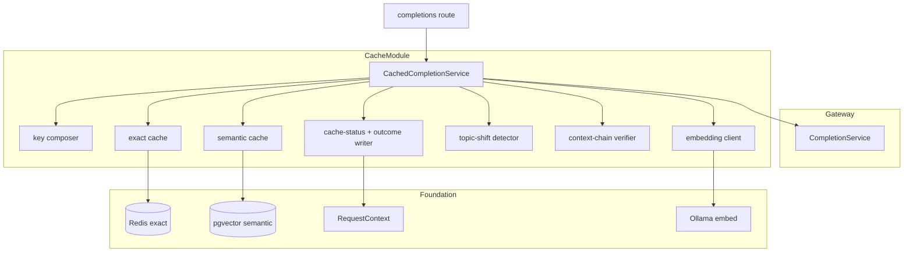
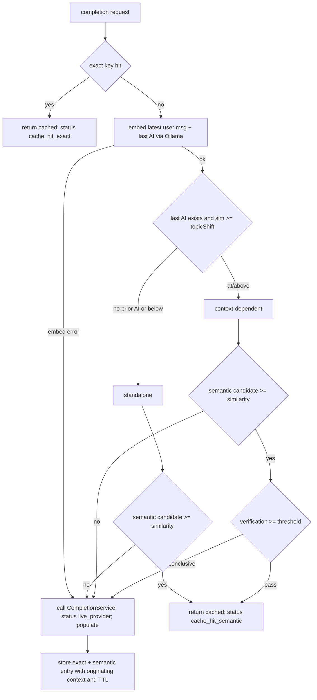

# Technical Design: dual-layer-caching

## Overview

**Purpose**: This feature serves repeated and near-duplicate prompts from cache instead of calling the customer's provider — the gateway's core value proposition. It wraps the completion flow with an exact-match layer (Redis) checked first and a semantic layer (`pgvector` over local Ollama embeddings) checked on an exact miss, both isolated per tenant. Semantic hits are **context-aware**: cheap topic-shift detection first, context-chain verification only on promising candidates, and a safety-biased fallback to a live call whenever detection or verification is uncertain. Every request is tagged with its cache status and its detection/verification outcome for telemetry.

**Users**: Customers (save cost/latency on repeats without their provider key being called) and `telemetry-analytics` (reads the exposed signals to compute savings, hit rate, and the false-hit rate).

**Impact**: Wraps `gateway-provider-routing`'s `CompletionService`, reads the conversation context it surfaces, and adds this spec's own `pgvector` migration. It calls no provider itself (delegates misses to routing), computes no savings/metrics (exposes signals), and never shares cache across tenants.

### Goals
- Exact-then-semantic lookup that returns a cached normalized response and avoids the provider on an accepted hit.
- A key-free semantic layer: local `nomic-embed-text` embeddings + `pgvector` cosine search above a configurable threshold, tenant-scoped.
- Context-aware matching: topic-shift detection, candidate-only context-chain verification, and safety-biased fallback — correctness over hit rate.
- Population of both layers on a miss, configurable TTL, and an invalidation means.
- An accurate `cacheStatus` (`cache_hit_exact` | `cache_hit_semantic` | `live_provider`) plus a detection/verification outcome written to the request context.

### Non-Goals
- Computing estimated savings or emitting metrics/dashboards (`telemetry-analytics`).
- Calling providers on a miss or surfacing the conversation context into `RequestContext` (`gateway-provider-routing`).
- Retries/circuit breaking (`resilience-failover`); cross-tenant cache sharing.
- A perfect classifier: very short low-information follow-ups ("yes", "ok") are an inherent hard case — biased to live and instrumented, not eliminated.

## Boundary Commitments

### This Spec Owns
- The exact-match cache (key composition + Redis storage/TTL) and the semantic cache (`pgvector` search/store/TTL).
- Local embedding generation via Ollama `nomic-embed-text`.
- Context-aware matching: topic-shift detection, context-chain verification (embedding-based), and safety-biased fallback.
- The cache orchestrator that wraps the completion flow and decides hit vs. live.
- Cache population, TTL, and invalidation; storing each semantic entry's originating context.
- The canonical `cacheStatus` vocabulary and the `cacheOutcome` detail signal in the request context.
- Its own `pgvector` migration (`semantic_cache_entries`) and cache config segment (thresholds, TTLs, embedding model).

### Out of Boundary
- Provider calls/normalization (delegated to `gateway-provider-routing`'s `CompletionService`).
- Surfacing the conversation message list / last AI response into the context (owned by `gateway-provider-routing`; this spec reads them).
- Estimated savings, hit-rate/false-hit dashboards, metrics (`telemetry-analytics`).
- Retries/failover; auth/tenant modeling; rate limiting.

### Allowed Dependencies
- `platform-foundation`: `app.pg`/`app.redis`, `app.config`, shared logger, `RequestContext`, migration runner.
- `gateway-provider-routing`: `CompletionService` (wrapped), `NormalizedResponse`, and the conversation-context fields in `RequestContext`.
- `auth-tenancy-credentials`: tenant identity for isolation.
- In-stack Ollama (`/api/embed`, `nomic-embed-text`); no external keyed service. PostgreSQL + Redis only.

### Revalidation Triggers
- The `cacheStatus` vocabulary or the `cacheOutcome` shape (consumed by `telemetry-analytics`).
- The `semantic_cache_entries` schema or the embedding dimension/model.
- The cache config keys (thresholds, TTLs).
- The wrapping contract around `CompletionService` (the completion entrypoint the route calls).
- Dependence on the conversation-context fields (`latestUserMessage`, `lastAssistantMessage`).

## Architecture

### Existing Architecture Analysis
Wraps `gateway-provider-routing`. The gateway route currently invokes `CompletionService`; with caching registered, the route invokes the `CachedCompletionService`, which calls the underlying `CompletionService` only on a miss. Embeddings come from the in-stack Ollama (already running); vectors live in the foundation's `pgvector` (extension enabled by the baseline migration). State stays within the two datastores (Redis exact + Postgres semantic). The conversation context needed for matching is already surfaced by routing.

### Architecture Pattern & Boundary Map

**Selected pattern**: A decorator (`CachedCompletionService`) over `CompletionService`, orchestrating layered cache services. The orchestrator concentrates the correctness-critical branching; exact cache, semantic cache, embedding client, topic-shift detector, and context-chain verifier are cohesive single-purpose units.



**Architecture Integration**:
- Selected pattern: decorator + layered services; one orchestrator owns the decision.
- Domain boundaries: key composition, exact layer, embeddings, semantic layer, detection, verification, and signal-writing are separate units.
- Existing patterns preserved: domain-module layout; wrap-not-modify of routing; `RequestContext` extension via declaration merging; two-datastore rule; migration-per-spec.
- New components rationale: detector/verifier isolate the context-aware logic; the orchestrator keeps correctness-first branching in one reviewable place.
- Steering compliance: key-free cache path; per-tenant isolation; uncertainty → live.

### Technology Stack

| Layer | Choice / Version | Role in Feature | Notes |
|-------|------------------|-----------------|-------|
| Backend / Services | Fastify 5 plugin (TypeScript strict) | Orchestration + wrapping | Registered after gateway |
| Embeddings | Ollama `nomic-embed-text` via `/api/embed` | Local 768-dim embeddings | Key-free; batch user msg + last AI |
| Semantic store | PostgreSQL `pgvector` (`app.pg`) | Cosine search over `vector(768)` | HNSW `vector_cosine_ops` index |
| Exact store | Redis (`app.redis`) | Hash-keyed response cache + TTL | — |
| Config | `zod` (cache env segment) | Thresholds, TTLs, embedding model | Self-contained module config |

## File Structure Plan

### Directory Structure
```
src/modules/cache/
├── index.ts                    # plugin: validate config, wrap CompletionService, expose CachedCompletionService + invalidate
├── config.ts                   # zod segment (similarity/topic-shift/verification thresholds, exact/semantic TTL, embedding model)
├── types.ts                    # CacheStatus, CacheOutcome, TopicShiftDecision, VerificationResult, SemanticEntry, LookupResult
├── context.ts                  # RequestContext refine (cacheStatus) + add cacheOutcome + write helpers
├── cosine.ts                   # in-app cosine similarity for two 768-vectors (detection + verification)
├── key-composer.ts             # params_hash + exact key over (tenant, model, params, canonical messages)
├── embedding-client.ts         # Ollama /api/embed batch embeddings (with failure signaling)
├── exact-cache.ts              # Redis get/set (TTL) + invalidate by tenant
├── semantic-cache.ts           # pgvector nearest search (tenant/model/params/non-expired), store, invalidate
├── topic-shift-detector.ts     # classify standalone vs context-dependent
├── context-chain-verifier.ts   # verify candidate originating context vs current last-AI embedding
└── cache-orchestrator.ts       # CachedCompletionService: the full lookup → decision → populate flow

migrations/
└── {timestamp}_semantic_cache.sql   # semantic_cache_entries + HNSW cosine index + supporting indexes
```

### Modified Files
- `src/app.ts` (foundation) — register the cache plugin after gateway; wire the completion route to the `CachedCompletionService` (the wrapping entrypoint).
- `src/platform/context/types.ts` (foundation) — refine `CacheStatus` to the canonical values (documented revalidation; foundation not yet implemented).
- `.env.example` — add `CACHE_SIMILARITY_THRESHOLD`, `CACHE_TOPIC_SHIFT_THRESHOLD`, `CACHE_VERIFICATION_THRESHOLD`, `CACHE_EXACT_TTL_SECONDS`, `CACHE_SEMANTIC_TTL_SECONDS`, `CACHE_EMBEDDING_MODEL`.

## System Flows

### Lookup, decision, and population


Key decisions: exact is checked before semantic (Req 1.1); a hit never calls a provider (Req 1.2); standalone messages accept a qualifying candidate without verification (Req 5.2); context-dependent messages require verification and, with no candidate, go live (Req 5.3, 6.2); any embedding error, missing candidate, or failed/inconclusive verification biases to live (Req 6.5–6.7); on any live path both layers are populated with the originating context and TTL (Req 7.1, 7.2). Cached and live responses share the normalized schema (Req 1.4).

### Decision table (semantic layer)
| last AI response | topic-shift sim | semantic candidate | verification | outcome |
|------------------|-----------------|--------------------|--------------|---------|
| none | — | any | not run | standalone; accept candidate if present else live |
| present | < threshold | present | not run | standalone; accept (Req 5.2) |
| present | < threshold | none | not run | live (semantic miss) |
| present | ≥ threshold | none | not run | live (Req 5.3) |
| present | ≥ threshold | present | pass | accept `cache_hit_semantic` (Req 6.4) |
| present | ≥ threshold | present | fail/inconclusive | live (Req 6.5) |
| any | any (embed error) | — | — | live (Req 6.6) |

## Requirements Traceability

| Requirement | Summary | Components | Flows |
|-------------|---------|------------|-------|
| 1.1 | Exact first, semantic on exact miss | orchestrator, exact/semantic cache | Lookup |
| 1.2 | Accepted hit returns cached, no provider | orchestrator | Lookup |
| 1.3 | Full miss/reject → live then populate | orchestrator, CompletionService | Lookup |
| 1.4 | Cached response uses normalized schema | orchestrator, semantic store | — |
| 2.1 | Exact key from tenant/model/params/prompt | key composer | Lookup |
| 2.2 | Exact key match → exact hit | exact cache | Lookup |
| 2.3 | Exact miss → semantic layer | orchestrator | Lookup |
| 3.1 | Embed prompt, search most similar in tenant | embedding client, semantic cache | Lookup |
| 3.2 | Only ≥ similarity threshold are candidates | semantic cache | Lookup |
| 3.3 | No qualifying entry → semantic miss → live | orchestrator | Lookup |
| 3.4 | Local embeddings, no external keyed call | embedding client | Lookup |
| 3.5 | Similarity threshold configurable | cache config | — |
| 4.1 | Every entry scoped to producing tenant | semantic cache, key composer, migration | — |
| 4.2 | Lookups consider only that tenant's entries | exact/semantic cache | Lookup |
| 4.3 | Never serve another tenant's entry | semantic cache (tenant filter) | Lookup |
| 5.1 | Classify via similarity to last AI response | topic-shift detector | Lookup |
| 5.2 | Below threshold → standalone, accept on msg | detector, orchestrator | Lookup |
| 5.3 | At/above → context-dependent, require verify | detector, orchestrator | Lookup |
| 5.4 | No prior AI → standalone | detector | Lookup |
| 5.5 | Topic-shift threshold configurable | cache config | — |
| 6.1 | Verify candidate context alignment | context-chain verifier | Lookup |
| 6.2 | Verify only context-dependent w/ candidate | orchestrator | Lookup |
| 6.3 | Verification key-free (embedding-based) | verifier, embedding client | Lookup |
| 6.4 | Verification pass → accept | orchestrator | Lookup |
| 6.5 | Fail/inconclusive → live | orchestrator | Lookup |
| 6.6 | Unreliable detection/verification → live | orchestrator | Lookup |
| 6.7 | Correctness over hit rate | orchestrator | Lookup |
| 7.1 | Populate both layers on miss | orchestrator, exact/semantic cache | Lookup |
| 7.2 | Store originating context for verification | semantic cache, migration | Lookup |
| 7.3 | Configurable TTL; don't serve expired | exact/semantic cache, config | — |
| 7.4 | Provide invalidation | exact/semantic cache | — |
| 8.1 | Record one of three cache statuses | signals writer | Lookup |
| 8.2 | Record detection/verification outcome | signals writer | Lookup |
| 8.3 | Status reflects whether provider was called | orchestrator, signals | Lookup |
| 8.4 | Expose signals only; no savings/metrics | signals writer | — |

## Components and Interfaces

| Component | Domain/Layer | Intent | Req Coverage | Key Dependencies (P0/P1) | Contracts |
|-----------|--------------|--------|--------------|--------------------------|-----------|
| Cache Config | config | Thresholds, TTLs, embedding model | 3.5, 5.5, 7.3 | zod (P0) | State |
| Cache Types & Context | types/context | Status/outcome contracts + write helpers | 8.1, 8.2 | RequestContext (P0) | State |
| Key Composer | keying | params_hash + exact key | 2.1, 4.1 | — | Service |
| Embedding Client | embeddings | Local batch embeddings | 3.1, 3.4, 6.3 | Ollama (P0), config (P0) | Service |
| Exact Cache | store | Redis get/set/TTL/invalidate | 2.2, 2.3, 4.2, 7.1, 7.3, 7.4 | app.redis (P0) | Service, State |
| Semantic Cache | store | pgvector search/store/TTL/invalidate | 3.1, 3.2, 4.1, 4.2, 4.3, 7.1, 7.2, 7.3, 7.4 | app.pg (P0), cosine index (P0) | Service, State |
| Topic-Shift Detector | matching | Standalone vs context-dependent | 5.1, 5.2, 5.3, 5.4 | cosine (P0), config (P0) | Service |
| Context-Chain Verifier | matching | Verify candidate context alignment | 6.1, 6.3, 6.4, 6.5 | cosine (P0), config (P0) | Service |
| Cache Orchestrator | orchestration | Full lookup→decision→populate; wraps completion | 1.1–1.4, 2.3, 3.3, 5.2, 5.3, 6.2, 6.4–6.7, 7.1, 8.1–8.3 | all above (P0), CompletionService (P0) | Service |
| Signals Writer | telemetry-facing | Write cacheStatus + cacheOutcome | 8.1, 8.2, 8.3, 8.4 | RequestContext (P0) | State |
| Semantic Migration | data | `semantic_cache_entries` + index | 4.1, 7.2 | migration runner (P0) | State |

### embeddings & matching

#### Embedding Client, Topic-Shift Detector, Context-Chain Verifier

| Field | Detail |
|-------|--------|
| Intent | Produce local embeddings and run the two context-aware checks |
| Requirements | 3.1, 3.4, 5.1–5.4, 6.1, 6.3, 6.4, 6.5 |

**Responsibilities & Constraints**
- Embedding client: batch-embed the latest user message and last AI response via Ollama `/api/embed`; signal failure (→ orchestrator falls back to live).
- Topic-shift detector: `standalone` when there is no prior AI response or `cosine(userMsg, lastAI) < topicShiftThreshold`; else `context_dependent` (Req 5).
- Context-chain verifier: for a context-dependent candidate, `pass` when `cosine(currentLastAI, candidate.originatingContext) >= verificationThreshold`; `inconclusive` when the candidate has no stored originating context; else `fail` (Req 6).

**Contracts**: Service [x]

##### Service Interface
```typescript
interface EmbeddingClient {
  embed(texts: string[]): Promise<number[][]>; // throws EmbeddingUnavailableError → live fallback
}

type TopicShiftDecision = 'standalone' | 'context_dependent' | 'no_prior_ai';
interface TopicShiftDetector {
  classify(userMsgEmbedding: number[], lastAiEmbedding: number[] | null): { decision: TopicShiftDecision; similarity: number | null };
}

type VerificationResult = 'passed' | 'failed' | 'inconclusive';
interface ContextChainVerifier {
  verify(currentLastAiEmbedding: number[] | null, candidateOriginatingContext: number[] | null): { result: VerificationResult; similarity: number | null };
}
```
- Invariants: no external/keyed call (Req 3.4, 6.3); thresholds come from config (Req 5.5).

### store

#### Exact Cache & Semantic Cache

| Field | Detail |
|-------|--------|
| Intent | Store and retrieve cached responses, tenant-scoped, with TTL and invalidation |
| Requirements | 2.2, 2.3, 3.1–3.3, 4.1–4.3, 7.1–7.4 |

**Responsibilities & Constraints**
- Exact cache: key `cache:exact:{sha256(tenant|model|params_hash|canonicalMessages)}` → `NormalizedResponse` JSON with TTL; only the requesting tenant's key can match (tenant in the key) (Req 4.2).
- Semantic cache: insert `(tenant_id, model, params_hash, prompt_text, prompt_embedding, originating_context_embedding, response_json, expires_at)`; nearest search `WHERE tenant_id=$1 AND model=$2 AND params_hash=$3 AND expires_at>now() ORDER BY prompt_embedding <=> $q LIMIT 1`, qualifying when `1 - distance >= similarityThreshold` (Req 3.2, 4.3); invalidate by tenant.

**Contracts**: Service [x] / State [x]

##### Service Interface
```typescript
interface ExactCache {
  get(key: string): Promise<NormalizedResponse | null>;
  set(key: string, value: NormalizedResponse, ttlSeconds: number): Promise<void>;
  invalidate(tenantId: string): Promise<void>;
}

interface SemanticCandidate {
  response: NormalizedResponse;
  similarity: number;
  originatingContext: number[] | null;
}
interface SemanticCache {
  search(scope: { tenantId: string; model: string; paramsHash: string }, queryEmbedding: number[]): Promise<SemanticCandidate | null>;
  store(entry: {
    tenantId: string; model: string; paramsHash: string;
    promptText: string; promptEmbedding: number[];
    originatingContextEmbedding: number[] | null;
    response: NormalizedResponse; ttlSeconds: number;
  }): Promise<void>;
  invalidate(tenantId: string): Promise<void>;
}
```
- Invariants: all reads/writes filtered by `tenant_id` (Req 4); expired entries never returned (Req 7.3).

### orchestration

#### Cache Orchestrator (CachedCompletionService)

| Field | Detail |
|-------|--------|
| Intent | Run the full lookup/decision/populate flow and wrap the completion service |
| Requirements | 1.1–1.4, 2.3, 3.3, 5.2, 5.3, 6.2, 6.4–6.7, 7.1, 8.1–8.3 |

**Responsibilities & Constraints**
- Implements the same contract as `CompletionService` so the route can call it transparently. Executes exact → embed → detect → semantic → verify → decide, calling the injected `CompletionService` only on a miss/reject, then populating both layers. Writes `cacheStatus` and `cacheOutcome`. Biases to live on any uncertainty (Req 6.6, 6.7).

**Dependencies**: Outbound: all cache components (P0), `CompletionService` (P0), Signals Writer (P0). Inbound: completions route; `telemetry-analytics` reads the signals (P1).

**Contracts**: Service [x]

##### Service Interface
```typescript
// Mirrors gateway CompletionService so it substitutes as the completion entrypoint
interface CachedCompletionService {
  complete(input: { tenantId: string; request: ChatCompletionRequest; perRequestKey?: string; ctx: RequestContext }): Promise<NormalizedResponse>;
}
```
- Preconditions: `ctx` carries `latestUserMessage`/`lastAssistantMessage` (surfaced by routing).
- Postconditions: returns a `NormalizedResponse` (cached or live); `cacheStatus` reflects the actual path; on live, both layers populated.
- Invariants: a provider is called iff `cacheStatus = live_provider` (Req 8.3); never serves cross-tenant (Req 4.3).

**Implementation Notes**
- Integration: registered as the completion entrypoint the route calls; wraps the gateway `CompletionService` (documented touchpoint). `resilience-failover` later wraps the underlying provider call, beneath this cache layer.
- Validation: unit tests drive the decision table; integration tests prove exact/semantic hits, isolation, verification, and fallback.
- Risks: keep the branching centralized and covered; short low-info follow-ups documented as an inherent hard case, biased to live.

### telemetry-facing

#### Cache Types, Context & Signals Writer

**Contracts**: State [x] (Req 8.1–8.4)
```typescript
type CacheStatus = 'unknown' | 'cache_hit_exact' | 'cache_hit_semantic' | 'live_provider';
interface CacheOutcome {
  topicShift: TopicShiftDecision;
  topicShiftSimilarity: number | null;
  semanticCandidate: boolean;
  candidateSimilarity: number | null;
  verification: VerificationResult | 'not_run';
  fellBackToLive: boolean;
}
// RequestContext: refine cacheStatus to CacheStatus (default 'unknown'); add cacheOutcome: CacheOutcome | null (default null)
```
- Writes exactly one status and one outcome per request; computes no savings/metrics (Req 8.4).

## Data Models

### Physical Data Model (PostgreSQL — this spec's migration)
```
semantic_cache_entries
  id                            uuid PRIMARY KEY DEFAULT gen_random_uuid()
  tenant_id                     uuid NOT NULL REFERENCES tenants(id) ON DELETE CASCADE
  model                         text NOT NULL
  params_hash                   text NOT NULL
  prompt_text                   text NOT NULL
  prompt_embedding              vector(768) NOT NULL
  originating_context_embedding vector(768)                 -- NULL when no prior AI response
  response_json                 jsonb NOT NULL              -- stored NormalizedResponse
  created_at                    timestamptz NOT NULL DEFAULT now()
  expires_at                    timestamptz NOT NULL

  INDEX hnsw (prompt_embedding vector_cosine_ops)           -- cosine ANN search
  INDEX (tenant_id, model, params_hash)                     -- scope filter
  INDEX (expires_at)                                        -- expiry sweeps
```

**Exact layer (Redis)**: `cache:exact:{sha256(tenant|model|params_hash|canonicalMessages)}` → `NormalizedResponse` JSON, `EX` = exact TTL.

**Consistency & Integrity**: tenant-scoped by FK + query filters (Req 4); expired entries excluded by `expires_at > now()` and Redis TTL (Req 7.3); the response is stored as the normalized schema so hits and misses are indistinguishable in shape (Req 1.4). The two-datastore rule holds (Redis + Postgres only).

## Error Handling

### Error Strategy
The cache is a best-effort accelerator: any cache-path failure biases to a correct live response rather than failing the request.

### Error Categories and Responses
- **Embedding unavailable / Ollama error**: fall back to live; record `fellBackToLive` (Req 6.6).
- **Semantic search / DB error**: treat as a miss, go live (logged); never serve a stale/uncertain entry.
- **Verification inconclusive** (missing stored context): reject candidate → live (Req 6.5).
- **Population failure after a live response**: return the live response regardless; log the cache-write failure (cache stays best-effort).

### Monitoring
Structured logs of the decision path (status, topic-shift, verification) without secrets or full prompts at info level. Metrics/dashboards are out of boundary (`telemetry-analytics`).

## Testing Strategy

Tests are co-located with the file under test (see `structure.md`): unit tests as `<name>.test.ts`
beside `<name>.ts`, integration tests as `<name>.integration.test.ts` beside the module they
exercise. There is no separate `test/` tree; the two Vitest suites are selected by filename suffix,
not by directory.

### Unit Tests
- Key composer: identical `(tenant, model, params, messages)` yield the same key; any change yields a different key (2.1).
- Topic-shift detector: no prior AI → standalone; below threshold → standalone; at/above → context-dependent (5.1–5.4).
- Context-chain verifier: aligned contexts pass; misaligned fail; missing stored context → inconclusive (6.1, 6.4, 6.5).
- Orchestrator decision table: each row of the semantic decision table yields the specified outcome, including all fallbacks (5.2, 5.3, 6.2, 6.4–6.7).
- Signals: exactly one `cacheStatus` and one `cacheOutcome` per request; status matches whether the provider was called (8.1–8.3).

### Integration Tests (against dockerized Postgres/pgvector, Redis, Ollama)
- Exact path: a repeated identical request returns `cache_hit_exact` and does not call the provider (1.1, 1.2, 2.2).
- Semantic standalone: a near-duplicate standalone prompt returns `cache_hit_semantic` above threshold; below threshold goes live (3.1–3.3, 5.2).
- Context-dependent: a follow-up matching an unrelated cached entry is rejected by verification and goes live; a genuinely aligned follow-up is accepted (6.1, 6.4, 6.5).
- Isolation: tenant A's entries are never returned to tenant B, even on a semantic match (4.1–4.3).
- Population/TTL: a miss populates both layers with the originating context; an expired entry is not served (7.1–7.3); invalidation removes entries (7.4).

## Performance & Scalability
- One HNSW cosine query and at most one batch embedding call per request; both sub-10ms class on the local stack.
- `ef_search` tunable for recall; a recall miss only costs a live call (correctness preserved by threshold + verification).
- Per-tenant scoping keeps searches small; TTL + invalidation bound table growth.

## Security Considerations
- Per-tenant isolation is enforced in the key (exact) and in every query filter (semantic); no cross-tenant serving even on a semantic match (Req 4.3).
- The cache path is key-free and offline — no provider credential is used or exposed on a hit (reinforces the value proposition).
- Stored `response_json` is a normalized response containing no provider credential; prompts are not logged in full at info level.
