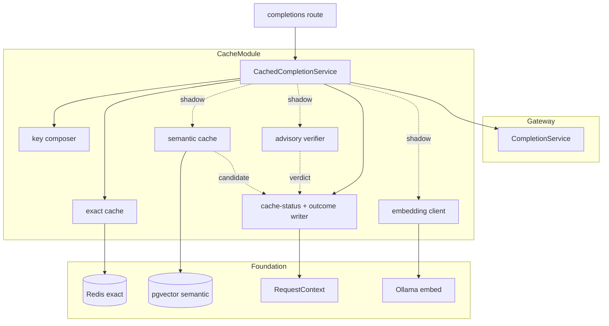
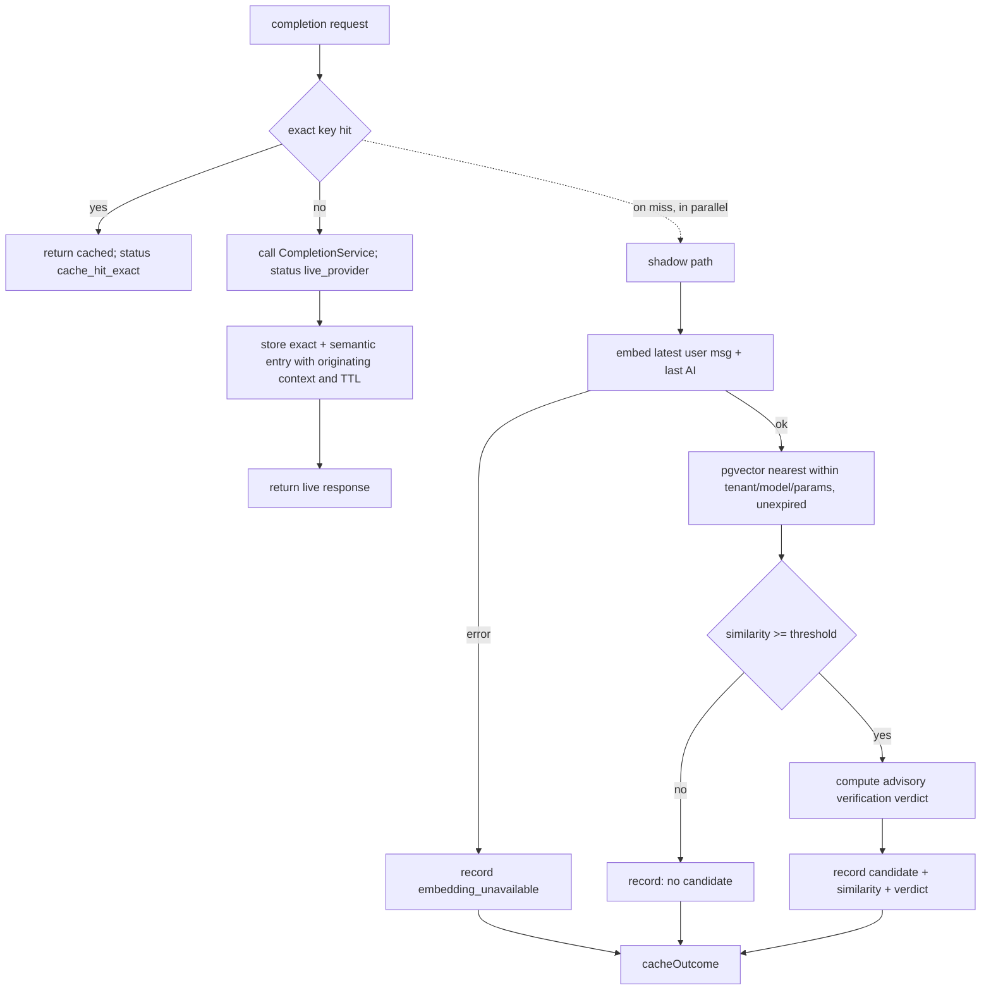

# Technical Design: dual-layer-caching

## Overview

**Purpose**: This feature serves repeated prompts from cache instead of calling the customer's provider. It wraps the completion flow with an exact-match layer (Redis) checked first and a semantic layer (`pgvector` over local Ollama embeddings) that runs on an exact miss **in shadow** — it searches, records the candidate it would have served, and the request goes live regardless. A committed benchmark harness measures the false-hit rate that serving those candidates would have produced. Every request is tagged with its cache status and its candidate outcome for telemetry.

> **Design revision 2026-08-08.** The original design accepted a semantic candidate above a similarity threshold, guarded by topic-shift detection and context-chain verification. Both guards were measured before implementation and both failed (`research.md` → Measurement Log, E1–E4). The semantic decision table below has been replaced by an unconditional live path; the topic-shift detector is deleted; the verifier is reduced to an advisory instrument. **Serving a semantic candidate is now the one thing this design forbids.**

**Users**: Customers (save cost/latency on exact repeats without their provider key being called) and `telemetry-analytics` (reads the exposed signals). The benchmark's reader is an engineer evaluating whether the semantic layer can be promoted.

**Impact**: Wraps `gateway-provider-routing`'s `CompletionService`, reads the conversation context it surfaces, and adds this spec's own `pgvector` migration. It calls no provider itself (delegates misses to routing), computes no savings/metrics (exposes signals), and never shares cache across tenants.

### Goals
- Exact-match lookup that returns a cached normalized response and avoids the provider on a hit.
- A key-free, tenant-scoped semantic store: local `nomic-embed-text` embeddings + `pgvector` cosine search above a configurable threshold — correct mechanics, running in shadow.
- A structural guarantee that no semantic candidate reaches a client: no code path from candidate to response.
- Population of both layers on a miss, configurable TTL, and an invalidation means.
- An accurate `cacheStatus` plus a candidate/verification outcome written to the request context.
- A committed, reproducible benchmark reporting the would-be false-hit rate over labelled fixtures.

### Non-Goals
- **Serving near-duplicate prompts from cache.** Withdrawn by measurement, not deferred. The semantic hit rate of this gateway is zero and the README must say so.
- Topic-shift classification (Req 5, withdrawn — performs below chance).
- Computing estimated savings or emitting metrics/dashboards (`telemetry-analytics`).
- Calling providers on a miss or surfacing the conversation context into `RequestContext` (`gateway-provider-routing`).
- Retries/circuit breaking (`resilience-failover`); cross-tenant cache sharing.
- Reaching a target hit rate or false-hit rate. The benchmark reports what is true; it does not have to report a good number.

## Boundary Commitments

### This Spec Owns
- The exact-match cache (key composition + Redis storage/TTL) and the semantic cache (`pgvector` search/store/TTL).
- Local embedding generation via Ollama `nomic-embed-text`.
- The shadow semantic path: candidate recording and the advisory (non-gating) context-chain verdict.
- The cache orchestrator that wraps the completion flow and decides exact-hit vs. live.
- Cache population, TTL, and invalidation; storing each semantic entry's originating context.
- The canonical `cacheStatus` vocabulary and the `cacheOutcome` detail signal in the request context.
- Its own `pgvector` migration (`semantic_cache_entries`) and cache config segment (thresholds, TTLs, embedding model).
- The false-hit benchmark harness and its labelled fixtures (Req 9).

### Out of Boundary
- Provider calls/normalization (delegated to `gateway-provider-routing`'s `CompletionService`).
- Surfacing the conversation message list / last AI response into the context (owned by `gateway-provider-routing`; this spec reads them).
- Estimated savings, hit-rate/false-hit dashboards, metrics (`telemetry-analytics`).
- Retries/failover; auth/tenant modeling; rate limiting.

### Allowed Dependencies
- `platform-foundation`: `app.pg`/`app.redis`, `app.config`, shared logger, `RequestContext`, migration runner.
- `gateway-provider-routing`: `CompletionService` (wrapped), `NormalizedResponse`, and the conversation-context fields in `RequestContext`.
- `auth-tenancy-credentials`: tenant identity for isolation.
- In-stack Ollama (`/api/embed`, `nomic-embed-text`); no external keyed service. PostgreSQL + Redis only.

### Revalidation Triggers
- The `cacheStatus` vocabulary or the `cacheOutcome` shape (consumed by `telemetry-analytics`).
- The `semantic_cache_entries` schema or the embedding dimension/model.
- The cache config keys (thresholds, TTLs).
- The wrapping contract around `CompletionService` (the completion entrypoint the route calls).
- Dependence on the conversation-context fields (`latestUserMessage`, `lastAssistantMessage`).
- **Promoting the semantic layer out of shadow.** Requires benchmark evidence clearing the promote criterion (zero false accepts at ≥40% recall, <300 ms p95) and a revision of Req 1.5 and 3.2–3.3. This is a requirements-level change, not a config flip.

## Architecture

### Existing Architecture Analysis
Wraps `gateway-provider-routing`. The gateway route currently invokes `CompletionService`; with caching registered, the route invokes the `CachedCompletionService`, which calls the underlying `CompletionService` only on a miss. Embeddings come from the in-stack Ollama (already running); vectors live in the foundation's `pgvector` (extension enabled by the baseline migration). State stays within the two datastores (Redis exact + Postgres semantic). The conversation context needed for matching is already surfaced by routing.

### Architecture Pattern & Boundary Map

**Selected pattern**: A decorator (`CachedCompletionService`) over `CompletionService`, orchestrating layered cache services. The orchestrator holds the one remaining decision — exact hit or live — and drives the shadow semantic path as a side effect that cannot influence the response.

The dashed edges below are the shadow path. Note that nothing flows from the semantic layer back into the response: `Semantic` and `Verifier` reach only `Signals`.


```mermaid
graph TB
    subgraph Foundation
        Redis[(Redis exact)]
        PG[(pgvector semantic)]
        Ctx[RequestContext]
        Ollama[Ollama embed]
    end
    subgraph Gateway
        Completion[CompletionService]
    end
    subgraph CacheModule
        Orchestrator[CachedCompletionService]
        KeyComposer[key composer]
        Exact[exact cache]
        Embed[embedding client]
        Semantic[semantic cache]
        Verifier[advisory verifier]
        Signals[cache-status + outcome writer]
    end
    Route[completions route] --> Orchestrator
    Orchestrator --> KeyComposer
    Orchestrator --> Exact
    Exact --> Redis
    Orchestrator --> Completion
    Orchestrator -.shadow.-> Embed
    Embed --> Ollama
    Orchestrator -.shadow.-> Semantic
    Semantic --> PG
    Orchestrator -.shadow.-> Verifier
    Semantic -.candidate.-> Signals
    Verifier -.verdict.-> Signals
    Orchestrator --> Signals
    Signals --> Ctx
```

**Architecture Integration**:
- Selected pattern: decorator + layered services; the orchestrator owns the exact-vs-live decision.
- Domain boundaries: key composition, exact layer, embeddings, semantic layer, advisory verification, and signal-writing are separate units.
- Existing patterns preserved: domain-module layout; wrap-not-modify of routing; `RequestContext` extension via declaration merging; two-datastore rule; migration-per-spec.
- **Shadow isolation is structural, not conditional.** The semantic search result is typed into the outcome signal, never into the return value — there is no `if (accept)` branch to get wrong, and no config flag that enables serving. Promotion means writing new code under a revised requirement, which is the intended friction.
- Steering compliance: key-free cache path; per-tenant isolation; correctness over hit rate, applied to its conclusion.
- **Deleted vs. the original design**: the topic-shift detector (Req 5 withdrawn) and the candidate-acceptance branch of the orchestrator.

### Technology Stack

| Layer | Choice / Version | Role in Feature | Notes |
|-------|------------------|-----------------|-------|
| Backend / Services | Fastify 5 plugin (TypeScript strict) | Orchestration + wrapping | Registered after gateway |
| Embeddings | Ollama `nomic-embed-text` via `/api/embed` | Local 768-dim embeddings | Key-free; batch user msg + last AI |
| Semantic store | PostgreSQL `pgvector` (`app.pg`) | Cosine search over `vector(768)` | HNSW `vector_cosine_ops` index |
| Exact store | Redis (`app.redis`) | Hash-keyed response cache + TTL | — |
| Config | `zod` (cache env segment) | Thresholds, TTLs, embedding model | Self-contained module config |

## File Structure Plan

### Directory Structure
```
src/modules/cache/
├── index.ts                    # plugin: validate config, wrap CompletionService, expose CachedCompletionService + invalidate
├── config.ts                   # zod segment (similarity + verification thresholds, exact/semantic TTL, embedding model)
├── types.ts                    # CacheStatus, CacheOutcome, VerificationResult, SemanticEntry, LookupResult
├── context.ts                  # RequestContext refine (cacheStatus) + add cacheOutcome + write helpers
├── cosine.ts                   # in-app cosine similarity for two 768-vectors (detection + verification)
├── key-composer.ts             # params_hash + exact key over (tenant, model, params, canonical messages)
├── embedding-client.ts         # Ollama /api/embed batch embeddings (with failure signaling)
├── exact-cache.ts              # Redis get/set (TTL) + invalidate by tenant
├── semantic-cache.ts           # pgvector nearest search (tenant/model/params/non-expired), store, invalidate
├── context-chain-verifier.ts   # ADVISORY verdict: candidate originating context vs current last-AI embedding
└── cache-orchestrator.ts       # CachedCompletionService: exact → live, with the shadow path as a side effect

scripts/bench/
├── false-hit-bench.ts          # Req 9 harness: runs an acceptance rule over fixtures, reports the numbers
├── acceptance-rules.ts         # pluggable rules under test (threshold rule today; a future mechanism next)
└── fixtures/
    └── prompt-pairs.json       # labelled pairs: {a, b, sameAnswer: boolean, class}

migrations/
└── {timestamp}_semantic_cache.sql   # semantic_cache_entries + HNSW cosine index + supporting indexes
```

**Deleted from the original plan**: `topic-shift-detector.ts` (Req 5 withdrawn).

`scripts/bench/` sits outside `src/` deliberately: it is a reported experiment, not shipped runtime,
and Req 9.6 keeps it out of both Vitest projects so a slow local model run never gates `npm test`.
It is wired as `npm run bench:false-hit`.

### Modified Files
- `src/app.ts` (foundation) — register the cache plugin after gateway; wire the completion route to the `CachedCompletionService` (the wrapping entrypoint).
- `src/platform/context/types.ts` (foundation) — refine `CacheStatus` to the canonical values (documented revalidation; foundation not yet implemented).
- `.env.example` — add `CACHE_SIMILARITY_THRESHOLD`, `CACHE_VERIFICATION_THRESHOLD`, `CACHE_EXACT_TTL_SECONDS`, `CACHE_SEMANTIC_TTL_SECONDS`, `CACHE_EMBEDDING_MODEL`. **Remove `CACHE_TOPIC_SHIFT_THRESHOLD`** — it shipped with task 1.2 and now configures nothing (task 1.5).
- `package.json` — add `bench:false-hit` (Req 9.3).

## System Flows

### Lookup, shadow observation, and population

```mermaid
graph TD
    Start[completion request] --> Exact{exact key hit}
    Exact -- yes --> HitE[return cached; status cache_hit_exact]
    Exact -- no --> Live[call CompletionService; status live_provider]
    Live --> Populate[store exact + semantic entry with originating context and TTL]
    Populate --> Return[return live response]

    Exact -. on miss, in parallel .-> Shadow[shadow path]
    Shadow --> Emb[embed latest user msg + last AI]
    Emb -- error --> RecErr[record embedding_unavailable]
    Emb -- ok --> Search[pgvector nearest within tenant/model/params, unexpired]
    Search --> Cand{similarity >= threshold}
    Cand -- no --> RecNone[record: no candidate]
    Cand -- yes --> Verdict[compute advisory verification verdict]
    Verdict --> RecCand[record candidate + similarity + verdict]
    RecErr --> Signals[cacheOutcome]
    RecNone --> Signals
    RecCand --> Signals
```

Key decisions: exact is checked first and a hit never calls a provider (Req 1.1, 1.2). **Every exact
miss goes live** — the shadow path has no edge into the response (Req 1.5, 3.3). A shadow failure of
any kind (embedder down, DB error) is recorded and discarded; it cannot fail or delay the request
(Req 3.6). On the live path both layers are populated with the originating context and TTL (Req 7.1,
7.2). Cached and live responses share the normalized schema (Req 1.4).

### Outcome table (what the shadow path records)
There is no decision table any more — the outcome does not depend on these values, which is the
point. This table defines what is *recorded*, and every row returns a live response.

| semantic candidate | advisory verdict | `cacheOutcome` recorded | response |
|--------------------|------------------|--------------------------|----------|
| embed/search failed | not run | `shadowError`, `candidate: false` | live |
| none ≥ threshold | not run | `candidate: false`, best similarity | live |
| present, stored context aligned | `passed` | candidate + similarity + `passed` | live |
| present, stored context misaligned | `failed` | candidate + similarity + `failed` | live |
| present, no stored context | `inconclusive` | candidate + similarity + `inconclusive` | live |

A `passed` verdict is the case worth reading in telemetry: it is where the original design would
have served a hit. The benchmark (Req 9) is what says how many of those would have been wrong.

## Requirements Traceability

| Requirement | Summary | Components | Flows |
|-------------|---------|------------|-------|
| 1.1 | Exact first, semantic on exact miss | orchestrator, exact/semantic cache | Lookup |
| 1.2 | Accepted hit returns cached, no provider | orchestrator | Lookup |
| 1.3 | Exact miss → live then populate both layers | orchestrator, CompletionService | Lookup |
| 1.4 | Cached response uses normalized schema | orchestrator, semantic store | — |
| 1.5 | Never serve a semantic candidate | orchestrator (no candidate→response edge) | Lookup |
| 2.1 | Exact key from tenant/model/params/prompt | key composer | Lookup |
| 2.2 | Exact key match → exact hit | exact cache | Lookup |
| 2.3 | Exact miss → semantic layer | orchestrator | Lookup |
| 3.1 | Embed prompt, search most similar in tenant | embedding client, semantic cache | Lookup |
| 3.2 | ≥ threshold = recorded candidate, not an authorization | semantic cache, signals writer | Lookup |
| 3.3 | Live regardless of candidate | orchestrator | Lookup |
| 3.4 | Local embeddings, no external keyed call | embedding client | Lookup |
| 3.5 | Similarity threshold configurable | cache config | — |
| 3.6 | Shadow failure recorded, request completes live | orchestrator | Lookup |
| 4.1 | Every entry scoped to producing tenant | semantic cache, key composer, migration | — |
| 4.2 | Lookups consider only that tenant's entries | exact/semantic cache | Lookup |
| 4.3 | Never serve another tenant's entry | semantic cache (tenant filter) | Lookup |
| ~~5.1–5.5~~ | ~~Topic-shift detection~~ | **WITHDRAWN — nothing implements Req 5** | — |
| 6.1 | Advisory verdict on every recorded candidate | context-chain verifier | Lookup |
| 6.2 | Verdict computed only when a candidate exists | orchestrator | Lookup |
| 6.3 | Verdict key-free (embedding-based) | verifier, embedding client | Lookup |
| 6.4 | Verdict ∈ passed/failed/inconclusive | verifier | Lookup |
| 6.5 | Verdict cannot affect the response | orchestrator (structural) | Lookup |
| 6.6 | Correctness over hit rate | orchestrator | Lookup |
| 7.1 | Populate both layers on miss | orchestrator, exact/semantic cache | Lookup |
| 7.2 | Store originating context for verification | semantic cache, migration | Lookup |
| 7.3 | Configurable TTL; don't serve expired | exact/semantic cache, config | — |
| 7.4 | Provide invalidation | exact/semantic cache | — |
| 8.1 | Record one of three cache statuses | signals writer | Lookup |
| 8.2 | Record candidate + similarity + verdict | signals writer | Lookup |
| 8.3 | Status reflects whether provider was called | orchestrator, signals | Lookup |
| 8.4 | Expose signals only; no savings/metrics | signals writer | — |
| 8.5 | `cache_hit_semantic` never emitted in shadow | orchestrator | Lookup |
| 9.1 | Labelled fixture set committed | `scripts/bench/fixtures/` | Benchmark |
| 9.2 | Report false accepts, recall, distributions | benchmark harness | Benchmark |
| 9.3 | One documented command, reproducible | `npm run bench:false-hit` | Benchmark |
| 9.4 | Report numbers, do not assert a threshold | benchmark harness | Benchmark |
| 9.5 | Pluggable alternative acceptance mechanism | `acceptance-rules.ts` | Benchmark |
| 9.6 | Outside the unit/integration suites | `scripts/` placement | — |

## Components and Interfaces

| Component | Domain/Layer | Intent | Req Coverage | Key Dependencies (P0/P1) | Contracts |
|-----------|--------------|--------|--------------|--------------------------|-----------|
| Cache Config | config | Thresholds, TTLs, embedding model | 3.5, 5.5, 7.3 | zod (P0) | State |
| Cache Types & Context | types/context | Status/outcome contracts + write helpers | 8.1, 8.2 | RequestContext (P0) | State |
| Key Composer | keying | params_hash + exact key | 2.1, 4.1 | — | Service |
| Embedding Client | embeddings | Local batch embeddings | 3.1, 3.4, 6.3 | Ollama (P0), config (P0) | Service |
| Exact Cache | store | Redis get/set/TTL/invalidate | 2.2, 2.3, 4.2, 7.1, 7.3, 7.4 | app.redis (P0) | Service, State |
| Semantic Cache | store | pgvector search/store/TTL/invalidate | 3.1, 3.2, 4.1, 4.2, 4.3, 7.1, 7.2, 7.3, 7.4 | app.pg (P0), cosine index (P0) | Service, State |
| Context-Chain Verifier | matching | **Advisory** context-alignment verdict; gates nothing | 6.1, 6.3, 6.4 | cosine (P0), config (P0) | Service |
| Cache Orchestrator | orchestration | Exact→live, with the shadow path as a recorded side effect | 1.1–1.5, 2.3, 3.3, 3.6, 6.2, 6.5, 6.6, 7.1, 8.1–8.3, 8.5 | all above (P0), CompletionService (P0) | Service |
| Signals Writer | telemetry-facing | Write cacheStatus + cacheOutcome | 8.1, 8.2, 8.3, 8.4 | RequestContext (P0) | State |
| Semantic Migration | data | `semantic_cache_entries` + index | 4.1, 7.2 | migration runner (P0) | State |
| Benchmark Harness | measurement | Would-be false-hit rate over labelled fixtures | 9.1–9.6 | embedding client (P0), fixtures (P0) | Service |

**Removed**: Topic-Shift Detector (Req 5 withdrawn — see `research.md` E3).

### embeddings & matching

#### Embedding Client, Context-Chain Verifier

| Field | Detail |
|-------|--------|
| Intent | Produce local embeddings and an advisory context-alignment verdict |
| Requirements | 3.1, 3.4, 6.1, 6.3, 6.4 |

**Responsibilities & Constraints**
- Embedding client: batch-embed the latest user message and last AI response via Ollama `/api/embed`; signal failure (→ the shadow path records the failure and is abandoned; the request goes live either way).
- Context-chain verifier: for a recorded candidate, `passed` when `cosine(currentLastAI, candidate.originatingContext) >= verificationThreshold`; `inconclusive` when the candidate has no stored originating context; else `failed` (Req 6.4). **The return value is written to `cacheOutcome` and read by nothing else** (Req 6.5).

**Contracts**: Service [x]

##### Service Interface
```typescript
interface EmbeddingClient {
  embed(texts: string[]): Promise<number[][]>; // throws EmbeddingUnavailableError → shadow path abandoned
}

type VerificationResult = 'passed' | 'failed' | 'inconclusive';
interface ContextChainVerifier {
  // ADVISORY ONLY (Req 6.5). Callers must not branch on this result.
  verify(currentLastAiEmbedding: number[] | null, candidateOriginatingContext: number[] | null): { result: VerificationResult; similarity: number | null };
}
```
- Invariants: no external/keyed call (Req 3.4, 6.3); thresholds come from config.
- **Removed**: `TopicShiftDetector` and `TopicShiftDecision` (Req 5 withdrawn). If a `topicShift` field
  is found in any code or context type, it is a leftover and should be deleted, not populated.

### store

#### Exact Cache & Semantic Cache

| Field | Detail |
|-------|--------|
| Intent | Store and retrieve cached responses, tenant-scoped, with TTL and invalidation |
| Requirements | 2.2, 2.3, 3.1–3.3, 4.1–4.3, 7.1–7.4 |

**Responsibilities & Constraints**
- Exact cache: key `cache:exact:{sha256(tenant|model|params_hash|canonicalMessages)}` → `NormalizedResponse` JSON with TTL; only the requesting tenant's key can match (tenant in the key) (Req 4.2).
- Semantic cache: insert `(tenant_id, model, params_hash, prompt_text, prompt_embedding, originating_context_embedding, response_json, expires_at)`; nearest search `WHERE tenant_id=$1 AND model=$2 AND params_hash=$3 AND expires_at>now() ORDER BY prompt_embedding <=> $q LIMIT 1`, qualifying when `1 - distance >= similarityThreshold` (Req 3.2, 4.3); invalidate by tenant.

**Contracts**: Service [x] / State [x]

##### Service Interface
```typescript
interface ExactCache {
  get(key: string): Promise<NormalizedResponse | null>;
  set(key: string, value: NormalizedResponse, ttlSeconds: number): Promise<void>;
  invalidate(tenantId: string): Promise<void>;
}

interface SemanticCandidate {
  response: NormalizedResponse;
  similarity: number;
  originatingContext: number[] | null;
}
interface SemanticCache {
  search(scope: { tenantId: string; model: string; paramsHash: string }, queryEmbedding: number[]): Promise<SemanticCandidate | null>;
  store(entry: {
    tenantId: string; model: string; paramsHash: string;
    promptText: string; promptEmbedding: number[];
    originatingContextEmbedding: number[] | null;
    response: NormalizedResponse; ttlSeconds: number;
  }): Promise<void>;
  invalidate(tenantId: string): Promise<void>;
}
```
- Invariants: all reads/writes filtered by `tenant_id` (Req 4); expired entries never returned (Req 7.3).

### orchestration

#### Cache Orchestrator (CachedCompletionService)

| Field | Detail |
|-------|--------|
| Intent | Wrap the completion service: exact-hit or live, plus the recorded shadow observation |
| Requirements | 1.1–1.5, 2.3, 3.3, 3.6, 6.2, 6.5, 6.6, 7.1, 8.1–8.3, 8.5 |

**Responsibilities & Constraints**
- Implements the same contract as `CompletionService` so the route can call it transparently. On an exact hit it returns the cached response. On an exact miss it calls the injected `CompletionService`, populates both layers, and returns the live response — **unconditionally**. Writes `cacheStatus` and `cacheOutcome`.
- The shadow observation (embed → search → advisory verdict) runs on the exact-miss path and writes only to `cacheOutcome`. Its result is never read by the return path, and any error inside it is caught, recorded, and swallowed (Req 3.6).
- **Structural invariant to preserve under review**: the function that produces the returned `NormalizedResponse` must not take the semantic candidate as an input. Keeping candidate and response in separate expressions is what makes Req 1.5 checkable by reading the code rather than by testing every branch.

**Dependencies**: Outbound: all cache components (P0), `CompletionService` (P0), Signals Writer (P0). Inbound: completions route; `telemetry-analytics` reads the signals (P1).

**Contracts**: Service [x]

##### Service Interface
```typescript
// Mirrors gateway CompletionService so it substitutes as the completion entrypoint
interface CachedCompletionService {
  complete(input: { tenantId: string; request: ChatCompletionRequest; perRequestKey?: string; ctx: RequestContext }): Promise<NormalizedResponse>;
}
```
- Preconditions: `ctx` carries `latestUserMessage`/`lastAssistantMessage` (surfaced by routing).
- Postconditions: returns a `NormalizedResponse` that is either an exact hit or live; `cacheStatus` reflects the actual path; on live, both layers populated.
- Invariants: a provider is called iff `cacheStatus = live_provider` (Req 8.3); never serves cross-tenant (Req 4.3); `cacheStatus` is never `cache_hit_semantic` (Req 8.5); the returned response is never derived from a semantic candidate (Req 1.5).

**Implementation Notes**
- Integration: registered as the completion entrypoint the route calls; wraps the gateway `CompletionService` (documented touchpoint). `resilience-failover` later wraps the underlying provider call, beneath this cache layer.
- Validation: unit tests drive the outcome table; integration tests prove the exact hit, the shadow recording, isolation, TTL/invalidation, and — critically — that a recorded candidate still resulted in a provider call.
- Risks: the shadow path silently drifting into an acceptance path. Mitigated structurally (candidate is not an input to the response expression) and by an integration assertion that pairs every recorded candidate with a provider call.

### telemetry-facing

#### Cache Types, Context & Signals Writer

**Contracts**: State [x] (Req 8.1–8.5)
```typescript
// 'cache_hit_semantic' is retained but NEVER emitted while the layer is in shadow (Req 8.5).
// It stays in the union so the telemetry-analytics contract survives promotion unchanged.
type CacheStatus = 'unknown' | 'cache_hit_exact' | 'cache_hit_semantic' | 'live_provider';

interface CacheOutcome {
  semanticCandidate: boolean;
  candidateSimilarity: number | null;   // best similarity seen, even when below threshold
  verification: VerificationResult | 'not_run';
  shadowError: 'embedding_unavailable' | 'search_failed' | null;
  // No `topicShift` field — Req 5 withdrawn.
  // No `fellBackToLive` field — every non-exact request is live, so the flag carries no information.
}
// RequestContext: refine cacheStatus to CacheStatus (default 'unknown'); add cacheOutcome: CacheOutcome | null (default null)
```
- Writes exactly one status and one outcome per request; computes no savings/metrics (Req 8.4).
- `candidateSimilarity` is recorded even below threshold: the distribution across real traffic is the
  part of the finding that shadow mode can contribute, since the benchmark's fixtures are synthetic.

### measurement

#### Benchmark Harness

| Field | Detail |
|-------|--------|
| Intent | Report the false-hit rate an acceptance rule would produce, over committed labelled fixtures |
| Requirements | 9.1–9.6 |

**Responsibilities & Constraints**
- Loads `fixtures/prompt-pairs.json`: each entry is `{ a, b, sameAnswer, class }` where `sameAnswer`
  is the label (may one cached answer legitimately serve both prompts?) and `class` names the
  failure family (`paraphrase`, `direction-inversion`, `negation`, `entity-swap`, …) so the report
  can break results down rather than give one aggregate.
- Embeds both sides via the same `EmbeddingClient` the runtime uses, applies each registered
  acceptance rule, and reports per rule: false accepts (`sameAnswer: false` accepted), recall
  (`sameAnswer: true` accepted), the similarity distribution per class, AUC, and the
  best-threshold-at-zero-false-accepts.
- **Reports, does not assert** (Req 9.4). Exit code is 0 whatever the numbers say; this is an
  experiment, not a test. Turning it into a gate would create pressure to edit fixtures.

**Contracts**: Service [x]

##### Service Interface
```typescript
interface AcceptanceRule {
  name: string;
  // Given both prompts' embeddings and texts, would this rule serve a's cached answer for b?
  accept(a: PairSide, b: PairSide): Promise<{ accepted: boolean; score: number }>;
}
// Registered today: thresholdRule(similarityThreshold) — the rule Req 3.2 describes.
// Req 9.5: a future cross-encoder/NLI rule registers here and is measured on the same fixtures.
```
- Invariants: key-free and local (Req 3.4); never imported by `src/` runtime code.

## Data Models

### Physical Data Model (PostgreSQL — this spec's migration)
```
semantic_cache_entries
  id                            uuid PRIMARY KEY DEFAULT gen_random_uuid()
  tenant_id                     uuid NOT NULL REFERENCES tenants(id) ON DELETE CASCADE
  model                         text NOT NULL
  params_hash                   text NOT NULL
  prompt_text                   text NOT NULL
  prompt_embedding              vector(768) NOT NULL
  originating_context_embedding vector(768)                 -- NULL when no prior AI response
  response_json                 jsonb NOT NULL              -- stored NormalizedResponse
  created_at                    timestamptz NOT NULL DEFAULT now()
  expires_at                    timestamptz NOT NULL

  INDEX hnsw (prompt_embedding vector_cosine_ops)           -- cosine ANN search
  INDEX (tenant_id, model, params_hash)                     -- scope filter
  INDEX (expires_at)                                        -- expiry sweeps
```

**Exact layer (Redis)**: `cache:exact:{sha256(tenant|model|params_hash|canonicalMessages)}` → `NormalizedResponse` JSON, `EX` = exact TTL.

**Consistency & Integrity**: tenant-scoped by FK + query filters (Req 4); expired entries excluded by `expires_at > now()` and Redis TTL (Req 7.3); the response is stored as the normalized schema so hits and misses are indistinguishable in shape (Req 1.4). The two-datastore rule holds (Redis + Postgres only).

## Error Handling

### Error Strategy
The cache is a best-effort accelerator: any cache-path failure biases to a correct live response rather than failing the request.

### Error Categories and Responses
- **Embedding unavailable / Ollama error**: abandon the shadow observation, record `shadowError: 'embedding_unavailable'`; the request was going live anyway (Req 3.6).
- **Semantic search / DB error**: record `shadowError: 'search_failed'`; request completes live.
- **Verification inconclusive** (missing stored context): recorded as `inconclusive` (Req 6.4). Not an error and not a rejection — nothing was going to be served.
- **Population failure after a live response**: return the live response regardless; log the cache-write failure (cache stays best-effort).

Because the shadow path can only ever *add* latency and never change the response, its errors are
logged at debug and never surfaced. The one failure mode that matters is the opposite of the usual
one: not "the cache broke and we served a stale answer" but "the shadow path became a serving path".

### Monitoring
Structured logs of the path taken (status, candidate presence, verdict) without secrets or full prompts at info level. Metrics/dashboards are out of boundary (`telemetry-analytics`).

## Testing Strategy

Tests are co-located with the file under test (see `structure.md`): unit tests as `<name>.test.ts`
beside `<name>.ts`, integration tests as `<name>.integration.test.ts` beside the module they
exercise. There is no separate `test/` tree; the two Vitest suites are selected by filename suffix,
not by directory.

### Unit Tests
- Key composer: identical `(tenant, model, params, messages)` yield the same key; any change yields a different key (2.1).
- Context-chain verifier: aligned contexts → `passed`; misaligned → `failed`; missing stored context → `inconclusive` (6.1, 6.4).
- Orchestrator outcome table: each row records the specified `cacheOutcome` **and returns the live response** (3.3, 3.6, 6.2).
- Orchestrator, the load-bearing negative test: given a semantic candidate at similarity 1.0 with a `passed` verdict — the most tempting possible hit — the wrapped `CompletionService` is still called exactly once and its response is returned (1.5, 8.5).
- Signals: exactly one `cacheStatus` and one `cacheOutcome` per request; status matches whether the provider was called; `cache_hit_semantic` is never written (8.1–8.3, 8.5).

### Integration Tests (against dockerized Postgres/pgvector, Redis, Ollama)
- Exact path: a repeated identical request returns `cache_hit_exact` and does not call the provider (1.1, 1.2, 2.2).
- Shadow path: a near-duplicate prompt records `semanticCandidate: true` with a similarity above threshold **and still calls the provider**, returning the live response (3.1–3.3, 1.5).
- Shadow degradation: with the embedder unreachable, the request still succeeds live and records `shadowError` (3.6).
- Short-follow-up case, against the real embedder: a bare `"yes"` after one conversation and the same word after an unrelated one produce a candidate at ~1.0 — assert it is *recorded* and *not served*. This case motivated the revision; it belongs in the suite as a regression guard against re-enabling serving.
- Isolation: tenant A's entries are never returned to tenant B, and never recorded as B's candidate (4.1–4.3).
- Population/TTL: a miss populates both layers with the originating context; an expired entry is not returned by search (7.1–7.3); invalidation removes entries (7.4).

### Benchmark (not a suite — Req 9.6)
`npm run bench:false-hit` reports the numbers in `research.md`'s Measurement Log against committed
fixtures. It is run and read by a human, never in CI, and never asserts.

## Performance & Scalability
- One HNSW cosine query and at most one batch embedding call per exact miss; both sub-10ms class on the local stack.
- **The shadow path is pure overhead** — it adds an embedding call and a vector query to every exact miss and saves nothing. This is the accepted cost of measuring on real traffic. If it ever shows up in latency, the correct response is to sample it (record on a fraction of requests) rather than to start serving from it.
- `ef_search` tunable for recall; recall affects only what gets recorded.
- Per-tenant scoping keeps searches small; TTL + invalidation bound table growth.

## Security Considerations
- Per-tenant isolation is enforced in the key (exact) and in every query filter (semantic); no cross-tenant serving even on a semantic match (Req 4.3).
- The cache path is key-free and offline — no provider credential is used or exposed on a hit (reinforces the value proposition).
- Stored `response_json` is a normalized response containing no provider credential; prompts are not logged in full at info level.
