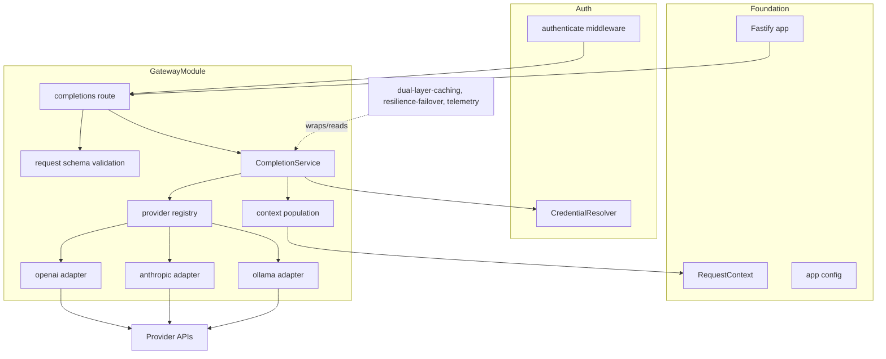
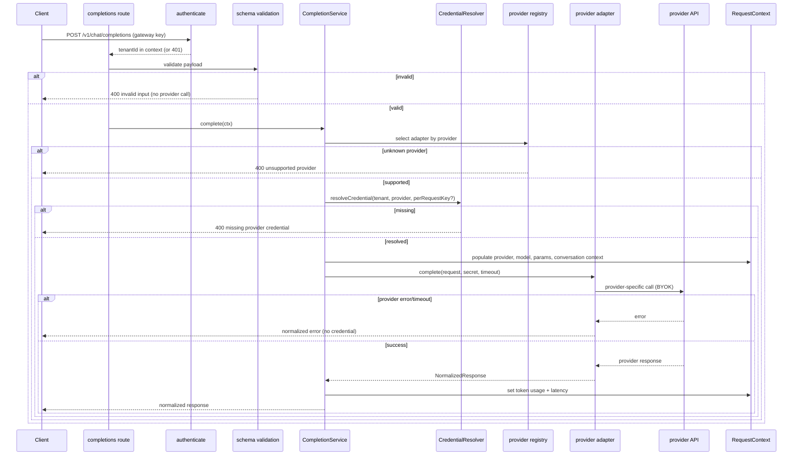
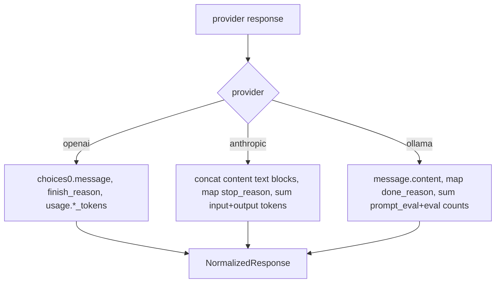

# Technical Design: gateway-provider-routing

## Overview

**Purpose**: This feature gives clients one provider-agnostic chat endpoint. `POST /v1/chat/completions` accepts a unified, validated payload (including the full conversation `messages` array), selects one of exactly three providers (OpenAI, Anthropic, Ollama), calls it through a shared `ProviderAdapter` using the tenant's own (BYOK) key, and normalizes every upstream response into one stable client schema. It also populates the shared request context — provider, resolved model, params, token usage, latency, and the conversation context (message list plus the derived latest user message and last assistant response) — so caching, resilience, and telemetry can hook in later.

**Users**: Developers integrating a single endpoint instead of three provider SDKs; and the downstream specs that wrap this flow.

**Impact**: Extends `platform-foundation` with the completion route and the `gateway` module, and consumes `auth-tenancy-credentials` (`authenticate` middleware, `CredentialResolver`, `ProviderName`, `ProviderSecret`). It defines the `ProviderAdapter` interface (shared with `resilience-failover`) and the conversation-context contract (consumed by `dual-layer-caching`). It performs no caching, retry/failover, telemetry, or rate limiting.

### Goals
- A validated, provider-agnostic `POST /v1/chat/completions` endpoint that rejects invalid input before any provider call.
- Provider selection restricted to exactly OpenAI, Anthropic, and Ollama.
- A shared `ProviderAdapter` interface with three adapters that call providers with the tenant's BYOK key and return a normalized response.
- One stable normalized response schema (content, role, token usage, resolved model, finish reason) with no provider-specific leakage.
- Population of the shared request context, including the conversation context needed for context-aware caching, exposed but not interpreted.

### Non-Goals
- Deciding whether to serve from cache; topic-shift detection / context-chain verification (`dual-layer-caching`).
- Retries, failover, circuit breaking (`resilience-failover`).
- Telemetry/metrics (`telemetry-analytics`); rate limiting (`rate-limiting`).
- Streaming/SSE (stretch); any fourth provider.

## Boundary Commitments

### This Spec Owns
- The `POST /v1/chat/completions` endpoint and the provider-agnostic request/response schemas and validation.
- Provider selection across the three supported providers.
- The `ProviderAdapter` interface and the OpenAI, Anthropic, and Ollama adapters (request translation + response normalization).
- The normalized response schema as the stable client contract.
- The `CompletionService` orchestration seam (wrappable by caching and failover).
- The conversation-context extension of `RequestContext` (`messages`, `latestUserMessage`, `lastAssistantMessage`) and population of provider/model/params/usage/latency.
- Its own gateway config segment (provider base URLs, request timeout, default max tokens, anthropic version).

### Out of Boundary
- Cache lookup/store and any topic-shift/context-chain logic (`dual-layer-caching` consumes the conversation context this spec exposes).
- Retry/failover/circuit breaking (`resilience-failover` wraps the adapter call).
- Telemetry/metrics (`telemetry-analytics` reads the context fields this spec populates).
- Rate limiting; streaming; credential storage/encryption (owned by `auth-tenancy-credentials`).

### Allowed Dependencies
- `platform-foundation`: Fastify app + plugin registration, `app.config`, shared logger, `RequestContext`.
- `auth-tenancy-credentials`: `authenticate` middleware, `CredentialResolver`, `ProviderName`, `ProviderSecret`.
- Provider SDKs `openai` and `@anthropic-ai/sdk` (per-request client, `maxRetries: 0`); Node built-in `fetch` for Ollama.
- No new datastore (stateless request path; two-datastore rule preserved).

### Revalidation Triggers
- The normalized response schema or the provider-agnostic request schema.
- The `ProviderAdapter` interface (consumed by `resilience-failover`).
- The `CompletionService` signature (wrapped by `dual-layer-caching`).
- The conversation-context fields added to `RequestContext` (consumed by `dual-layer-caching`).
- The supported `ProviderName` set.

## Architecture

### Existing Architecture Analysis
Extends the foundation's plugin/decoration model and auth's middleware. Provider-specific concerns stay behind the `ProviderAdapter` per steering (`providers hide behind ProviderAdapter`). The request path is stateless (no datastore). The route is a protected endpoint guarded by auth's `authenticate` middleware; the foundation's health endpoints remain unauthenticated.

### Architecture Pattern & Boundary Map

**Selected pattern**: Adapter pattern behind a `ProviderAdapter` interface, orchestrated by a `CompletionService`. The route validates input and delegates to the service; the service resolves the credential, selects the adapter via a registry, invokes it, and populates the request context. Each adapter owns translation to its provider and normalization back to the unified schema.



**Architecture Integration**:
- Selected pattern: adapter + orchestration service; normalization folded into the adapter contract.
- Domain boundaries: schema/validation, adapters, registry, orchestration, and context population are cohesive sub-areas within one module.
- Existing patterns preserved: domain-module layout, auth middleware, `RequestContext` extension via declaration merging, two-datastore rule.
- New components rationale: the registry isolates provider selection; the service is the wrappable seam for caching/failover.
- Steering compliance: providers hidden behind the adapter; BYOK pass-through; non-streaming v1; exactly three providers.

### Technology Stack

| Layer | Choice / Version | Role in Feature | Notes |
|-------|------------------|-----------------|-------|
| Backend / Services | Fastify 5 plugin (TypeScript strict) | Route, validation, orchestration | Registered onto the foundation app after auth |
| Provider clients | `openai`, `@anthropic-ai/sdk` (per-request), Node `fetch` (Ollama) | Call upstream providers with BYOK keys | `maxRetries: 0`; per-call timeout |
| Validation | Fastify JSON Schema | Validate the provider-agnostic request/response at the boundary | Reject invalid input before any provider call |
| Config | `zod` (gateway env segment) | Provider base URLs, timeout, default max tokens, anthropic version | Self-contained module config |

## File Structure Plan

### Directory Structure
```
src/modules/gateway/
├── index.ts                        # plugin: validate gateway config, register route under auth middleware, expose CompletionService + ProviderAdapter types
├── config.ts                       # zod gateway env segment → frozen GatewayConfig
├── types.ts                        # ChatMessage, ChatCompletionRequest, NormalizedResponse, FinishReason, ProviderAdapter, ProviderError
├── schema.ts                       # Fastify JSON Schema for request body + normalized response
├── context.ts                      # RequestContext extension (messages, latestUserMessage, lastAssistantMessage) + populate helpers
├── completion-service.ts           # orchestration: resolve credential, select adapter, invoke, normalize, populate context
├── providers/
│   ├── provider-registry.ts        # ProviderName → adapter; rejects unknown/unsupported provider
│   ├── mapping.ts                  # shared finish-reason + usage mapping helpers
│   ├── openai-adapter.ts           # translate + normalize OpenAI
│   ├── anthropic-adapter.ts        # translate (system param, content blocks) + normalize Anthropic
│   └── ollama-adapter.ts           # translate + normalize Ollama (fetch, stream:false)
└── routes/
    └── completions-route.ts        # POST /v1/chat/completions handler → CompletionService
```

### Modified Files
- `src/app.ts` (foundation) — register the gateway plugin after the auth plugin.
- `.env.example` — add gateway vars (`PROVIDER_TIMEOUT_MS`, `PROVIDER_DEFAULT_MAX_TOKENS`, `OPENAI_BASE_URL`, `ANTHROPIC_BASE_URL`, `ANTHROPIC_VERSION`; Ollama base URL reuses the foundation `OLLAMA_URL`).

> The route applies auth's `authenticate` middleware (the seam auth exported); `CompletionService` is exposed so `dual-layer-caching` can wrap it and `resilience-failover` can wrap the adapter invocation.

## System Flows

### Completion request flow


Key decisions: validation and provider-support checks happen before any provider call (Req 1.3, 2.2, 3.3); the conversation context is populated before the call so downstream stages can read it even on failure (Req 5.2); token usage/latency are set after a successful call (Req 5.1); errors are normalized and never carry the credential (Req 4.3).

### Normalization mapping (per provider)


Key decisions: Anthropic's `system` messages are lifted to the top-level `system` param and its `content[]` blocks are concatenated; missing token totals (Anthropic, Ollama) are computed; a default `max_tokens` is supplied for Anthropic when omitted. Finish reasons map to a closed union with `other` as the fallback.

## Requirements Traceability

| Requirement | Summary | Components | Interfaces | Flows |
|-------------|---------|------------|------------|-------|
| 1.1 | Expose POST /v1/chat/completions | completions route, plugin | route | Completion |
| 1.2 | Validate payload before any provider call | schema, route | JSON Schema | Completion |
| 1.3 | Reject invalid input, no provider call | schema, route | 400 response | Completion |
| 1.4 | Accept full messages array | schema, types | `ChatCompletionRequest` | Completion |
| 2.1 | Route to specified provider's adapter | provider registry, CompletionService | `select` | Completion |
| 2.2 | Reject unknown/unsupported provider | provider registry, schema | 400 response | Completion |
| 2.3 | Exactly three providers | provider registry, types | `ProviderName` | — |
| 2.4 | Pass resolved model, reflect in response | CompletionService, adapters | `NormalizedResponse.model` | Completion |
| 3.1 | Call every provider via shared adapter | ProviderAdapter, adapters | `ProviderAdapter` | Completion |
| 3.2 | Use tenant BYOK key, no gateway account | CompletionService, adapters, resolver | `resolveCredential` | Completion |
| 3.3 | Reject when credential unavailable | CompletionService, resolver | missing-credential error | Completion |
| 3.4 | Translate agnostic request to provider shape | adapters | `complete` | Normalization |
| 3.5 | Non-streaming, single complete response | adapters, schema | `complete` | Completion |
| 4.1 | Normalize into unified schema | adapters, mapping | `NormalizedResponse` | Normalization |
| 4.2 | No provider-specific leakage | ProviderAdapter contract, types | return type | Normalization |
| 4.3 | Normalized error without credential | ProviderError, route | normalized error | Completion |
| 4.4 | Stable schema across providers | types, schema | `NormalizedResponse` | — |
| 5.1 | Populate provider/model/params/usage/latency | context population, CompletionService | `RequestContext` | Completion |
| 5.2 | Surface conversation context incl. latest user + last AI | context extension, population | `RequestContext` | Completion |
| 5.3 | Expose without interpreting; no cache/topic logic | context population | — | — |
| 5.4 | Leave un-run stages at defaults | context population | defaults | — |

## Components and Interfaces

| Component | Domain/Layer | Intent | Req Coverage | Key Dependencies (P0/P1) | Contracts |
|-----------|--------------|--------|--------------|--------------------------|-----------|
| Gateway Types | types | Shared request/response/adapter contracts | 1.4, 2.3, 3.1, 4.1, 4.2, 4.4 | ProviderName (P0), ProviderSecret (P0) | Service |
| Gateway Config | config | Timeout, base URLs, default max tokens, version | 3.4, 3.5 | zod (P0) | State |
| Request Schema | validation | Validate agnostic request; reject invalid | 1.2, 1.3, 1.4, 2.2, 3.5 | Fastify schema (P0) | API |
| Context Extension | context | Add + populate conversation context | 5.1, 5.2, 5.3, 5.4 | RequestContext (P0) | State |
| Provider Registry | providers | Select adapter, reject unsupported provider | 2.1, 2.2, 2.3 | adapters (P0) | Service |
| OpenAI Adapter | providers | Translate + normalize OpenAI | 3.1, 3.4, 4.1 | openai SDK (P0), ProviderSecret (P0) | Service |
| Anthropic Adapter | providers | Translate (system/blocks) + normalize Anthropic | 3.1, 3.4, 4.1 | anthropic SDK (P0) | Service |
| Ollama Adapter | providers | Translate + normalize Ollama via fetch | 3.1, 3.4, 4.1 | fetch (P0) | Service |
| Mapping Helpers | providers | Finish-reason + usage normalization | 4.1 | — | Service |
| CompletionService | orchestration | Resolve credential, select, invoke, normalize, populate | 2.1, 2.4, 3.2, 3.3, 5.1, 5.2 | resolver (P0), registry (P0) | Service |
| Completions Route | routes | Endpoint handler under auth middleware | 1.1, 1.3, 4.3 | authenticate (P0), CompletionService (P0) | API |

### types

#### Gateway Types & ProviderAdapter

| Field | Detail |
|-------|--------|
| Intent | Define the agnostic request, normalized response, and shared adapter contract |
| Requirements | 1.4, 2.3, 3.1, 4.1, 4.2, 4.4 |

**Responsibilities & Constraints**
- Define the closed provider set and the stable client contract; provider-specific types never appear here.

**Contracts**: Service [x]

##### Service Interface
```typescript
import type { ProviderName, ProviderSecret } from '#src/modules/auth/types.js';

type ChatRole = 'system' | 'user' | 'assistant';
interface ChatMessage { role: ChatRole; content: string; }

interface ChatCompletionRequest {
  provider: ProviderName;
  model: string;
  messages: ChatMessage[];
  temperature?: number;
  maxTokens?: number;
  topP?: number;
  stop?: string[];
}

type FinishReason = 'stop' | 'length' | 'content_filter' | 'tool_use' | 'other';

interface NormalizedResponse {
  id: string;
  provider: ProviderName;
  model: string;                                   // resolved model (Req 2.4)
  message: { role: 'assistant'; content: string };
  usage: { promptTokens: number; completionTokens: number; totalTokens: number };
  finishReason: FinishReason;
}

interface ProviderAdapter {
  readonly name: ProviderName;
  complete(
    request: ChatCompletionRequest,
    credential: ProviderSecret,
    opts: { timeoutMs: number; defaultMaxTokens: number },
  ): Promise<NormalizedResponse>;
}

// Typed error carrying no credential material
type ProviderErrorKind = 'upstream_error' | 'timeout' | 'invalid_response';
class ProviderError extends Error {
  readonly provider: ProviderName;
  readonly kind: ProviderErrorKind;
  readonly status?: number;
}
```
- Invariants: `complete` returns only `NormalizedResponse`; provider-specific shapes stay inside the adapter (Req 4.2); `ProviderError` never includes the credential (Req 4.3).

### providers

#### Provider Registry

| Field | Detail |
|-------|--------|
| Intent | Resolve a `ProviderName` to its adapter and reject unsupported providers |
| Requirements | 2.1, 2.2, 2.3 |

**Responsibilities & Constraints**
- Hold exactly the three adapters; return the adapter for a supported provider or raise an unsupported-provider error (also enforced at schema validation).

**Contracts**: Service [x]

##### Service Interface
```typescript
interface ProviderRegistry {
  select(provider: ProviderName): ProviderAdapter; // throws UnsupportedProviderError
}
```

#### Provider Adapters (OpenAI / Anthropic / Ollama)

| Field | Detail |
|-------|--------|
| Intent | Translate the agnostic request to the provider and normalize the response |
| Requirements | 3.1, 3.4, 3.5, 4.1, 4.2 |

**Responsibilities & Constraints**
- OpenAI: SDK call with `Authorization: Bearer`, pass messages/params; map `choices[0].message`, `finish_reason`, `usage.*_tokens`.
- Anthropic: lift `system` messages to the top-level `system` param, supply default `max_tokens` when omitted, `x-api-key` + `anthropic-version`; concatenate `content[]` text blocks; map `stop_reason`; sum `input_tokens + output_tokens`.
- Ollama: `fetch` `/api/chat` with `stream:false`; map `message.content`, `done_reason`; sum `prompt_eval_count + eval_count`.
- All: `maxRetries: 0`, per-call timeout; call `credential.reveal()` only at the HTTP boundary; throw `ProviderError` on upstream error/timeout without the credential.

**Dependencies**: External: `openai`, `@anthropic-ai/sdk`, `fetch` (P0). Inbound: Provider Registry, `resilience-failover` (later) (P0).

**Contracts**: Service [x]

**Implementation Notes**
- Integration: `resilience-failover` will wrap `complete` calls; keep the interface stable.
- Validation: unit tests assert per-provider translation + normalization and that no provider-specific field appears in `NormalizedResponse`.
- Risks: nonce of leakage — ensure error objects and logs never serialize the revealed secret.

### orchestration & routes

#### CompletionService

| Field | Detail |
|-------|--------|
| Intent | Orchestrate a completion and populate the request context |
| Requirements | 2.1, 2.4, 3.2, 3.3, 5.1, 5.2 |

**Responsibilities & Constraints**
- Select the adapter, resolve the credential (per-request key or stored), populate provider/model/params + conversation context before the call, invoke the adapter, then set token usage + latency. Maps resolver `missing` → missing-credential error (Req 3.3). Performs no caching/topic logic (Req 5.3).

**Dependencies**: Outbound: `CredentialResolver` (P0), Provider Registry (P0), Context Extension (P0). Inbound: Completions Route; `dual-layer-caching` wraps this (P0).

**Contracts**: Service [x]

##### Service Interface
```typescript
interface CompletionService {
  complete(input: {
    tenantId: string;
    request: ChatCompletionRequest;
    perRequestKey?: string;
    ctx: RequestContext;
  }): Promise<NormalizedResponse>; // throws MissingCredentialError | ProviderError
}
```
- Preconditions: authenticated `tenantId`; validated `request`.
- Postconditions: context carries provider/model/params/usage/latency and the conversation context; secret never written to context/logs.
- Invariants: exactly one adapter invoked per request; non-streaming single response (Req 3.5).

#### Completions Route

| Field | Detail |
|-------|--------|
| Intent | HTTP endpoint delegating to the service |
| Requirements | 1.1, 1.3, 4.3 |

**Contracts**: API [x]

##### API Contract
| Method | Endpoint | Request | Response | Errors |
|--------|----------|---------|----------|--------|
| POST | /v1/chat/completions | `ChatCompletionRequest` (validated) | `NormalizedResponse` 200 | 400 invalid input / unsupported provider / missing credential; 401 unauthenticated; 502 normalized provider error; 504 timeout |

- Applies auth's `authenticate` middleware; a per-request provider key may be supplied via header (BYOK) and is passed to the resolver, never logged.

### context

#### Context Extension & Population

| Field | Detail |
|-------|--------|
| Intent | Extend and populate the shared request context |
| Requirements | 5.1, 5.2, 5.3, 5.4 |

**Contracts**: State [x]

##### State Management
```typescript
// Declaration merging on the foundation RequestContext (no foundation edit)
declare module '#src/platform/context/types.js' {
  interface RequestContext {
    messages: ChatMessage[];                    // default []
    latestUserMessage: ChatMessage | null;      // default null
    lastAssistantMessage: ChatMessage | null;   // default null
  }
}
```
- Populates `provider`, `model`, `params`, `messages`, and the derived `latestUserMessage` (last `user` turn) and `lastAssistantMessage` (last `assistant` turn); sets `tokenUsage`/`latencyMs` after the call. Fields for stages that have not run keep their defaults (Req 5.4). Exposes, never interprets, the conversation context (Req 5.3).

## Data Models

No persistent data model — the completion request path is stateless. The only "models" are the in-memory contracts in `types.ts` (agnostic request, normalized response) and the `RequestContext` extension above. The two-datastore rule is preserved (this module adds no store and no migration).

## Error Handling

### Error Strategy
Validate early; normalize provider failures; never leak the credential.

### Error Categories and Responses
- **Validation** (400): invalid payload or unsupported provider → reject before any provider call (Req 1.3, 2.2).
- **Missing credential** (400/422): resolver `missing` → missing-provider-credential error (Req 3.3).
- **Provider error/timeout** (502/504): `ProviderError` mapped to a normalized error body carrying no provider-specific fields and no credential (Req 4.3).
- **Unauthenticated** (401): handled by auth's middleware upstream of the handler.

### Monitoring
Structured logs via the shared logger with redaction; the revealed secret is never logged. Metrics are out of boundary (`telemetry-analytics`).

## Testing Strategy

### Unit Tests
- Schema validation: a valid payload passes; a missing `messages`, an unknown `provider`, or a bad param is rejected with a 400 and no provider call (1.2, 1.3, 2.2).
- OpenAI adapter: maps `choices[0].message`, `finish_reason` → `FinishReason`, and `usage.*_tokens` → normalized usage (3.4, 4.1).
- Anthropic adapter: lifts `system` messages to the `system` param, supplies default `max_tokens`, concatenates content blocks, maps `stop_reason`, and sums input+output tokens (3.4, 4.1).
- Ollama adapter: sends `stream:false`, maps `message.content`/`done_reason`, and sums prompt_eval + eval counts (3.4, 4.1).
- Normalization leakage: `NormalizedResponse` contains no provider-specific fields across all three adapters (4.2, 4.4).
- Context population: provider/model/params/messages/derived-turns populated; unset downstream fields keep defaults (5.1, 5.2, 5.4).
- Error mapping: a provider error yields a normalized error containing no credential (4.3).

### Integration Tests
- End-to-end against a stubbed provider endpoint (or Ollama from the Compose stack): authenticated request → provider selected → BYOK key used → normalized response with resolved model + token usage (1.1, 2.1, 2.4, 3.2).
- Missing credential: no per-request key and no stored credential → 400 missing-credential, provider not called (3.3).
- Provider selection: request for each of the three providers routes to the correct adapter; an unsupported provider is rejected (2.1, 2.2, 2.3).

## Security Considerations
- BYOK pass-through: the gateway holds no provider account; the tenant credential is resolved per request, revealed only at the provider HTTP boundary, and never written to logs, errors, telemetry, or the request context (Req 3.2, 4.3).
- `ProviderError` and normalized error responses exclude provider-specific internals and all secret material (Req 4.3).
- The endpoint is protected by auth's `authenticate` middleware; a per-request provider key passes straight to the resolver and is never persisted or logged.
