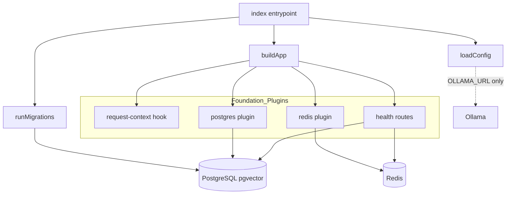
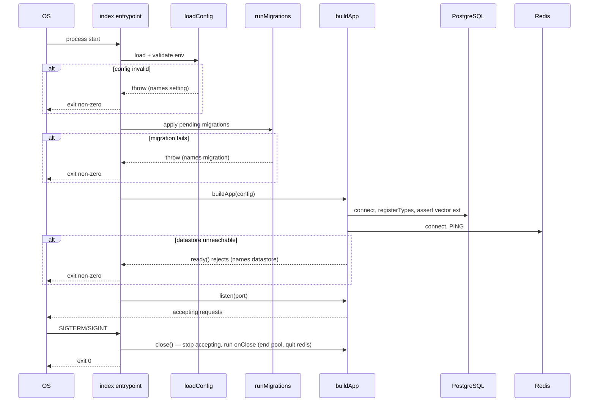
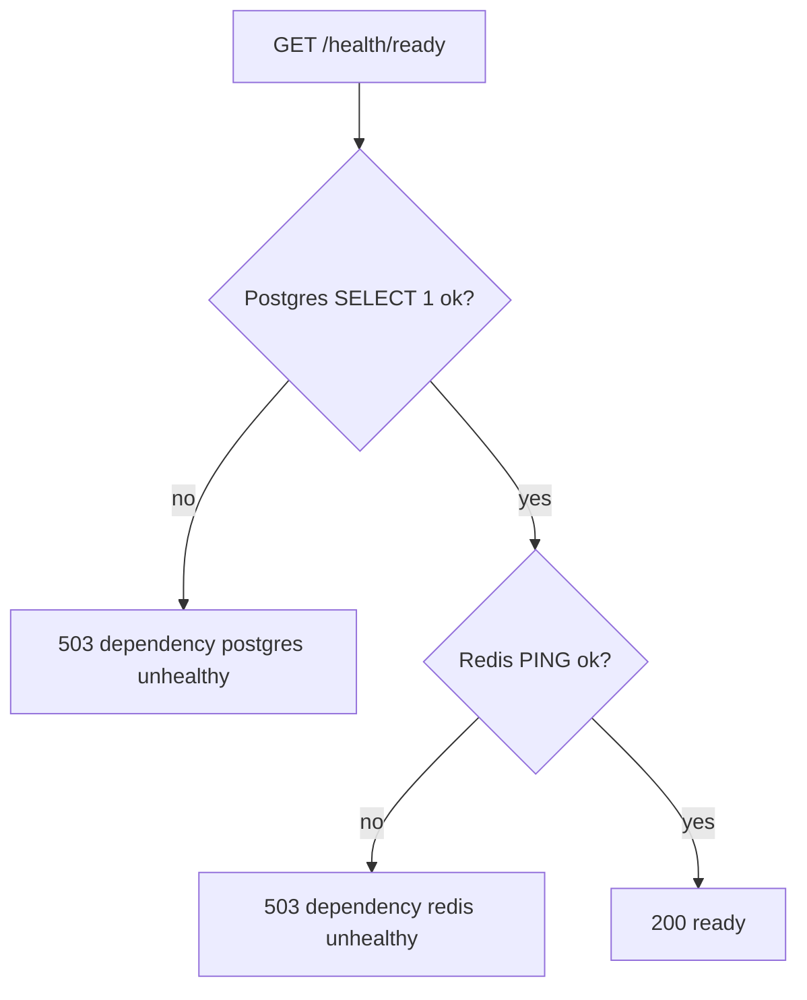

# Technical Design: platform-foundation

## Overview

**Purpose**: This feature delivers the shared runtime baseline every other Semantic Cache Gateway spec builds on — a Fastify (TypeScript) service that boots in a defined order, loads and validates typed configuration, logs structurally with secret redaction, wires shared PostgreSQL (`pgvector`) and Redis clients, runs recorded database migrations, exposes liveness/readiness endpoints, defines the extensible shared request-context type, and comes up reproducibly under Docker Compose with a unit + integration test harness.

**Users**: Platform and domain engineers building later specs (auth, routing, caching, resilience, telemetry, rate limiting) consume this foundation's conventions — the shared app instance, the datastore clients, the shared logger, and the request-context shape — instead of re-wiring infrastructure per module.

**Impact**: Establishes the greenfield repository's build tooling, service scaffold, and local infrastructure. It introduces no business logic; it defines the seams that business logic plugs into.

### Goals
- A gateway service that boots in the order **config → logger → datastore clients → listen**, and fails fast (non-zero exit) if any startup dependency is unavailable.
- A single typed, read-only configuration object validated at startup, with secret-safe error reporting.
- Shared Pino logger (secret-redacting), shared `pg`/`pgvector` and `ioredis` clients, and a recorded, deterministic migration runner.
- Liveness + readiness endpoints (readiness verifies Postgres and Redis) served without authentication.
- An extensible `RequestContext` type with defined defaults for all fields.
- `docker compose up` brings up gateway + Postgres(`pgvector`) + Redis + Ollama with health-gated ordering, plus build/lint/format/test tooling and at least one passing unit and integration test.

### Non-Goals
- Any business logic: authentication/tenancy, provider routing/adapters, caching, resilience, rate limiting (later specs).
- Prometheus metrics export and Grafana dashboards (owned by `telemetry-analytics`).
- Populating business fields of the request context — this spec defines the shape and defaults only.
- Streaming/SSE and production/Fly.io deployment hardening.

## Boundary Commitments

### This Spec Owns
- Service bootstrap, lifecycle, and graceful shutdown (`buildApp`, entrypoint, signal handling).
- The typed configuration loader/schema and the read-only `Config` contract.
- The shared Pino logger configuration and secret-redaction policy.
- The shared PostgreSQL (`pg` + `pgvector`) and Redis (`ioredis`) client plugins and their exposure on the app instance.
- The migration runner and the **baseline** migration (enable `pgvector`, foundation baseline schema).
- Liveness (`/health/live`) and readiness (`/health/ready`) endpoints.
- The `RequestContext` type, its default values, and the mechanism that attaches it per request.
- The Docker Compose environment for all backing services and the dev tooling / test harness.

### Out of Boundary
- Authentication, tenant modeling, credential storage (`auth-tenancy-credentials`).
- Provider adapters, the chat endpoint, response normalization (`gateway-provider-routing`).
- Cache logic, embeddings, semantic matching (`dual-layer-caching`).
- Retry/circuit-breaker logic (`resilience-failover`).
- Metrics export, dashboards, cost estimation (`telemetry-analytics`).
- Rate-limit enforcement (`rate-limiting`).
- Any migration that creates business tables (each owning spec adds its own migration).

### Allowed Dependencies
- Runtime: Node.js 22 LTS.
- Backing services: PostgreSQL with `pgvector`, Redis, Ollama (connectivity/config only; readiness checks Postgres + Redis).
- Libraries: Fastify 5, Pino (bundled), `pg`, `pgvector`, `ioredis`, `zod`, `node-pg-migrate`, `close-with-grace`, Vitest, ESLint, Prettier, `tsx`.
- Constraint: **exactly two datastores** (Postgres, Redis) — no third store may be introduced here or downstream.

### Revalidation Triggers
Downstream specs must re-check integration when any of these change:
- The `Config` shape or environment-variable contract.
- The `RequestContext` field set, defaults, or extension mechanism.
- The names/shapes of the app decorations (`app.config`, `app.pg`, `app.redis`, `request.ctx`).
- Datastore client choice or connection strategy.
- The bootstrap ordering or graceful-shutdown contract.
- The migration runner conventions (directory, tracking table, invocation).

## Architecture

### Architecture Pattern & Boundary Map

**Selected pattern**: Fastify plugin/decorator composition. Each cross-cutting concern is an encapsulated plugin that decorates a single shared app instance; domain specs later register their own plugins into the same host without editing foundation code. This matches steering's "domain-modular over a shared platform layer" and enforces the dependency direction (domain modules depend on the foundation, never the reverse).



**Architecture Integration**:
- Selected pattern: Fastify plugin composition with app-level decorations as the shared seam.
- Domain boundaries: config, logging, datastore clients, request context, and health are separate plugins/modules with single responsibilities.
- Existing patterns preserved: none (greenfield); this spec establishes the conventions in `structure.md`.
- New components rationale: each plugin owns exactly one cross-cutting concern so later specs reuse them without duplication.
- Steering compliance: two datastores only; secrets never leave a module in plaintext; dependency direction points at the foundation.

### Technology Stack

| Layer | Choice / Version | Role in Feature | Notes |
|-------|------------------|-----------------|-------|
| Runtime | Node.js 22 LTS | Executes the service | Fastify 5 requires Node 20+ |
| Language | TypeScript 5.x (strict, ESM) | Strong typing across the stack | `any` forbidden; `@/` path alias → `src/` |
| Framework | Fastify 5.10.x | HTTP server, plugin host, request lifecycle hooks | Native Pino integration + `onRequest`/`onResponse` hooks |
| Config validation | `zod` (^3.23 / v4) | Parse + validate `process.env` into a frozen typed `Config` | Runs before app construction |
| Logging | Pino (bundled with Fastify) | Structured, leveled logs with `redact` paths | Level + redaction from config |
| Data / Postgres | `pg` (^8), `pgvector` (^0.3) | Shared pooled Postgres client; vector type registration + extension check | `registerTypes` on startup connection |
| Data / Redis | `ioredis` (^5) | Shared Redis client | Chosen for Lua/atomic ops needed by downstream specs |
| Migrations | `node-pg-migrate` (^7) | Deterministic, recorded migrations; baseline enables `pgvector` | Tracking table `pgmigrations` |
| Lifecycle | `close-with-grace` | Graceful shutdown on SIGTERM/SIGINT | Closes pool + redis before exit |
| Testing | Vitest (^3) | Unit + integration suites; `app.inject` for routes | Integration targets dockerized PG + Redis |
| Tooling | ESLint (^9 flat config), Prettier (^3), `tsx` | Lint/format, strict build, dev watch | `tsc` for type-checked build |
| Infrastructure | Docker Compose; `pgvector/pgvector:pg17`, `redis:7`, `ollama/ollama` | Local stack with health-gated ordering | Gateway container migrates then serves |

## File Structure Plan

### Directory Structure
```
.
├── docker-compose.yml            # gateway + postgres(pgvector) + redis + ollama, healthchecks + depends_on
├── Dockerfile                    # build + entrypoint: run migrations then start server
├── package.json                  # scripts: dev, build, start, lint, format, test, test:integration, migrate
├── tsconfig.json                 # strict, ESM, @/ path alias
├── eslint.config.js              # ESLint flat config
├── .prettierrc                   # Prettier config
├── .env.example                  # documented env vars + defaults
├── migrations/
│   └── {timestamp}_baseline.sql  # CREATE EXTENSION vector; foundation baseline schema
├── src/
│   ├── index.ts                  # entrypoint: loadConfig → runMigrations → buildApp → listen → graceful shutdown
│   ├── app.ts                    # buildApp(config): create Fastify(logger opts), register foundation plugins, return app
│   ├── platform/
│   │   ├── config/
│   │   │   ├── schema.ts          # zod env schema + inferred Config type + sensitive-field marks
│   │   │   └── load-config.ts     # loadConfig(): parse/validate process.env → frozen Config (throws on invalid)
│   │   ├── logger/
│   │   │   └── logger-options.ts  # buildLoggerOptions(config): Pino level + redact paths + request serializers
│   │   ├── db/
│   │   │   ├── pg-plugin.ts        # Fastify plugin: pg.Pool, registerTypes(pgvector), assert extension, decorate app.pg, onClose end pool
│   │   │   └── migrate.ts          # runMigrations(config): programmatic node-pg-migrate wrapper
│   │   ├── redis/
│   │   │   └── redis-plugin.ts     # Fastify plugin: ioredis client, connectivity check, decorate app.redis, onClose quit
│   │   ├── context/
│   │   │   ├── types.ts            # RequestContext interface + enums (CacheStatus, BreakerState, ...) + createDefaultContext()
│   │   │   └── context-plugin.ts   # decorateRequest('ctx') + onRequest hook assigning defaults
│   │   └── health/
│   │       └── health-plugin.ts    # GET /health/live, GET /health/ready (checks pg + redis)
│   └── types/
│       └── fastify.d.ts            # module augmentation: FastifyInstance.{config,pg,redis}, FastifyRequest.ctx
└── test/
    ├── unit/
    │   └── config.test.ts          # loadConfig: missing var named, sensitive value not printed, defaults applied
    └── integration/
        └── readiness.test.ts       # boot app vs dockerized PG+Redis; /health/ready 200; failure names dependency; vector extension present
```

### Modified Files
- None — greenfield. All files above are created. This spec also seeds `structure.md`/`tech.md` conventions already recorded in steering.

## System Flows

### Startup & graceful shutdown


Key decisions: datastore connections happen during plugin registration so `app.ready()` (awaited before `listen`) rejects on any failure — the service never listens partially initialized (Req 1.3). Migrations run before the server binds. `close-with-grace` drives ordered shutdown (Req 1.4).

### Readiness check


Key decisions: readiness names the unhealthy dependency without exposing connection secrets (Req 6.3); liveness returns 200 as soon as the server accepts requests and performs no datastore checks (Req 6.1). Both endpoints are unauthenticated and remain so after auth is added later (Req 6.4).

## Requirements Traceability

| Requirement | Summary | Components | Interfaces | Flows |
|-------------|---------|------------|------------|-------|
| 1.1 | Boot order config→logger→db→listen | Entrypoint, buildApp, plugins | `loadConfig`, `buildApp` | Startup |
| 1.2 | Listen only after deps init | Entrypoint | `app.ready` → `app.listen` | Startup |
| 1.3 | Fail fast, non-zero exit | Entrypoint, Pg/Redis plugins | plugin registration reject | Startup |
| 1.4 | Graceful shutdown on signal | Entrypoint, plugins `onClose` | `close-with-grace`, `app.close` | Startup |
| 1.5 | Modules register routes/middleware without editing bootstrap | buildApp (plugin host) | Fastify plugin registration | — |
| 2.1 | Read required settings from env | Config loader | `loadConfig`, `schema.ts` | — |
| 2.2 | Abort naming offending setting | Config loader | `ZodError` mapping | Startup |
| 2.3 | Report sensitive errors without value | Config loader | sensitive-field marks | Startup |
| 2.4 | Apply documented defaults | Config schema | zod `.default()` | — |
| 2.5 | Single typed read-only config object | Config loader | frozen `Config` | — |
| 3.1 | Structured logs via shared logger | Logger, buildApp | Pino instance | — |
| 3.2 | Redact sensitive fields | Logger options | `redact` paths | — |
| 3.3 | Configurable log level | Logger options, Config | `LOG_LEVEL` | — |
| 3.4 | Log request start/completion | buildApp (Fastify hooks) | `onResponse` serializers | Readiness/all |
| 4.1 | Connect PG + Redis at startup | Pg plugin, Redis plugin | `app.pg`, `app.redis` | Startup |
| 4.2 | Fail naming unreachable datastore | Pg/Redis plugins | registration reject | Startup |
| 4.3 | Verify `pgvector` available | Pg plugin | extension assertion | Startup |
| 4.4 | Expose clients via shared app | Pg/Redis plugins | decorations | — |
| 4.5 | Only two datastores | Boundary/Compose | — | — |
| 5.1 | Apply pending migrations in order, record | Migration runner | `runMigrations` | Startup |
| 5.2 | No-op when up to date | Migration runner | node-pg-migrate | Startup |
| 5.3 | Baseline enables `pgvector` + baseline schema | Baseline migration | `baseline.sql` | Startup |
| 5.4 | Stop + report on failure, don't record | Migration runner | node-pg-migrate | Startup |
| 6.1 | Liveness success when accepting | Health plugin | `GET /health/live` | Readiness |
| 6.2 | Readiness checks PG + Redis | Health plugin | `GET /health/ready` | Readiness |
| 6.3 | Readiness failure names dep, no secrets | Health plugin | 503 body | Readiness |
| 6.4 | Health endpoints unauthenticated, stay so | Health plugin | route config | — |
| 7.1 | Create request-scoped context | Context plugin | `onRequest` hook | — |
| 7.2 | Define fields for later stages | Context types | `RequestContext` | — |
| 7.3 | Extensible without changing foundation | Context types | declaration merging | — |
| 7.4 | Accessible to handlers/middleware | Context plugin | `request.ctx` | — |
| 7.5 | Defined defaults, never undefined | Context types | `createDefaultContext` | — |
| 8.1 | Compose starts gateway + PG + Redis + Ollama | docker-compose.yml | services | — |
| 8.2 | Gate gateway on healthy deps | docker-compose.yml | `depends_on` healthchecks | Startup |
| 8.3 | Readiness healthy without manual config | docker-compose.yml, Health plugin | env wiring | Readiness |
| 8.4 | Supply service its connection config | docker-compose.yml, Config | env vars | — |
| 9.1 | build/lint/format/test commands | package.json | scripts | — |
| 9.2 | Strict type checking, fail on errors | tsconfig, build script | `tsc --noEmit`/build | — |
| 9.3 | Lint/format violations exit non-zero | eslint/prettier config | scripts | — |
| 9.4 | Integration tests vs dockerized deps | Vitest integration | `readiness.test.ts` | Readiness |
| 9.5 | ≥1 unit + ≥1 integration passing | test/unit, test/integration | `config.test.ts`, `readiness.test.ts` | — |

## Components and Interfaces

| Component | Domain/Layer | Intent | Req Coverage | Key Dependencies (P0/P1) | Contracts |
|-----------|--------------|--------|--------------|--------------------------|-----------|
| Config Loader | platform/config | Parse+validate env into frozen typed `Config` | 2.1–2.5, 3.3, 8.4 | zod (P0) | Service, State |
| Logger Options | platform/logger | Pino level + redaction policy | 3.1–3.4 | Pino (P0), Config (P0) | Service |
| Postgres Plugin | platform/db | Shared pooled `pg` client, pgvector types, extension check | 4.1–4.4 | pg (P0), pgvector (P0), Config (P0) | Service, State |
| Migration Runner | platform/db | Deterministic recorded migrations + baseline | 5.1–5.4 | node-pg-migrate (P0), Config (P0) | Batch |
| Redis Plugin | platform/redis | Shared `ioredis` client | 4.1, 4.2, 4.4 | ioredis (P0), Config (P0) | Service, State |
| Request Context | platform/context | Extensible request-scoped context + defaults | 7.1–7.5 | Fastify (P0) | State |
| Health Plugin | platform/health | Liveness + readiness endpoints | 6.1–6.4, 8.3 | app.pg (P0), app.redis (P0) | API |
| App Builder | root/app | Compose plugins into shared host; request logging | 1.1, 1.2, 1.5, 3.4 | all plugins (P0) | Service |
| Entrypoint | root/index | Bootstrap order + graceful shutdown | 1.1–1.4 | buildApp (P0), runMigrations (P0), close-with-grace (P1) | Service |
| Docker Compose | infra | Local stack, health-gated ordering | 8.1–8.4 | backing images (P0) | — |
| Dev Tooling & Tests | tooling | Build/lint/format/test + proof tests | 9.1–9.5 | Vitest/ESLint/Prettier/tsc (P0) | — |

### platform/config

#### Config Loader

| Field | Detail |
|-------|--------|
| Intent | Read `process.env`, validate, and expose one frozen typed config object |
| Requirements | 2.1, 2.2, 2.3, 2.4, 2.5, 3.3, 8.4 |

**Responsibilities & Constraints**
- Owns the environment-variable contract and the `Config` type; single source of runtime settings.
- Validates at startup and throws before the app is built; missing/invalid required values name the setting; invalid **sensitive** values are reported without the value.
- Applies documented defaults for optional settings; returns a read-only (`Object.freeze`) object.

**Dependencies**
- External: `zod` — schema parse/validate (P0).

**Contracts**: Service [x] / State [x]

##### Service Interface
```typescript
// Sensitive keys are marked so errors never echo their value.
interface Config {
  readonly httpPort: number;
  readonly logLevel: 'fatal' | 'error' | 'warn' | 'info' | 'debug' | 'trace';
  readonly postgres: {
    readonly url: string;        // sensitive
    readonly poolMax: number;    // default applied
  };
  readonly redis: {
    readonly url: string;        // sensitive
  };
  readonly ollama: {
    readonly url: string;
  };
  readonly nodeEnv: 'development' | 'test' | 'production';
}

function loadConfig(env?: NodeJS.ProcessEnv): Config; // throws ConfigValidationError
```
- Preconditions: called once during bootstrap before `buildApp`.
- Postconditions: returns a frozen, fully-populated `Config`, or throws an error naming the offending setting (never printing sensitive values).
- Invariants: no field is `undefined`; sensitive values never appear in thrown messages or logs.

**Implementation Notes**
- Integration: `buildApp(config)` and `runMigrations(config)` receive the object; downstream modules read `app.config`.
- Validation: unit test covers missing required var (named), invalid sensitive var (value absent from message), and default application.
- Risks: keep the sensitive-key list authoritative so new secrets are redacted by default.

### platform/logger

#### Logger Options

| Field | Detail |
|-------|--------|
| Intent | Produce Pino options (level + redaction) consumed by Fastify at construction |
| Requirements | 3.1, 3.2, 3.3, 3.4 |

**Responsibilities & Constraints**
- Owns the redaction policy: paths for provider credentials, gateway API keys, and encryption material are redacted before write.
- Sets log level from `config.logLevel`; enables Fastify request/response logging with method, route, status, latency serializers.

**Dependencies**
- Inbound: App Builder — consumes the options (P0).
- External: Pino (bundled with Fastify) (P0).

**Contracts**: Service [x]

##### Service Interface
```typescript
function buildLoggerOptions(config: Config): FastifyServerOptions['logger'];
// Configures: level, redact.paths (authorization, *.apiKey, *.credential*, *.encryptionKey, req.headers.authorization),
// and serializers emitting { method, url/route, statusCode, responseTime }.
```
- Preconditions: valid `Config`.
- Postconditions: options that redact sensitive fields and emit structured request lifecycle logs.
- Invariants: redaction applies regardless of log level (Req 3.2 holds even at `trace`).

**Implementation Notes**
- Validation: unit assertion that a log record containing a redact-path field is masked.
- Risks: redaction path list must align with the config sensitive-key list and downstream secret fields.

### platform/db

#### Postgres Plugin

| Field | Detail |
|-------|--------|
| Intent | Establish a shared pooled Postgres client with `pgvector` support and extension verification |
| Requirements | 4.1, 4.2, 4.3, 4.4 |

**Responsibilities & Constraints**
- Creates a `pg.Pool` from config, calls `pgvector.registerTypes` on a startup connection, and asserts the `vector` extension exists.
- Decorates `app.pg`; registers an `onClose` hook ending the pool. Connection failure rejects plugin registration, naming Postgres.

**Dependencies**
- Inbound: Health Plugin, later domain modules (P0).
- Outbound: Config (P0).
- External: `pg` (P0), `pgvector` (P0).

**Contracts**: Service [x] / State [x]

##### Service Interface
```typescript
// Fastify decoration
interface FastifyInstance {
  pg: import('pg').Pool;
}
// Plugin behavior (pseudo-contract)
// - on register: connect, registerTypes(client), assert SELECT 1 FROM pg_extension WHERE extname='vector'
// - on failure: throw Error('PostgreSQL unreachable: ...') | Error('pgvector extension not installed')
// - on close: await pool.end()
```
- Preconditions: valid `Config`; Postgres reachable and migrated (extension present).
- Postconditions: `app.pg` is a ready pooled client with vector types registered.
- Invariants: pool is created once and shared; no module opens its own connection (Req 4.4).

**Implementation Notes**
- Integration: readiness and all future data access use `app.pg`.
- Risks: extension check depends on the baseline migration having run first — entrypoint orders migrate before serve.

#### Migration Runner

| Field | Detail |
|-------|--------|
| Intent | Apply pending migrations deterministically and record them; baseline enables `pgvector` |
| Requirements | 5.1, 5.2, 5.3, 5.4 |

**Responsibilities & Constraints**
- Wraps `node-pg-migrate` programmatically; applies pending migrations in timestamp order, recording them in `pgmigrations`; no-ops when up to date; on failure stops, reports the failing migration, and does not record it.
- The baseline migration runs `CREATE EXTENSION IF NOT EXISTS vector` and creates the foundation baseline schema.

**Dependencies**
- Outbound: Config (P0).
- External: `node-pg-migrate` (P0).

**Contracts**: Batch [x]

##### Batch / Job Contract
- Trigger: `npm run migrate up` and the container entrypoint before the server binds.
- Input / validation: migration files under `migrations/`; Postgres connection from config.
- Output / destination: applied schema + `pgmigrations` tracking rows.
- Idempotency & recovery: re-running applies only pending migrations (5.2); a failed migration is not recorded, so re-run resumes at the failing step (5.4).

**Implementation Notes**
- Integration: entrypoint runs migrate → serve; integration test asserts the `vector` extension is present after baseline.
- Risks: migration ordering relies on filename timestamps — enforce the convention in tooling/docs.

#### Redis Plugin

| Field | Detail |
|-------|--------|
| Intent | Establish a shared `ioredis` client exposed to modules |
| Requirements | 4.1, 4.2, 4.4 |

**Responsibilities & Constraints**
- Creates an `ioredis` client from config, verifies connectivity, decorates `app.redis`, and registers an `onClose` hook that quits the client. Connection failure rejects registration, naming Redis.

**Dependencies**
- Inbound: Health Plugin, later domain modules (P0).
- Outbound: Config (P0).
- External: `ioredis` (P0).

**Contracts**: Service [x] / State [x]

##### Service Interface
```typescript
interface FastifyInstance {
  redis: import('ioredis').Redis;
}
// on register: new Redis(config.redis.url), await ping; on failure throw Error('Redis unreachable: ...'); on close: await redis.quit()
```
- Preconditions: valid `Config`; Redis reachable.
- Postconditions: `app.redis` is a ready shared client.
- Invariants: one shared client; chosen for Lua/atomic ops needed by `rate-limiting` and `resilience-failover`.

**Implementation Notes**
- Risks: `lazyConnect` off so registration awaits an actual connection for fail-fast semantics.

### platform/context

#### Request Context

| Field | Detail |
|-------|--------|
| Intent | Provide an extensible, request-scoped context with defined defaults |
| Requirements | 7.1, 7.2, 7.3, 7.4, 7.5 |

**Responsibilities & Constraints**
- Defines the `RequestContext` interface with fields for later stages and a `createDefaultContext()` factory giving every field a non-undefined default.
- Attaches a fresh context per request via `decorateRequest('ctx', null)` + an `onRequest` hook; extensible by downstream specs through TypeScript declaration merging (no foundation edits).
- This spec does **not** populate business fields — it defines shape and defaults only.

**Dependencies**
- Inbound: all later pipeline stages (P0).
- External: Fastify (P0).

**Contracts**: State [x]

##### State Management
```typescript
type CacheStatus = 'unknown' | 'miss' | 'exact_hit' | 'semantic_hit' | 'bypassed';
type BreakerState = 'closed' | 'open' | 'half_open';

interface TokenUsage { prompt: number; completion: number; total: number; }

interface RequestContext {
  tenantId: string | null;
  provider: string | null;
  model: string | null;
  params: Record<string, unknown>;
  cacheStatus: CacheStatus;      // default 'unknown'
  tokenUsage: TokenUsage;        // default zeros
  latencyMs: number | null;
  failover: { attempted: boolean; from: string | null; to: string | null };
  breakerState: BreakerState;    // default 'closed'
}

function createDefaultContext(): RequestContext;

// Extension by downstream specs (no foundation change):
// declare module 'fastify' { interface FastifyRequest { ctx: RequestContext } }
// declare module '@/platform/context/types' { interface RequestContext { messages?: ChatMessage[] } }
```
- State model: one `RequestContext` per request, mutated in place by pipeline stages.
- Persistence & consistency: in-memory, request-lifetime only.
- Concurrency strategy: request-scoped, no sharing across requests.

**Implementation Notes**
- Integration: `dual-layer-caching` extends with the conversation message list; `telemetry-analytics` reads populated fields at request end.
- Validation: unit test asserts a fresh request's `ctx` carries all defaults (7.5).
- Risks: keep extension solely via declaration merging so the foundation stays closed for modification.

### platform/health

#### Health Plugin

| Field | Detail |
|-------|--------|
| Intent | Liveness and readiness endpoints for orchestration and monitoring |
| Requirements | 6.1, 6.2, 6.3, 6.4, 8.3 |

**Responsibilities & Constraints**
- `GET /health/live`: 200 once the server accepts requests; no datastore checks.
- `GET /health/ready`: checks `app.pg` (`SELECT 1`) and `app.redis` (`PING`); 200 only if both succeed; otherwise 503 naming the unhealthy dependency without secrets.
- Both routes are unauthenticated and must remain accessible after auth is introduced later.

**Dependencies**
- Outbound: `app.pg` (P0), `app.redis` (P0).

**Contracts**: API [x]

##### API Contract
| Method | Endpoint | Request | Response | Errors |
|--------|----------|---------|----------|--------|
| GET | /health/live | — | `{ status: 'ok' }` 200 | — |
| GET | /health/ready | — | `{ status: 'ok', checks: { postgres: 'ok', redis: 'ok' } }` 200 | 503 `{ status: 'unhealthy', checks: { postgres: 'ok'|'unhealthy', redis: 'ok'|'unhealthy' } }` |

**Implementation Notes**
- Integration: Compose healthcheck for the gateway targets `/health/ready`; the readiness test drives both success and single-dependency-down paths.
- Validation: readiness body must never include connection strings or credentials (6.3).
- Risks: when auth lands, these routes must be registered on an unauthenticated allowlist (documented revalidation trigger for `auth-tenancy-credentials`).

### root

#### App Builder & Entrypoint

| Field | Detail |
|-------|--------|
| Intent | Compose foundation plugins into a shared host and drive bootstrap/shutdown |
| Requirements | 1.1, 1.2, 1.3, 1.4, 1.5, 3.4 |

**Responsibilities & Constraints**
- `buildApp(config)`: constructs Fastify with logger options, registers foundation plugins (context, pg, redis, health), returns the app; supports later `app.register(domainPlugin)` without edits (1.5).
- `index.ts`: `loadConfig()` → `runMigrations(config)` → `buildApp(config)` → `await app.ready()` → `app.listen()`; wires `close-with-grace` to `app.close()` on SIGTERM/SIGINT; any failure exits non-zero.

**Contracts**: Service [x]

##### Service Interface
```typescript
function buildApp(config: Config): FastifyInstance; // registers foundation plugins, not yet listening
```
- Preconditions: valid `Config`; migrations applied.
- Postconditions: an app that, after `ready()`, has connected datastores and registered health routes.
- Invariants: `listen()` is called only after `ready()` resolves (1.2, 1.3).

**Implementation Notes**
- Integration: `buildApp` is the reuse point for integration tests (`app.inject`) and for downstream specs registering their plugins.
- Risks: keep bootstrap ordering centralized in the entrypoint so no plugin re-implements it.

### infra & tooling

#### Docker Compose

**Responsibilities & Constraints** (Req 8.1–8.4)
- Services: `gateway`, `postgres` (`pgvector/pgvector:pg17`), `redis`, `ollama`, each with healthchecks.
- `gateway.depends_on` uses `condition: service_healthy` for postgres/redis/ollama so the gateway starts only after backing services are healthy (8.2).
- Supplies the gateway its connection env (Postgres/Redis/Ollama URLs, port, log level) (8.4); readiness reachable with no manual steps (8.3).

**Implementation Note**: Postgres healthcheck uses `pg_isready`; Redis uses `redis-cli ping`; gateway healthcheck curls `/health/ready`.

#### Dev Tooling & Test Harness

**Responsibilities & Constraints** (Req 9.1–9.5)
- `package.json` scripts: `dev` (`tsx watch`), `build` (`tsc`), `start`, `lint`, `format`, `test`, `test:integration`, `migrate`.
- Strict `tsconfig` (build fails on type errors); ESLint + Prettier exit non-zero on violations.
- Vitest suites: unit (`config.test.ts`) and integration (`readiness.test.ts`) against dockerized Postgres + Redis, proving the harness works.

## Error Handling

### Error Strategy
Fail fast at startup; degrade clearly at request time for readiness only.

### Error Categories and Responses
- **Startup errors** (config invalid, datastore unreachable, migration failure, missing `pgvector`): throw a descriptive error naming the subject (setting/datastore/migration) and exit non-zero; never print secret values (Req 1.3, 2.2, 2.3, 4.2, 5.4).
- **Readiness failures** (dependency down at runtime): 503 with per-dependency status, no secrets (Req 6.3).
- **Signals** (SIGTERM/SIGINT): stop accepting, close pool + redis, exit 0 (Req 1.4).

### Monitoring
Structured Pino logs for request lifecycle (method, route, status, latency) and startup/shutdown milestones. Metrics export is out of boundary (`telemetry-analytics`).

## Testing Strategy

### Unit Tests
- `loadConfig` throws naming a missing required variable (2.2).
- `loadConfig` reports an invalid sensitive value **without** printing it (2.3).
- `loadConfig` applies documented defaults for optional settings and returns a frozen object (2.4, 2.5).
- `createDefaultContext()` returns all fields with defined defaults (7.5).
- `buildLoggerOptions` masks a record containing a redact-path field (3.2).

### Integration Tests (against dockerized Postgres + Redis)
- Boot `buildApp(config)` and assert `GET /health/ready` returns 200 with both checks `ok` (6.2, 9.4).
- Point Redis (or Postgres) at an unreachable address and assert `/health/ready` returns 503 naming that dependency, with no secrets in the body (6.3).
- After `runMigrations`, assert the `vector` extension exists (`SELECT 1 FROM pg_extension WHERE extname='vector'`) (4.3, 5.3).
- Assert `GET /health/live` returns 200 independently of datastore state (6.1).

### Tooling Verification
- `npm run build` fails on an introduced type error (9.2); `npm run lint` exits non-zero on a violation (9.3).

## Security Considerations
- Secrets (Postgres/Redis URLs with credentials, future provider keys, gateway API keys, encryption material) are marked sensitive in config and included in Pino `redact` paths; they never appear in thrown errors, readiness responses, or logs (Req 2.3, 3.2, 6.3).
- Health endpoints are intentionally unauthenticated; when `auth-tenancy-credentials` adds authentication, these routes must be allowlisted (recorded as a revalidation trigger).
