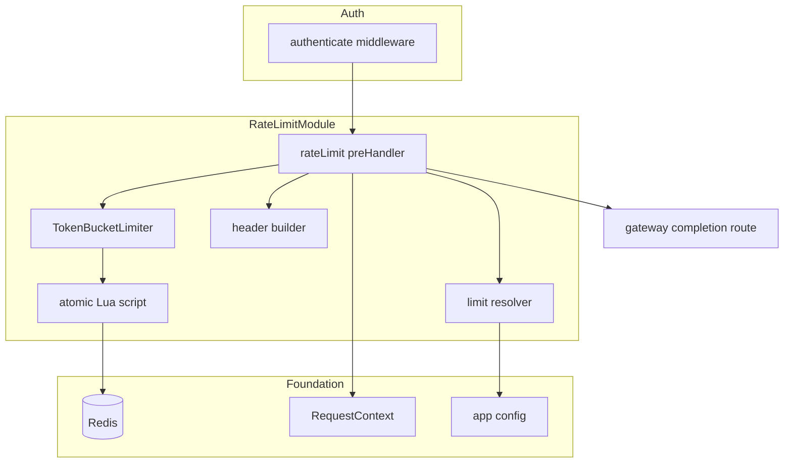
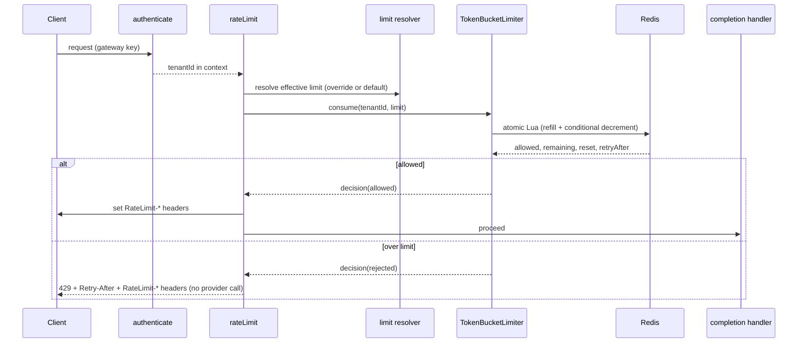

# Technical Design: rate-limiting

## Overview

**Purpose**: This feature protects the gateway's own infrastructure by bounding each tenant's request rate. A Redis-backed token-bucket limiter, enforced as middleware on the gateway request endpoints after authentication, admits within-limit requests and rejects over-limit ones with `429 Too Many Requests` plus standard rate-limit headers. Limits are configurable (a default capacity/refill with optional per-tenant overrides) and enforced atomically so bursts cannot slip past under concurrency.

**Users**: Gateway operators (bound per-tenant load, tune capacity/burst per customer) and developers (receive a clear `429` + `Retry-After` to back off).

**Impact**: Extends `platform-foundation` (uses `app.redis`, `app.config`, the shared logger, `RequestContext`) and consumes `auth-tenancy-credentials` (tenant identity in the context). It applies to the endpoints from `gateway-provider-routing` and adds no datastore or migration. It does not authenticate, call providers, or track provider health.

### Goals
- Per-tenant request rate limiting accounted before provider-calling logic, isolated per tenant.
- A configurable burst capacity and refill rate, with per-tenant overrides and a default fallback.
- `429` responses with `Retry-After` and standard rate-limit headers on both admit and reject.
- Atomic enforcement under concurrent load (no over-admission from races).
- No throttling of the foundation's liveness/readiness endpoints.

### Non-Goals
- Authentication and tenant modeling (`auth-tenancy-credentials`).
- The customer's provider-side token/cost limits (owned by the customer via their key).
- Circuit breaking and provider health (`resilience-failover`).
- Global or IP-based rate limiting; dynamic (datastore-backed) override management.

## Boundary Commitments

### This Spec Owns
- The token-bucket algorithm (atomic Redis Lua script) and its per-tenant Redis keying and TTL.
- The rate-limit middleware applied to gateway request endpoints.
- The rate-limit config segment: default capacity/refill and per-tenant overrides, plus the limit resolver.
- The `429` response and the standard rate-limit headers (`RateLimit-Limit`, `RateLimit-Remaining`, `RateLimit-Reset`, `Retry-After`).
- Atomic/concurrency-correct enforcement.

### Out of Boundary
- Authentication/tenant identity (consumed from `RequestContext.tenantId`).
- Provider-side token/cost limits; provider calls; response normalization.
- Circuit breaking / provider-health cooldown (`resilience-failover`).
- Global/IP-based limits; throttle-event telemetry (`telemetry-analytics` may later read outcomes).
- Any change to the foundation's health endpoints.

### Allowed Dependencies
- `platform-foundation`: `app.redis` (ioredis), `app.config`, shared logger, `RequestContext`.
- `auth-tenancy-credentials`: tenant identity in the request context; the middleware runs after `authenticate`.
- `gateway-provider-routing`: the routes the middleware is applied to.
- Redis only (no PostgreSQL, no migration; two-datastore rule preserved).

### Revalidation Triggers
- The rate-limit config keys or the override format.
- The Redis key namespace or bucket state layout.
- The set of emitted headers or the `429` contract.
- The middleware's placement in the gateway route preHandler chain.

## Architecture

### Existing Architecture Analysis
Extends the foundation's plugin/decoration model. State lives only in Redis (the foundation chose ioredis specifically for atomic Lua scripting). The middleware runs after auth's `authenticate` (so `tenantId` is present) and before the completion handler, matching the steering pipeline order **auth → rate limit → cache → provider**. Health endpoints are unauthenticated and outside the gateway route scope, so they are never throttled.

### Architecture Pattern & Boundary Map

**Selected pattern**: A token-bucket service backed by an atomic Lua script, fronted by a Fastify preHandler middleware. The middleware resolves the effective limit (override or default), consumes a token atomically, sets headers, and either proceeds or rejects with `429`.



**Architecture Integration**:
- Selected pattern: token-bucket service + preHandler middleware.
- Domain boundaries: the bucket algorithm, limit resolution, header building, and middleware orchestration are separate cohesive units.
- Existing patterns preserved: domain-module layout, app decorations (`app.redis`), `RequestContext` consumption, exported-middleware composition (as auth does), two-datastore rule.
- New components rationale: the Lua script isolates atomicity; the resolver isolates override policy; the middleware is the pipeline seam.
- Steering compliance: Redis-only state; per-tenant isolation; pipeline order respected.

### Technology Stack

| Layer | Choice / Version | Role in Feature | Notes |
|-------|------------------|-----------------|-------|
| Backend / Middleware | Fastify 5 preHandler (TypeScript strict) | Enforce the limit on gateway routes | Applied after `authenticate` |
| State / Redis | ioredis (`app.redis`) + Lua via `defineCommand` | Atomic refill + consume; per-tenant bucket | Uses Redis server `TIME` for refill math |
| Config | `zod` (rate-limit env segment) | Default capacity/refill + per-tenant overrides | Self-contained module config |

## File Structure Plan

### Directory Structure
```
src/modules/rate-limiting/
├── index.ts             # plugin: validate config, register Lua command on app.redis, expose rateLimit middleware
├── config.ts            # zod segment (default capacity/refill, overrides JSON) → RateLimitConfig
├── types.ts             # RateLimitConfig, EffectiveLimit, RateLimitDecision, TokenBucketLimiter
├── token-bucket.ts      # TokenBucketLimiter: invoke Lua command, key namespace + TTL, build decision
├── token-bucket.lua     # atomic refill + conditional decrement script (uses Redis TIME)
├── limit-resolver.ts    # effective limit = per-tenant override or default
├── headers.ts           # build RateLimit-* headers and Retry-After from a decision
└── middleware.ts        # rateLimit preHandler: resolve, consume, set headers, 429 or proceed
```

### Modified Files
- `src/app.ts` (foundation) — register the rate-limiting plugin (registers the Lua command; exposes the middleware).
- Gateway completion route — apply the exported `rateLimit` preHandler after `authenticate` (documented integration touchpoint).
- `.env.example` — add `RATE_LIMIT_DEFAULT_CAPACITY`, `RATE_LIMIT_DEFAULT_REFILL_PER_SEC`, `RATE_LIMIT_OVERRIDES`.

## System Flows

### Rate-limit enforcement


Key decisions: the refill+decrement is one atomic Lua step using Redis server time, so concurrent requests for the same tenant cannot over-admit (Req 4.1, 4.2); headers are set on both admit and reject (Req 3.3); a rejection short-circuits before the completion handler, so no provider is called (Req 3.1). Different tenants use different keys, giving independent allowances (Req 1.3).

## Requirements Traceability

| Requirement | Summary | Components | Interfaces | Flows |
|-------------|---------|------------|------------|-------|
| 1.1 | Account request before provider logic | middleware | preHandler order | Enforcement |
| 1.2 | Admit within-limit requests | middleware, TokenBucketLimiter | `consume` | Enforcement |
| 1.3 | Independent per-tenant enforcement | TokenBucketLimiter | key namespace | Enforcement |
| 1.4 | Limit request rate only, not provider spend | middleware (scope) | — | — |
| 1.5 | Do not throttle liveness/readiness | middleware scope (gateway routes only) | route application | — |
| 2.1 | Configurable capacity + refill | config, Lua | `RateLimitConfig` | Enforcement |
| 2.2 | Replenish over time up to capacity | Lua, TokenBucketLimiter | refill math | Enforcement |
| 2.3 | Apply per-tenant override when set | limit resolver | `resolve` | Enforcement |
| 2.4 | Apply default when no override | limit resolver | `resolve` | Enforcement |
| 3.1 | Reject over-limit with 429, no provider call | middleware | 429 response | Enforcement |
| 3.2 | Include Retry-After on rejection | headers | `Retry-After` | Enforcement |
| 3.3 | Standard rate-limit headers on admit/reject | headers | `RateLimit-*` | Enforcement |
| 4.1 | Atomic enforcement under concurrency | Lua, TokenBucketLimiter | atomic script | Enforcement |
| 4.2 | No over-admission from races | Lua | atomic script | Enforcement |

## Components and Interfaces

| Component | Domain/Layer | Intent | Req Coverage | Key Dependencies (P0/P1) | Contracts |
|-----------|--------------|--------|--------------|--------------------------|-----------|
| Rate-Limit Config | config | Default capacity/refill + overrides | 2.1, 2.3, 2.4 | zod (P0) | State |
| Rate-Limit Types | types | Shared contracts | 2.1 | — | Service |
| TokenBucketLimiter | core | Atomic refill + consume in Redis | 1.2, 1.3, 2.1, 2.2, 4.1, 4.2 | app.redis (P0), Lua (P0) | Service, State |
| Lua Script | core | Single atomic refill + decrement | 2.2, 4.1, 4.2 | Redis (P0) | Batch |
| Limit Resolver | policy | Effective limit = override or default | 2.3, 2.4 | Rate-Limit Config (P0) | Service |
| Header Builder | http | Build RateLimit-* + Retry-After | 3.2, 3.3 | — | Service |
| Rate-Limit Middleware | middleware | Orchestrate resolve → consume → headers/429 | 1.1, 1.2, 1.4, 1.5, 3.1, 3.3 | resolver (P0), limiter (P0), RequestContext (P0) | Service |

### core

#### TokenBucketLimiter & Lua Script

| Field | Detail |
|-------|--------|
| Intent | Atomically refill and consume a tenant's bucket |
| Requirements | 1.2, 1.3, 2.1, 2.2, 4.1, 4.2 |

**Responsibilities & Constraints**
- Invoke the Lua command (registered via ioredis `defineCommand`) with the tenant key, capacity, and refill rate. The script reads `(tokens, ts)`, refills by `elapsed · refillPerSec` capped at `capacity` using Redis server `TIME`, admits and decrements if ≥ 1 token, persists state, and sets a TTL. Returns whether admitted plus remaining/reset/retry-after values.
- Key namespace `ratelimit:{tenantId}` gives per-tenant isolation; TTL ≈ `ceil(capacity / refillPerSec)` refreshed each call.

**Dependencies**: Outbound: `app.redis` (P0). External: Redis Lua (P0).

**Contracts**: Service [x] / State [x]

##### Service Interface
```typescript
interface EffectiveLimit { capacity: number; refillPerSec: number; }

interface RateLimitDecision {
  allowed: boolean;
  limit: number;             // capacity
  remaining: number;         // floored tokens left
  resetSeconds: number;      // seconds until bucket is full again
  retryAfterSeconds: number; // seconds until >= 1 token is available (used when !allowed)
}

interface TokenBucketLimiter {
  consume(tenantId: string, limit: EffectiveLimit): Promise<RateLimitDecision>;
}
```
- Preconditions: `tenantId` present (post-auth); `limit` resolved.
- Postconditions: at most `capacity` tokens ever available; exactly one token consumed on admit.
- Invariants: refill + decrement occur atomically in one Redis round-trip (Req 4.1, 4.2); buckets never exceed capacity (Req 2.2).

**Implementation Notes**
- Integration: registered as a command on `app.redis` at plugin start; `resetSeconds`/`retryAfterSeconds` computed from tokens and refill rate.
- Validation: concurrency test fires N > capacity simultaneous consumes and asserts exactly `capacity` admitted.
- Risks: use Redis `TIME` (not app clock) so multiple app instances agree on elapsed time.

### policy & http

#### Limit Resolver & Header Builder

| Field | Detail |
|-------|--------|
| Intent | Resolve the effective limit and build response headers |
| Requirements | 2.3, 2.4, 3.2, 3.3 |

**Responsibilities & Constraints**
- Resolver: return the per-tenant override when configured, otherwise the default (Req 2.3, 2.4).
- Header builder: from a decision, set `RateLimit-Limit`, `RateLimit-Remaining`, `RateLimit-Reset` on every response and `Retry-After` on a 429.

**Contracts**: Service [x]

##### Service Interface
```typescript
interface LimitResolver { resolve(tenantId: string): EffectiveLimit; }

interface RateLimitHeaders {
  set(reply: FastifyReply, decision: RateLimitDecision): void; // RateLimit-* always; Retry-After when !allowed
}
```

### middleware

#### Rate-Limit Middleware

| Field | Detail |
|-------|--------|
| Intent | Enforce the limit on gateway routes after authentication |
| Requirements | 1.1, 1.2, 1.4, 1.5, 3.1, 3.3 |

**Responsibilities & Constraints**
- As a Fastify preHandler applied to gateway request endpoints after `authenticate`: read `tenantId` from the context, resolve the limit, consume a token, set headers, and either proceed (admit) or reply `429` (reject) before the completion handler. Limits only the request rate; never inspects provider tokens/cost (Req 1.4). Never registered on health endpoints (Req 1.5).

**Dependencies**: Outbound: Limit Resolver (P0), TokenBucketLimiter (P0), Header Builder (P0), `RequestContext` (P0). Inbound: gateway completion route (P0).

**Contracts**: Service [x]

##### Service Interface
```typescript
// Fastify preHandler
function rateLimit(request: FastifyRequest, reply: FastifyReply): Promise<void>;
// Admit: sets RateLimit-* headers, returns (continues chain)
// Reject: sets RateLimit-* + Retry-After, sends 429 { error: 'rate_limited' }, stops the chain
```
- Preconditions: applied after `authenticate`; `request.ctx.tenantId` is set.
- Postconditions: exactly one token accounted per request; a rejected request never reaches the completion handler (Req 3.1).
- Invariants: applies only to gateway routes (Req 1.5).

**Implementation Notes**
- Integration: the gateway completion route composes `[authenticate, rateLimit]` as preHandlers (documented touchpoint; matches steering pipeline order).
- Validation: integration test asserts admit/reject behavior, headers, and that health endpoints are unaffected.

## Data Models

No persistent (PostgreSQL) model — state is Redis-only. Per tenant: a Redis hash `ratelimit:{tenantId}` with fields `tokens` (number) and `ts` (last-refill time from Redis `TIME`), with a TTL refreshed each call. No migration is added; the two-datastore rule is preserved.

## Error Handling

### Error Strategy
Fail closed on a clear over-limit signal; fail open only on limiter infrastructure errors to avoid taking down the gateway for a Redis blip (logged), unless stricter behavior is configured.

### Error Categories and Responses
- **Over limit** (429): reject with `Retry-After` + `RateLimit-*` headers; no provider call (Req 3.1, 3.2, 3.3).
- **Redis/limiter error**: log via the shared logger and admit the request (fail-open) so a limiter outage does not hard-fail the gateway; documented trade-off.
- **Missing tenant identity**: should not occur post-auth; treated as an internal error rather than silently unlimited.

### Monitoring
Structured logs for throttle decisions (tenant id, allowed/blocked) without secrets. Throttle-event metrics are out of boundary (`telemetry-analytics`).

## Testing Strategy

### Unit Tests
- Limit resolver: returns the override when configured, the default otherwise (2.3, 2.4).
- Header builder: sets `RateLimit-Limit`/`Remaining`/`Reset` on admit and adds `Retry-After` on reject (3.2, 3.3).
- TokenBucketLimiter: a full bucket admits; an empty bucket rejects; tokens refill over elapsed time up to capacity and never beyond (1.2, 2.1, 2.2).

### Integration Tests (against dockerized Redis)
- Concurrency: fire more simultaneous requests than capacity for one tenant and assert exactly `capacity` are admitted and the rest get `429` (4.1, 4.2).
- Isolation: two tenants each get their own full allowance; exhausting one does not affect the other (1.3).
- Pipeline: an over-limit request returns `429` with `Retry-After` and is not forwarded to the completion handler; liveness/readiness are never throttled (1.1, 1.5, 3.1).
- Refill: after waiting for the configured refill interval, a previously-throttled tenant is admitted again (2.2).

## Performance & Scalability
- One Redis round-trip per request (EVALSHA-cached Lua); negligible added latency on the request path.
- Per-tenant keys with TTL bound memory to active tenants.
- Correct across multiple gateway instances because all state and timing live in Redis (Req 4.1).
