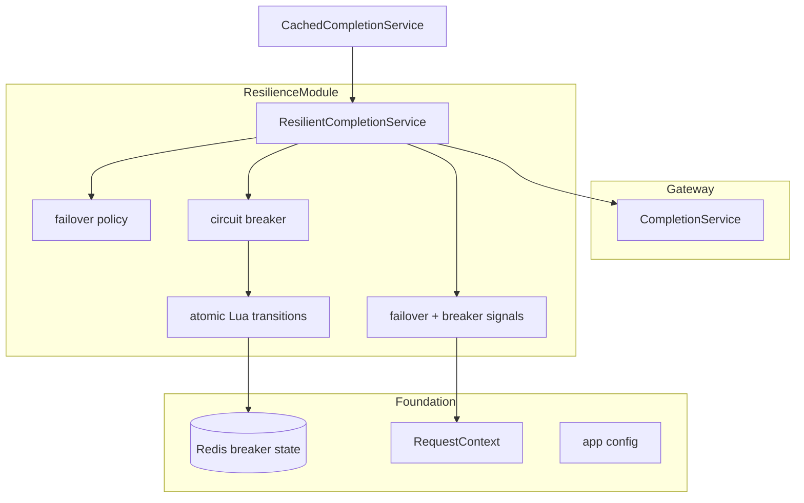
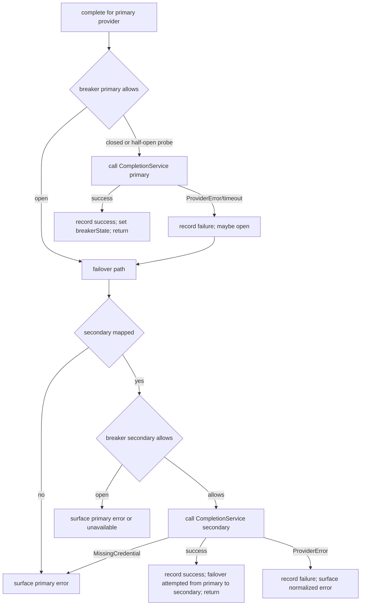
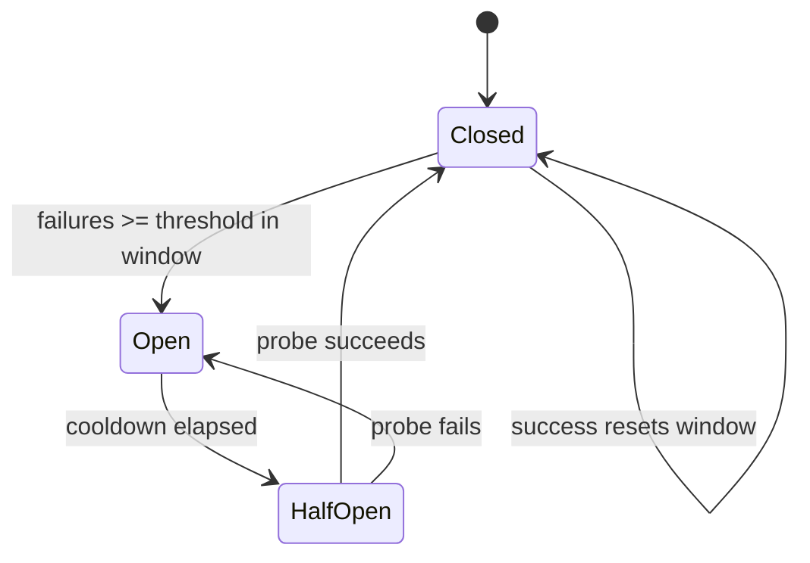

# Technical Design: resilience-failover

## Overview

**Purpose**: This feature keeps upstream-provider failures from surfacing as failed requests and stops the gateway from hammering a provider that is down for a tenant. It wraps the provider call with two mechanisms: automatic failover from the primary provider to a pre-configured secondary using the tenant's secondary credential, and a per-`(tenant, provider)` circuit breaker that counts failures in a rolling window, opens on a threshold, cools down, and probes recovery through a half-open state. Failover decisions and breaker-state transitions are written to the shared request context for telemetry.

**Users**: Customers (a provider outage transparently fails over instead of erroring) and operators (a downed provider stops consuming latency/quota for a tenant). `telemetry-analytics` reads the exposed signals.

**Impact**: Wraps `gateway-provider-routing`'s `CompletionService` (reusing its adapter/credential/normalization) and sits beneath the cache layer. State lives in Redis (no new datastore, no migration). It selects no primary provider, normalizes nothing itself, and emits no metrics.

### Goals
- Automatic retry to a pre-configured secondary provider using the tenant's secondary credential; surface the primary error when no secondary credential exists.
- A per-`(tenant, provider)` circuit breaker with configurable rolling window, failure threshold, cooldown, and single half-open probe, isolated per tenant.
- A hardcoded primary→secondary sequence for v1 (no dynamic cost/latency routing).
- Failover and breaker-state signals written to the shared request context.

### Non-Goals
- Selecting the primary provider, provider adapters, or response normalization (`gateway-provider-routing`).
- Dynamic weighted/cost/latency routing (stretch).
- Rate limiting (`rate-limiting`); telemetry dashboards/metrics (`telemetry-analytics`).

## Boundary Commitments

### This Spec Owns
- The failover policy: the configured primary→secondary map and the retry-to-secondary decision.
- The per-`(tenant, provider)` circuit breaker: rolling failure window, open/half-open/closed transitions, cooldown, and single-probe recovery, with state in Redis.
- The `ResilientCompletionService` that wraps the completion flow and applies the breaker gate + failover.
- Population of the failover and breaker-state signals in the request context (plus a per-provider transitions detail).
- Its own resilience config segment (failover map, window, threshold, cooldown).

### Out of Boundary
- Provider adapters, credential resolution/encryption, and normalization (owned upstream; reused).
- Choosing the primary provider or routing by live cost/latency.
- Cache lookup/store (cache wraps this layer); rate limiting; metrics/dashboards.

### Allowed Dependencies
- `platform-foundation`: `app.redis`, `app.config`, shared logger, `RequestContext` (populates `failover`, `breakerState`).
- `gateway-provider-routing`: the `CompletionService` contract, `ProviderName`, `ProviderError`.
- `auth-tenancy-credentials`: the tenant's secondary credential (resolved indirectly by `CompletionService` for the secondary provider).
- Redis only (no PostgreSQL, no migration).

### Revalidation Triggers
- The failover map / config keys.
- The breaker Redis key layout or state semantics.
- The `breakerEvents` context field or the use of `failover`/`breakerState`.
- The completion-entrypoint composition order (cache → resilience → completion).

## Architecture

### Existing Architecture Analysis
Wraps the gateway `CompletionService` and reuses it for the secondary call, so adapter selection, credential resolution, and normalization are not duplicated. Breaker state is per-`(tenant, provider)` in Redis (foundation client), matching the rate-limiter's atomic-Lua approach. The foundation `RequestContext` already declares `failover` and `breakerState`, which this spec populates. Composition places caching outermost so a cache hit avoids this layer entirely.

### Architecture Pattern & Boundary Map

**Selected pattern**: A decorator (`ResilientCompletionService`) over `CompletionService`, plus a Redis-backed circuit-breaker state machine and a failover policy. The decorator gates each provider on its breaker, calls the primary, and on failure/open breaker fails over to the configured secondary.



**Architecture Integration**:
- Selected pattern: decorator + Redis state machine + policy.
- Domain boundaries: the breaker (state/transitions), the failover policy (secondary selection), and the resilient orchestration are separate units.
- Existing patterns preserved: wrap-not-modify of the completion service; app decorations (`app.redis`); `RequestContext` population; two-datastore rule.
- New components rationale: the breaker isolates atomic state; the policy isolates the sequence; the decorator keeps the retry/gate logic in one place.
- Steering compliance: hardcoded primary→secondary (v1); breaker distinct from rate limiting; per-tenant isolation.

### Technology Stack

| Layer | Choice / Version | Role in Feature | Notes |
|-------|------------------|-----------------|-------|
| Backend / Services | Fastify 5 plugin (TypeScript strict) | Resilient wrapping of the completion flow | Composed beneath caching |
| State / Redis | ioredis (`app.redis`) + Lua via `defineCommand` | Atomic breaker transitions + rolling failure window | Uses Redis server `TIME` |
| Config | `zod` (resilience env segment) | Failover map, window, threshold, cooldown | Self-contained module config |

## File Structure Plan

### Directory Structure
```
src/modules/resilience/
├── index.ts                          # plugin: validate config, register breaker Lua commands, expose ResilientCompletionService
├── config.ts                         # zod segment (failover map, failure window, threshold, cooldown)
├── types.ts                          # BreakerState, BreakerDecision, ResilienceOutcome, FailoverPlan
├── context.ts                        # populate failover + breakerState + breakerEvents write helpers
├── circuit-breaker.ts                # check/transition + recordSuccess/recordFailure over Redis
├── circuit-breaker.lua               # atomic rolling-window failure count + state transitions
├── failover-policy.ts               # resolve the secondary provider from the configured map
└── resilient-completion-service.ts   # wrap CompletionService: breaker gate + primary→secondary failover
```

### Modified Files
- `src/app.ts` (foundation) — register the resilience plugin; compose the completion entrypoint as cache → resilience → completion.
- `.env.example` — add `RESILIENCE_FAILOVER_MAP`, `RESILIENCE_FAILURE_WINDOW_SECONDS`, `RESILIENCE_FAILURE_THRESHOLD`, `RESILIENCE_COOLDOWN_SECONDS`.

> `ResilientCompletionService` implements the same `complete()` contract as `CompletionService`, so the cache orchestrator wraps it transparently and the raw completion service is the innermost call.

## System Flows

### Failover with breaker gating


Key decisions: an open primary breaker skips the primary and fails over immediately (Req 2.3); failover only follows a `ProviderError`/timeout, never a validation/auth error; a missing secondary credential surfaces the primary's error and does not fail over (Req 1.3); a secondary success returns its normalized response (Req 1.4); every failure/success updates the affected `(tenant, provider)` breaker atomically (Req 2.1, 2.2).

### Breaker state machine


Key decisions: the failure window is rolling (Req 2.1); OPEN persists for the cooldown (Req 3.1); after cooldown a single half-open probe is admitted (Req 3.2); probe success closes and resumes routing (Req 3.3), probe failure re-opens for another cooldown (Req 3.4). Concurrent requests during HALF_OPEN beyond the one probe are treated as open.

## Requirements Traceability

| Requirement | Summary | Components | Flows |
|-------------|---------|------------|-------|
| 1.1 | Retry to secondary on primary error/timeout | ResilientCompletionService, failover policy | Failover |
| 1.2 | Use tenant's secondary credential | ResilientCompletionService (via CompletionService) | Failover |
| 1.3 | No secondary credential → surface primary error | ResilientCompletionService | Failover |
| 1.4 | Secondary success returns normalized response | ResilientCompletionService | Failover |
| 1.5 | Pre-configured sequence, no dynamic routing | failover policy, config | — |
| 2.1 | Track failures per (tenant, provider) in window | circuit breaker, Lua | State |
| 2.2 | Open on threshold within window | circuit breaker, Lua | State |
| 2.3 | While open, don't route; fail over or error | ResilientCompletionService, breaker | Failover |
| 2.4 | Breaker state isolated per tenant | circuit breaker (key namespace) | — |
| 3.1 | Keep open for cooldown | circuit breaker | State |
| 3.2 | Half-open probe after cooldown | circuit breaker | State |
| 3.3 | Probe success closes breaker | circuit breaker | State |
| 3.4 | Probe failure re-opens | circuit breaker | State |
| 4.1 | Record served-by-secondary on failover | signals writer | Failover |
| 4.2 | Record breaker state transitions | signals writer, breaker | State |
| 4.3 | Expose signals only; no metrics | signals writer | — |

## Components and Interfaces

| Component | Domain/Layer | Intent | Req Coverage | Key Dependencies (P0/P1) | Contracts |
|-----------|--------------|--------|--------------|--------------------------|-----------|
| Resilience Config | config | Failover map, window, threshold, cooldown | 1.5, 2.1, 2.2, 3.1 | zod (P0) | State |
| Resilience Types & Context | types/context | Breaker/outcome contracts + signal writers | 4.1, 4.2 | RequestContext (P0) | State |
| Circuit Breaker | core | Redis state machine + rolling window | 2.1, 2.2, 2.3, 2.4, 3.1, 3.2, 3.3, 3.4 | app.redis (P0), Lua (P0) | Service, State |
| Failover Policy | policy | Resolve secondary from the configured map | 1.5 | Resilience Config (P0) | Service |
| ResilientCompletionService | orchestration | Breaker gate + primary→secondary failover | 1.1, 1.2, 1.3, 1.4, 2.3, 4.1 | breaker (P0), policy (P0), CompletionService (P0) | Service |
| Signals Writer | telemetry-facing | Write failover + breaker signals | 4.1, 4.2, 4.3 | RequestContext (P0) | State |

### core

#### Circuit Breaker & Lua

| Field | Detail |
|-------|--------|
| Intent | Per-`(tenant, provider)` state machine with atomic transitions |
| Requirements | 2.1, 2.2, 2.3, 2.4, 3.1, 3.2, 3.3, 3.4 |

**Responsibilities & Constraints**
- Key `breaker:{tenantId}:{provider}` holds state (CLOSED/OPEN/HALF_OPEN), the open timestamp, and an in-flight probe marker; failures are recorded in a rolling window (sorted set of timestamps within the configured window). All check/transition/record operations run as atomic Lua using Redis server `TIME`.
- `check`: CLOSED → allow; OPEN → if cooldown elapsed, transition to HALF_OPEN and allow one probe, else deny; HALF_OPEN → allow only if no probe in flight.
- `recordFailure`: append to the window; if count ≥ threshold (or a half-open probe failed) → OPEN with a fresh open timestamp.
- `recordSuccess`: on HALF_OPEN → CLOSED and reset; on CLOSED → clear the failure window.
- State is isolated per tenant by the key (Req 2.4).

**Contracts**: Service [x] / State [x]

##### Service Interface
```typescript
type BreakerState = 'closed' | 'open' | 'half_open';
interface BreakerDecision { allow: boolean; state: BreakerState; isProbe: boolean; }

interface CircuitBreaker {
  check(tenantId: string, provider: ProviderName): Promise<BreakerDecision>;
  recordSuccess(tenantId: string, provider: ProviderName, wasProbe: boolean): Promise<BreakerState>;
  recordFailure(tenantId: string, provider: ProviderName, wasProbe: boolean): Promise<BreakerState>;
}
```
- Invariants: transitions are atomic (Req 2.2, 3.x); at most one half-open probe; keys namespaced by tenant (Req 2.4).

**Implementation Notes**
- Integration: Lua commands registered on `app.redis` at plugin start; returned `BreakerState` feeds the signals writer.
- Validation: unit/integration tests drive threshold→open, cooldown→half-open, probe success→closed, probe failure→open.
- Risks: use Redis `TIME` for window/cooldown math so instances agree; fail open on a breaker store error.

### orchestration

#### ResilientCompletionService

| Field | Detail |
|-------|--------|
| Intent | Gate on the breaker and fail over primary→secondary |
| Requirements | 1.1, 1.2, 1.3, 1.4, 2.3, 4.1 |

**Responsibilities & Constraints**
- Implements the same contract as `CompletionService`. For the primary provider: `check` the breaker; if allowed, call the inner `CompletionService`; on success `recordSuccess`; on `ProviderError`/timeout `recordFailure` and fail over. If the primary breaker is open, skip to failover. Failover: resolve the secondary via the policy; if none mapped, surface the primary error; otherwise `check` the secondary breaker and, if allowed, call the inner service with the secondary provider. A `MissingCredentialError` from the secondary surfaces the primary error (Req 1.3). Record failover and breaker signals.

**Dependencies**: Outbound: Circuit Breaker (P0), Failover Policy (P0), `CompletionService` (P0), Signals Writer (P0). Inbound: `CachedCompletionService` (wraps this) (P0).

**Contracts**: Service [x]

##### Service Interface
```typescript
// Mirrors gateway CompletionService; substitutes as the inner completion entrypoint under caching
interface ResilientCompletionService {
  complete(input: { tenantId: string; request: ChatCompletionRequest; perRequestKey?: string; ctx: RequestContext }): Promise<NormalizedResponse>;
}
```
- Preconditions: authenticated tenant; validated request; primary provider in `request.provider`.
- Postconditions: returns the primary or secondary normalized response; `failover`/`breakerState`/`breakerEvents` populated; breaker state updated for each provider tried.
- Invariants: at most one primary attempt and one secondary attempt (v1 sequence, Req 1.5); fails over only on provider failure, not on validation/auth errors.

**Implementation Notes**
- Integration: composed as cache → resilience → completion; `resilience` re-invokes the inner `CompletionService` with the secondary provider so credential resolution and normalization are reused.
- Validation: integration tests cover primary-fail→secondary-success, no-secondary→primary-error, and open-breaker→failover.
- Risks: ensure the secondary path does not double-count breaker failures for the primary.

### telemetry-facing

#### Resilience Types, Context & Signals Writer

**Contracts**: State [x] (Req 4.1, 4.2, 4.3)
```typescript
interface BreakerEvent { provider: ProviderName; state: BreakerState; }
// Populates foundation RequestContext.failover { attempted, from, to } and RequestContext.breakerState;
// adds (declaration merging) breakerEvents: BreakerEvent[] (default [])
```
- Records that a request was served by the secondary (Req 4.1) and each `(tenant, provider)` breaker transition (Req 4.2); computes no metrics (Req 4.3).

## Data Models

No persistent (PostgreSQL) model — breaker state is Redis-only. Per `(tenant, provider)`: `breaker:{tenant}:{provider}` (state, open timestamp, probe marker) and a rolling-window failure set, each with a TTL bounded by window/cooldown so idle keys expire. No migration; two-datastore rule preserved.

## Error Handling

### Error Strategy
Fail over on provider failure; fail open on breaker-infrastructure failure; never mask client-side errors as provider failures.

### Error Categories and Responses
- **Primary provider error/timeout**: record failure, fail over to secondary if available (Req 1.1); otherwise surface the primary's normalized error (Req 1.3).
- **Secondary provider error**: record failure; surface a normalized error carrying no credential.
- **Open breaker**: skip the provider; fail over or surface an error per policy (Req 2.3).
- **Breaker store error**: fail open (allow the call) and log; a Redis blip must not block all traffic.
- **Validation/auth errors**: propagate unchanged; never trigger failover.

### Monitoring
Structured logs of failover decisions and breaker transitions (tenant, provider, state) without secrets. Metrics/dashboards are out of boundary (`telemetry-analytics`).

## Testing Strategy

Tests are co-located with the file under test (see `structure.md`): unit tests as `<name>.test.ts`
beside `<name>.ts`, integration tests as `<name>.integration.test.ts` beside the module they
exercise. There is no separate `test/` tree; the two Vitest suites are selected by filename suffix,
not by directory.

### Unit Tests
- Failover policy: resolves the configured secondary for a primary; returns none when unmapped (1.5).
- Breaker transitions: threshold reached within window → open; success resets the window; a half-open probe result closes or re-opens (2.1, 2.2, 3.3, 3.4).
- Resilient service decision logic: primary success returns without failover; primary error with a secondary fails over; primary error without a secondary credential surfaces the primary error (1.1, 1.3, 1.4).

### Integration Tests (against dockerized Redis, with stubbed providers)
- Failover: a failing primary and a healthy secondary (with a secondary credential) returns the secondary's response and records failover (1.1, 1.4, 4.1).
- No secondary: a failing primary with no secondary credential surfaces the primary error and does not fail over (1.3).
- Breaker open: repeated primary failures for a `(tenant, provider)` open the breaker; subsequent requests skip the primary and fail over; the state is recorded (2.2, 2.3, 4.2).
- Recovery: after cooldown, one half-open probe is admitted; success closes the breaker and resumes routing (3.1, 3.2, 3.3).
- Isolation: one tenant's failures do not open another tenant's breaker for the same provider (2.4).

## Performance & Scalability
- One breaker check (and one record) per provider attempt, each a single atomic Redis round-trip.
- Per-`(tenant, provider)` keys with TTL bound state to active pairs.
- Correct across gateway instances because breaker state and timing live in Redis (shared, atomic).

## Security Considerations
- Failover reuses the tenant's own secondary credential via the existing resolver; no credential is logged or surfaced in errors (normalized errors carry no secret).
- Breaker keys contain only tenant and provider identifiers, never secrets.
