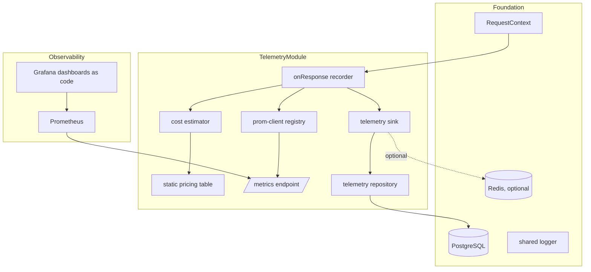
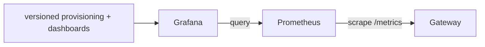

# Technical Design: telemetry-analytics

## Overview

**Purpose**: This feature makes the gateway's value measurable and the system observable. It records a structured telemetry record for every completion request from the signals routing, caching, and resilience already populate in the shared context; computes **estimated cost saved** on cache hits from a static in-repo pricing table; exports Prometheus metrics (requests, cache status, latency, tokens, savings, and the context-aware matching + false-hit instrumentation); and provisions Grafana dashboards-as-code. Recording never blocks the request path, and no secret or raw content ever appears in telemetry, metrics, or dashboards.

**Users**: Operators and stakeholders (savings, latency, cache-hit-rate, and detection-effectiveness dashboards) and the future stretch Admin UI / dynamic-weighted-routing.

**Impact**: Consumes the request-context signals from `gateway-provider-routing`, `dual-layer-caching`, and `resilience-failover`; adds this spec's own `request_telemetry` migration; and adds the Prometheus + Grafana observability layer to Docker Compose. It computes none of the underlying decisions and performs no billing.

### Goals
- Persist a per-request telemetry record with tenant, provider, model, tokens, cache status, latency, failover/breaker state, and the matching outcome — read, not recomputed.
- Compute estimated cost saved on cache hits from a static pricing table; zero on live; graceful on missing entries.
- Export a Prometheus-scrapable `/metrics` endpoint with the required series, labeled without secrets.
- Provision reproducible Grafana dashboards for savings, latency, cache-hit-rate, and matching/false-hit views.
- Record telemetry without blocking the response and without surfacing telemetry failures.

### Non-Goals
- Billing/invoicing/charging; live pricing feeds; a custom client-facing frontend.
- Producing cache-status, topic-shift, or verification decisions (owned by `dual-layer-caching`).
- Selecting providers or altering the request path.

## Boundary Commitments

### This Spec Owns
- The per-request telemetry schema and persistence (its own migration), including the optional background-queue offload.
- The static in-repo pricing table and the estimated-cost-saved computation.
- The Prometheus metrics registry, the `/metrics` endpoint, and all metric series/labels.
- The Grafana dashboards-as-code and provisioning, plus the Prometheus scrape config, and the compose additions for both.
- Secret/PII exclusion from telemetry, metrics, and dashboards.

### Out of Boundary
- The signals themselves (`cacheStatus`/`cacheOutcome`, `failover`/`breakerState`/`breakerEvents`, provider/model/usage/latency) — consumed, not produced.
- Provider calls, caching, resilience, auth, rate limiting.
- Any billing/charging; live pricing.

### Allowed Dependencies
- `platform-foundation`: `app.pg`, `app.redis` (only if BullMQ offload enabled), `app.config`, shared logger, `RequestContext`, migration runner, Docker Compose.
- `gateway-provider-routing` / `dual-layer-caching` / `resilience-failover`: the request-context fields they populate.
- `prom-client`; Prometheus + Grafana (compose services); optional `bullmq`.

### Revalidation Triggers
- The `request_telemetry` schema.
- The metric names/labels (consumed by dashboards).
- The set of context fields read (a rename upstream requires updating the recorder).
- The compose observability services / provisioning layout.

## Architecture

### Existing Architecture Analysis
Terminal consumer: an `onResponse` hook on the completion route reads the fully-populated `RequestContext` after routing/caching/resilience have run. Metric updates are in-memory and inline (non-blocking); the Postgres row is offloaded. The foundation's Pino logger and datastores are reused; this spec adds the Prometheus/Grafana layer to the compose stack. `/metrics` is unauthenticated for scraping (like health), outside the gateway auth middleware.

### Architecture Pattern & Boundary Map

**Selected pattern**: An `onResponse` recorder that snapshots the context, updates a `prom-client` registry inline, computes savings, and hands a record to a non-blocking `TelemetrySink` (direct async by default; optional BullMQ). Dashboards and scrape config are versioned files provisioned into Grafana/Prometheus.



**Architecture Integration**:
- Selected pattern: inline metrics + offloaded persistence + provisioned dashboards.
- Domain boundaries: recording, cost estimation, metrics, persistence/sink, and dashboards are separate units.
- Existing patterns preserved: domain-module layout; app decorations; migration-per-spec; shared logger; two-datastore rule (Postgres for rows, Redis only if BullMQ).
- New components rationale: the sink isolates non-blocking persistence; the registry isolates metrics; pricing/cost isolate savings.
- Steering compliance: estimated savings only; secrets never in telemetry; observability via Prometheus + Grafana.

### Technology Stack

| Layer | Choice / Version | Role in Feature | Notes |
|-------|------------------|-----------------|-------|
| Backend / Services | Fastify 5 plugin (TypeScript strict) | `onResponse` recorder + `/metrics` route | Registered after gateway/cache/resilience |
| Metrics | `prom-client` | Counters/histograms + `/metrics` | Dedicated registry; low-cardinality labels |
| Persistence | PostgreSQL (`app.pg`) | `request_telemetry` rows | This spec's migration |
| Offload (optional) | `bullmq` on `app.redis` | Durable async telemetry writes | Config-selected; default direct async |
| Observability | Prometheus + Grafana (compose) | Scrape + dashboards-as-code | Provisioned from versioned files |
| Config | `zod` (telemetry env segment) | Offload mode, metrics path | Self-contained module config |

## File Structure Plan

### Directory Structure
```
src/modules/telemetry/
├── index.ts                    # plugin: validate config, init registry + sink, register /metrics + onResponse recorder
├── config.ts                   # zod segment (offload mode direct|bullmq, metrics path)
├── types.ts                    # TelemetryRecord, PricingEntry, CostResult
├── pricing.ts                  # static in-repo pricing table (per provider/model input/output rates) + lookup
├── cost-estimator.ts           # estimated cost saved from usage + pricing + cache status
├── metrics.ts                  # prom-client registry + metric definitions + update(record) + metrics handler
├── telemetry-repository.ts     # insert request_telemetry rows
├── telemetry-sink.ts           # non-blocking writer: direct async (default) + optional BullMQ producer/worker
└── recorder.ts                 # onResponse hook: snapshot ctx → compute savings → update metrics → enqueue persist

migrations/
└── {timestamp}_request_telemetry.sql   # request_telemetry table + indexes

prometheus/
└── prometheus.yml              # scrape config targeting the gateway /metrics

grafana/
├── provisioning/datasources/prometheus.yml   # Prometheus datasource
├── provisioning/dashboards/dashboards.yml     # file provider → dashboards dir
└── dashboards/
    ├── overview.json           # cost saved, latency distribution, cache hit rate over time
    └── context-matching.json   # topic-shift/verification breakdown + false-hit instrumentation
```

### Modified Files
- `src/app.ts` (foundation) — register the telemetry plugin; attach the `onResponse` recorder to the completion route; expose `/metrics` unauthenticated.
- `docker-compose.yml` (foundation) — add `prometheus` and `grafana` services with the provisioning/scrape files mounted (this spec owns the observability layer).
- `.env.example` — add `TELEMETRY_OFFLOAD_MODE`, `METRICS_PATH`.

## System Flows

### Recording on response
```mermaid
sequenceDiagram
    participant Handler as completion handler
    participant Hook as onResponse recorder
    participant Cost as cost estimator
    participant Metrics as prom-client
    participant Sink as telemetry sink
    participant Client

    Handler-->>Client: response sent
    Handler->>Hook: onResponse (context fully populated)
    Hook->>Cost: estimate saving (cache status, usage, provider, model)
    Hook->>Metrics: update counters/histograms inline
    Hook->>Sink: hand record (non-blocking)
    Sink-->>Hook: returns immediately
    Note over Sink: persists row async; errors caught + logged
```

Key decisions: the recorder runs after the response is sent, so nothing it does adds latency (Req 5.1); metric updates are in-memory; the row persistence is handed to the sink and not awaited (Req 5.2); any sink/DB failure is caught and logged, never surfaced (Req 1.4, 5.3). All values are read from the context — none recomputed (Req 1.3).

### Scrape and dashboards


Key decisions: `/metrics` is unauthenticated for scraping; dashboards and datasource are provisioned from version-controlled files (Req 4.3).

## Requirements Traceability

| Requirement | Summary | Components | Flows |
|-------------|---------|------------|-------|
| 1.1 | Persist structured per-request record | recorder, repository, migration | Recording |
| 1.2 | Include matching outcome in record | recorder, repository | Recording |
| 1.3 | Read from context, don't recompute | recorder | Recording |
| 1.4 | Persist failure doesn't fail/delay response | sink, recorder | Recording |
| 2.1 | Compute saved cost on cache hit | cost estimator | Recording |
| 2.2 | From static pricing table | pricing, cost estimator | Recording |
| 2.3 | Zero saved on live | cost estimator | Recording |
| 2.4 | Estimated only, no billing | cost estimator | — |
| 2.5 | Missing pricing entry → no saving, no fail | cost estimator, pricing | Recording |
| 3.1 | Prometheus-scrapable endpoint | metrics, /metrics route | Scrape |
| 3.2 | Request/cache/latency/token/savings series | metrics | Scrape |
| 3.3 | Matching + false-hit instrumentation series | metrics | Scrape |
| 3.4 | Label by dimensions, no secrets | metrics | Scrape |
| 4.1 | Dashboards: cost, latency, hit rate | grafana dashboards | Dashboards |
| 4.2 | Dashboard: matching + false-hit breakdown | grafana dashboards | Dashboards |
| 4.3 | Provision from versioned definitions | grafana provisioning | Dashboards |
| 5.1 | Record without blocking response | recorder | Recording |
| 5.2 | Offloaded queue returns without waiting | sink | Recording |
| 5.3 | Telemetry down → keep serving | sink, recorder | Recording |
| 6.1 | Exclude secrets from telemetry/metrics/dashboards | recorder, metrics, repository | — |
| 6.2 | No raw prompt/response in metric labels | metrics | — |

## Components and Interfaces

| Component | Domain/Layer | Intent | Req Coverage | Key Dependencies (P0/P1) | Contracts |
|-----------|--------------|--------|--------------|--------------------------|-----------|
| Telemetry Config | config | Offload mode, metrics path | 5.2 | zod (P0) | State |
| Telemetry Types | types | Record + pricing contracts | 1.1 | — | Service |
| Pricing Table | pricing | Static per-provider/model rates | 2.2, 2.5 | — | State |
| Cost Estimator | savings | Estimated saved from usage + status | 2.1, 2.3, 2.4, 2.5 | pricing (P0) | Service |
| Metrics Registry | metrics | prom-client series + update + handler | 3.1, 3.2, 3.3, 3.4, 6.2 | prom-client (P0) | Service, API |
| Telemetry Repository | persistence | Insert telemetry rows | 1.1, 1.2, 6.1 | app.pg (P0) | State |
| Telemetry Sink | persistence | Non-blocking write (direct/BullMQ) | 1.4, 5.1, 5.2, 5.3 | repository (P0), bullmq (P1) | Service |
| Recorder | orchestration | onResponse snapshot → metrics + persist | 1.1, 1.2, 1.3, 5.1, 6.1 | cost (P0), metrics (P0), sink (P0), RequestContext (P0) | Service |
| Telemetry Migration | data | `request_telemetry` table | 1.1 | migration runner (P0) | State |
| Dashboards & Provisioning | observability | Grafana + Prometheus as code | 4.1, 4.2, 4.3, 3.1 | Prometheus/Grafana (P0) | Batch |

### savings

#### Pricing Table & Cost Estimator

| Field | Detail |
|-------|--------|
| Intent | Estimate cost saved on cache hits from static rates |
| Requirements | 2.1, 2.2, 2.3, 2.4, 2.5 |

**Responsibilities & Constraints**
- Pricing: a typed static table keyed by `(provider, model)` with input/output per-token rates.
- Estimator: for a cache hit, `saved = promptTokens·inputRate + completionTokens·outputRate`; for a live request, `saved = 0` (Req 2.3); when the `(provider, model)` has no entry, return "no saving computed" without failing (Req 2.5). Values are estimates only — no billing (Req 2.4).

**Contracts**: Service [x]

##### Service Interface
```typescript
interface PricingEntry { inputRatePerToken: number; outputRatePerToken: number; }
interface CostResult { estimatedCostSaved: number | null; } // null when no pricing entry

interface CostEstimator {
  estimateSaved(input: {
    cacheStatus: CacheStatus;
    provider: ProviderName; model: string;
    promptTokens: number; completionTokens: number;
  }): CostResult;
}
```
- Invariants: non-zero saving only for `cache_hit_exact`/`cache_hit_semantic` with a pricing entry; `live_provider` → 0; missing entry → null.

### metrics

#### Metrics Registry

| Field | Detail |
|-------|--------|
| Intent | Define and expose Prometheus series |
| Requirements | 3.1, 3.2, 3.3, 3.4, 6.2 |

**Responsibilities & Constraints**
- Own a dedicated `prom-client` registry with: `gateway_requests_total{provider,cache_status}`, `gateway_request_latency_seconds` histogram `{provider,cache_status}`, `gateway_tokens_total{provider,model,type}`, `gateway_estimated_cost_saved_total{provider,model}`, `gateway_topic_shift_total{decision}`, `gateway_verification_total{result}`, and `gateway_semantic_candidates_total` / fallbacks for false-hit instrumentation. Serve `/metrics` with the registry's content type. Labels are bounded dimensions only — no tenant id, secrets, or raw content (Req 3.4, 6.2).

**Contracts**: Service [x] / API [x]

##### API Contract
| Method | Endpoint | Request | Response | Errors |
|--------|----------|---------|----------|--------|
| GET | /metrics | — | Prometheus exposition text 200 | — |

- Unauthenticated (scrape target); not behind the gateway auth middleware.

### persistence & orchestration

#### Telemetry Sink & Recorder

| Field | Detail |
|-------|--------|
| Intent | Snapshot the context and persist without blocking |
| Requirements | 1.1, 1.2, 1.3, 1.4, 5.1, 5.2, 5.3, 6.1 |

**Responsibilities & Constraints**
- Recorder: an `onResponse` hook that reads the populated context (tenant, provider, model, tokens, cache status, latency, failover/breaker, `cacheOutcome`, `breakerEvents`), computes the saving, updates metrics inline, and hands a `TelemetryRecord` to the sink. Reads only — recomputes nothing (Req 1.3). Excludes secrets and raw content (Req 6.1).
- Sink: `record()` returns immediately; the direct implementation persists on the next tick with errors caught + logged; the optional BullMQ implementation enqueues and a worker persists. A failing sink/DB never affects the client (Req 1.4, 5.3).

**Contracts**: Service [x]

##### Service Interface
```typescript
interface TelemetryRecord {
  tenantId: string; provider: string | null; model: string | null;
  promptTokens: number; completionTokens: number; totalTokens: number;
  cacheStatus: CacheStatus; latencyMs: number | null;
  failoverAttempted: boolean; failoverFrom: string | null; failoverTo: string | null;
  breakerState: string;
  topicShift: string; verification: string; fellBackToLive: boolean;
  estimatedCostSaved: number | null;
}
interface TelemetrySink { record(record: TelemetryRecord): void; } // never throws to the caller
```
- Invariants: no field carries a credential, prompt, or response body; `record()` is non-blocking and failure-isolated.

**Implementation Notes**
- Integration: attached to the completion route as `onResponse`; runs after routing/caching/resilience populate the context.
- Validation: tests assert non-blocking behavior, failure isolation, and that no secret/content appears in the record or labels.
- Risks: keep the context field mapping in sync with upstream (revalidation trigger).

### observability

#### Dashboards & Provisioning

**Responsibilities & Constraints** (Req 4.1, 4.2, 4.3, 3.1)
- Versioned Grafana provisioning (Prometheus datasource + dashboard provider) and dashboard JSON: an overview (total cost saved, latency distribution, cache hit rate over time) and a context-matching view (topic-shift/verification breakdown + false-hit instrumentation). A `prometheus.yml` scrape config targets the gateway `/metrics`. Compose adds `prometheus` and `grafana` services mounting these files.

**Contracts**: Batch [x]
- **Implementation Note**: false-hit instrumentation is shown via proxy series (semantic candidates, verification results, fallbacks); direct false-hit ground truth requires external labeling (documented).

## Data Models

### Physical Data Model (PostgreSQL — this spec's migration)
```
request_telemetry
  id                    uuid PRIMARY KEY DEFAULT gen_random_uuid()
  tenant_id             uuid NOT NULL REFERENCES tenants(id) ON DELETE CASCADE
  provider              text
  model                 text
  prompt_tokens         integer NOT NULL DEFAULT 0
  completion_tokens     integer NOT NULL DEFAULT 0
  total_tokens          integer NOT NULL DEFAULT 0
  cache_status          text NOT NULL          -- cache_hit_exact | cache_hit_semantic | live_provider
  latency_ms            integer
  failover_attempted    boolean NOT NULL DEFAULT false
  failover_from         text
  failover_to           text
  breaker_state         text
  topic_shift_decision  text
  verification_result   text
  fell_back_to_live     boolean NOT NULL DEFAULT false
  estimated_cost_saved  numeric                -- NULL when no pricing entry
  created_at            timestamptz NOT NULL DEFAULT now()

  INDEX (tenant_id, created_at)
  INDEX (provider, cache_status)
```

**Consistency & Integrity**: metadata-only — no column stores a credential, prompt, or response body (Req 6.1). `estimated_cost_saved` is nullable for missing pricing (Req 2.5). Two-datastore rule holds (Postgres rows; Redis only if BullMQ offload).

## Error Handling

### Error Strategy
Telemetry is strictly best-effort: never block, never fail, never leak.

### Error Categories and Responses
- **Persistence failure**: caught in the sink, logged, response unaffected (Req 1.4, 5.3).
- **Missing pricing entry**: record with `estimated_cost_saved = null`; no failure (Req 2.5).
- **Metrics update error**: guarded so it cannot break the response path.

### Monitoring
The system self-observes via `/metrics`; internal telemetry errors are logged through the shared logger without secrets.

## Testing Strategy

Tests are co-located with the file under test (see `structure.md`): unit tests as `<name>.test.ts`
beside `<name>.ts`, integration tests as `<name>.integration.test.ts` beside the module they
exercise. There is no separate `test/` tree; the two Vitest suites are selected by filename suffix,
not by directory.

### Unit Tests
- Cost estimator: cache hit with a pricing entry computes `tokens·rates`; live records zero; a missing `(provider, model)` returns null without throwing (2.1, 2.3, 2.5).
- Metrics: an update from a record increments the right series with bounded labels; no secret/content label is emitted (3.2, 3.3, 3.4, 6.2).
- Recorder: builds a record from the context without recomputation and excludes secrets/content (1.1, 1.2, 1.3, 6.1).
- Sink: `record()` returns without awaiting persistence; a repository error is swallowed and logged (1.4, 5.1, 5.3).

### Integration Tests (against dockerized Postgres, Prometheus, Grafana)
- Persistence: a completed request writes one `request_telemetry` row with the expected metadata and no secrets (1.1, 6.1).
- Metrics scrape: `/metrics` exposes the required series and Prometheus scrapes them successfully (3.1, 3.2, 3.3).
- Dashboards: Grafana provisions the datasource and both dashboards from the versioned files on startup (4.1, 4.2, 4.3).
- Non-blocking: with the telemetry DB unavailable, requests still succeed and responses are unaffected (5.3).

## Security Considerations
- Metadata-only telemetry: credentials, gateway keys, encryption material, and raw prompt/response content never enter rows, metric labels, or dashboards (Req 6.1, 6.2).
- `/metrics` is an internal scrape target (unauthenticated like health) reachable within the compose network; labels are bounded, low-cardinality dimensions.
- Estimated savings only — no billing, invoicing, or charging (Req 2.4).
